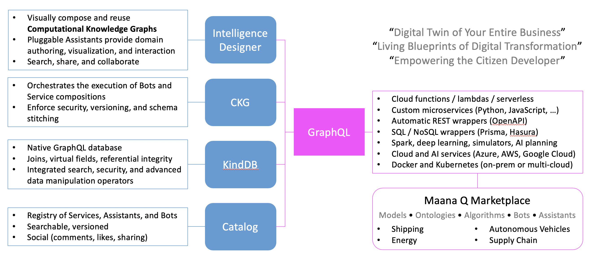

# Maana Q Documentation

**Welcome to Maana Q!** Get familiar with Maana and the Q Knowledge Platform

**About Maana**

Maana organizes the world’s industrial data and human expertise into digital knowledge to enable millions of experts to make better decisions affecting the global economy and human civilization.  Using our Knowledge Platform™ and its proprietary Computational Knowledge Graph™, Fortune Global 500 industrial companies drive answers to operational questions that direct the future. 

Maana is a pioneer of digital knowledge technology, enabling enterprise-wide digital transformation through unsurpassed interoperability of tools without creating new silos.

Learn more about Maana on our [website](https://www.maana.io).

\*\*\*\*

**The Platform**

The Maana Knowledge Platform organizes industrial data and human expertise into digital knowledge allowing companies to answer enterprise-wide questions better and faster. The Platform features the following:

* The ability to model a wide variety of business operations, whether it is in exploration, drilling, production, refining, trading, procurement or health, environment and safety, the Platform helps get answers to business questions that direct the future
* Supports multiple programming languages and provides scaffolds and templates to ensure enterprises can leverage their existing data platform and digital infrastructure investment
* An easy-to-use, visual authoring environment to support business decision makers, subject matter experts, and data scientists and developers, in the development of use cases
* Integrated Azure services to accelerate development and deployment of models

Learn more about the platform features [here](platform-features/).

