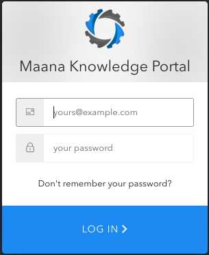
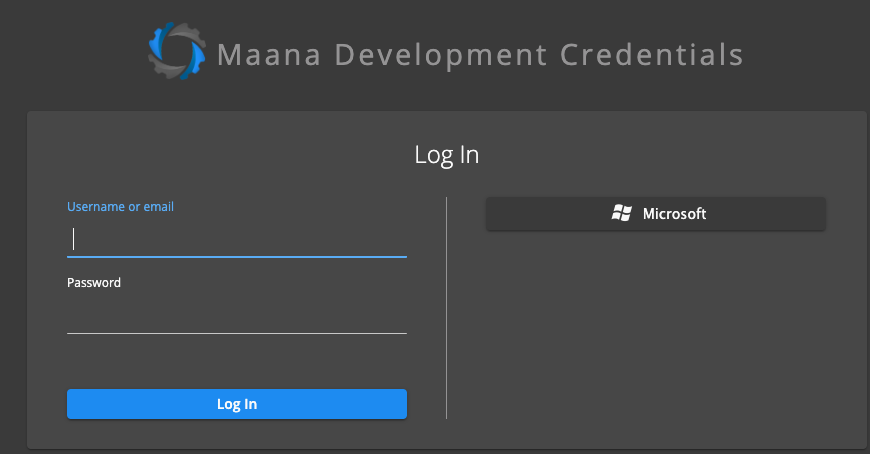
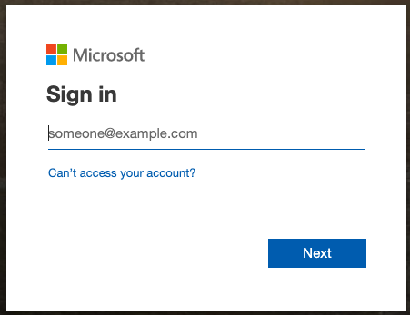
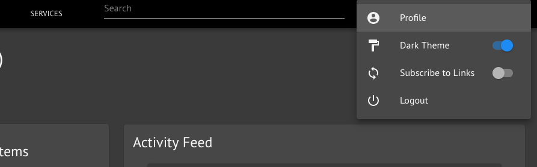

# Logging In and Out



## Logging In 

Go to the web address provided by IT admin. Login using one of the 2 methods described below:

### Auth0

If single sign-on \(SSO\) is enabled by your IT, enter your email address and select **LOG IN**. Otherwise, enter your email and password and select **LOG IN.** 

### Keycloak

Enter your email or username and password and select **Log In**.

If Keycloak is configured to support logging in using a Microsoft account \(or other provider\), it will be shown on the right. Click the link and you will be taken to a sign in page for the selected provider. Microsoft is shown below.

Complete the sign in process to access Q.

## After Logging In

Once logged in, you can:

* Add/change info on your profile \(e.g. name, add a picture, email address, etc.\)
* Choose between a Light or Dark portal theme
* "Subscribe to Links" allows new [Links](../reference-guide/technical-design-and-architecture/links.md) to automatically appear in the browser, as opposed to refreshing to see them \(may result in lower performance\).
* Log out

This is accessible from the User menu in the top right corner of the screen.




### To Log Out 

Select the the **User menu** icon in the top right corner of the screen followed by the **Logout** option.




