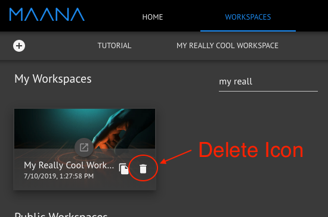
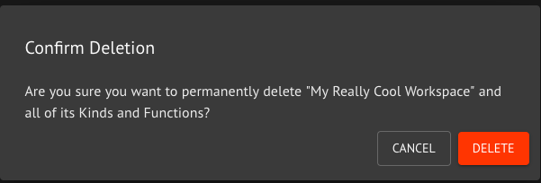
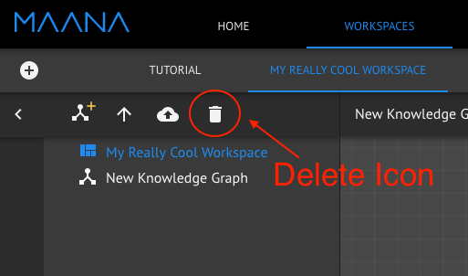

# Deleting a Workspace

## Delete a Workspace

A workspace can be deleted both from the Workspaces tab and from within a Workspace. To delete a Workspace from the Workspaces tab, click on the delete icon next to the Workspace name.

After clicking the delete icon, you will be presented with a confirmation dialog.


Beware of the implications of deleting a Workspace. All Kinds and Functions that were created within the workspace will be deleted along with the service that backs the Workspace. Any references to the deleted Kinds, Functions, or the backing service that are within other Workspaces, Functions, or elsewhere will no longer be valid.


An alternative way to delete a Workspace is from within the Workspace itself. Select the Workspace name in the Explorer panel and click on the delete icon.

You will be presented with the same confirmation dialog as above.

