# Inside the Workspace

The workspace features several areas with specific functionality that enables you to create, manage, visualize and explore Knowledge Graphs and their components.

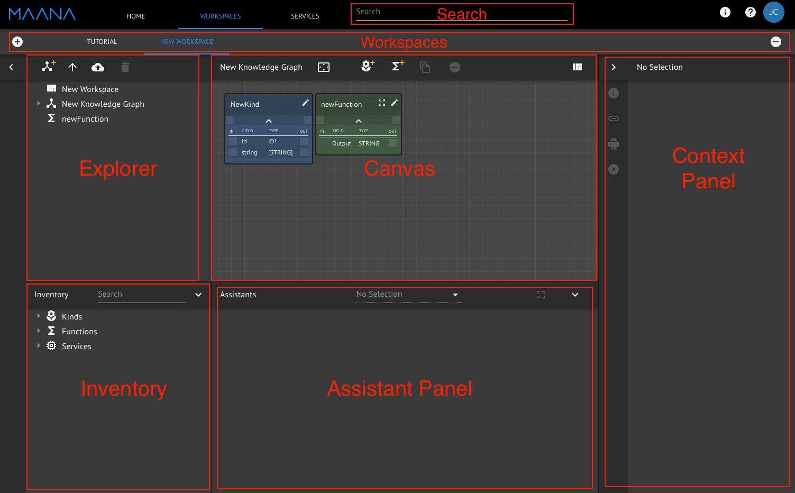


**Note**:  Most actions that are taken in a workspace will be auto-saved.  Changes that need to be explicitly saved, such as those made in the Context Panel or Assistant Panel, will have a save button.  Contact Maana support to resolve any issues with saving.


## Explorer Panel Area

This area contains Knowledge Graphs \(KGs\) and the Kinds, Functions, and Instances of various types that are a part of the Knowledge Graphs. It also contains Function implementations, along with the Functions that are a part of the implementations. The Explorer Panel area of the screen allows you to:

Select or navigate a hierarchical list of:

* Knowledge Graphs
* Files
* Documents
* Kinds
* Functions \(and their implementations when applicable\)
* Instances

### **Explorer Panel** enables you to:

* Create a new Knowledge Graph.
* Upload local files into the Workspace.
* Upload a remote file into the Workspace.
* Remove or delete items from your Workspace.

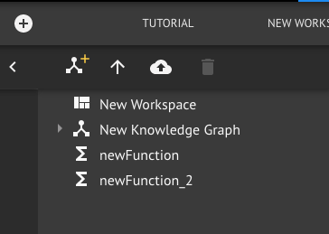

## The Canvas Area

The **Canvas Area** offers you the ability to visualize Knowledge Graphs and Function implementations. Within Knowledge Graphs you can see Kinds, Functions, and Instances as nodes on the graph and the Relations between them as edges. In addition, you can create a new Kind or Function, or remove or duplicate a node \(Kind, Function, or Instance\) in this location.

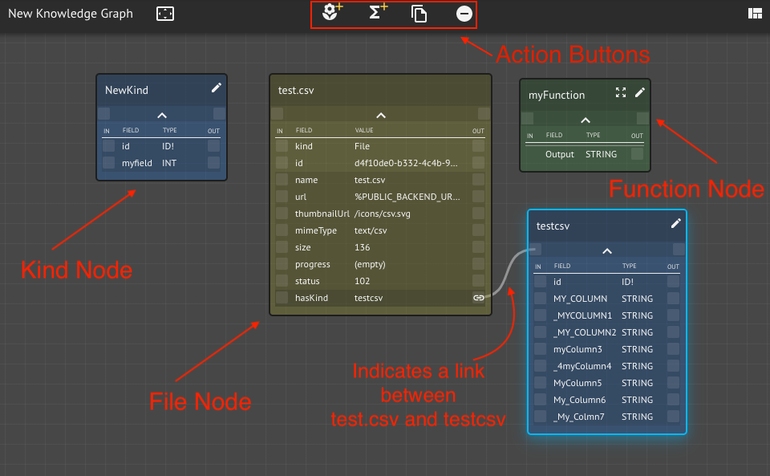

### The Canvas area of the screen enables you to:

#### Drag and drop files to enhance a Knowledge Graph

Dragging and dropping files is supported in the Canvas area when a Knowledge Graph is shown.

* Files are uploaded and an instance of the File kind is created when dropping a file on the graph. A File node representing the uploaded file is added to the Knowledge Graph as well.
* Certain file types have special viewers in the Assistants panel that allow previewing the data
  * These include CSVs, TXTs, PDFs, and Images
* Some file types have special meanings:
  * CSV
    * Uploading a CSV generates a Kind with fields corresponding to the columns of the CSV \(this requires the CSV to have a header row\)
    * Each row in the CSV becomes an Instance of the generated Kind
  * Documents \(PDF, DOCX, XLSX, TXT\)
    * Uploading these file types create an Instance of the Document Kind in addition to the Instance of the File Kind
  * Images \(JPG, PNG\)
    * Uploading these file types create an Instance of the Image Kind in addition to the Instance of the File Kind

#### Create new Kinds and Functions

The first two buttons in the action panel allowing creating a new Kind or Function, respectively. Newly created Kinds and Functions start out with an empty schema and an auto-generated name. Define the fields \(names, types, and modifiers\) that make up the schema directly in the node shown on the graph.

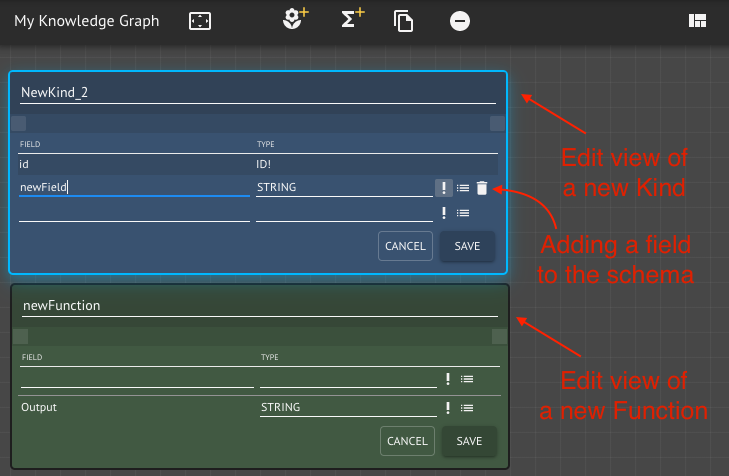


Kinds and Functions must have unique names within a Workspace and they must adhere to the GraphQL naming conventions.



Fields within Kinds and Functions must have unique names and they must adhere to the GraphQL naming conventions.


For more info see:





#### Duplicate Kinds, Functions, and Instances

Kinds, Functions, and Instances can be duplicated within the Canvas area by selecting one or more and clicking the duplicate button in the Action Buttons:

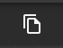

Duplicating a Kind, Function, or Instance creates an exact copy and adds a corresponding node to the graph. In the case of Kinds and Functions, a new, unique name is generated.

#### Remove Kind, Function, and Instance nodes from the graph

Kind, Function, and Instance nodes can be removed from the graph by selecting one or more and clicking the remove button in the Action Buttons:

This will remove the Kind, Function, or Instance node from the graph.


Removing a Kind, Function, or Instance node from the graph does not remove the Kind, Function, or Instance from the Workspace. It only affects the current graph.


#### Edit existing Kinds and Functions

The pencil icon in the top right corner of nodes allows editing the schema of the Kind or Function.

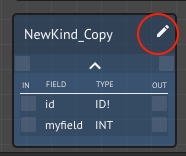


Only Kinds and Functions created in the current Workspace are editable in that Workspace. Kinds and Functions brought in from other services are not.


#### Compose Functions

The composition of a Function can be viewed and edited by clicking the expand icon in the top right of the Function node.

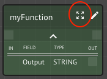


Only Functions created in the current Workspace can have their composition viewed and modified within that Workspace. Functions brought in from other services cannot.


Function composition is a whole topic in itself. See the following link for a detailed description of Function Composition:



#### Navigating Links between Kinds and Instances

One of the most important aspects of the Knowledge Graph is the ability to view and navigate the links between Kinds and Instances. When a Kind or Instance has a link to the another Kind or Instance, a link icon will display next to the field that has the link.

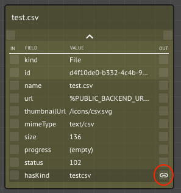

Hovering over the link Icon will display a preview of the Kind or Instance that the link points to.

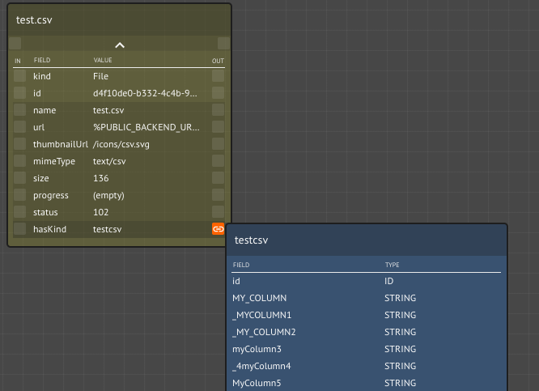

Clicking the link icon will add the linked Kind or Instance to the graph. A line will be drawn from the linked field to the Kind or Instance that it points to, indicating the relationship between the two.

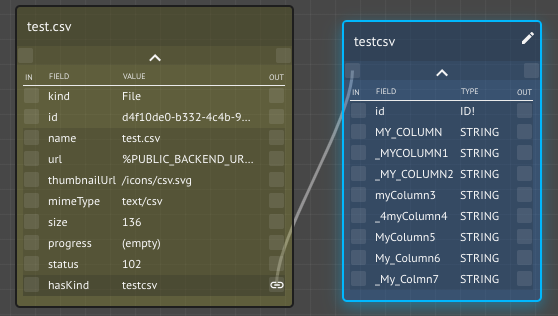

The darker background color on the linked row indicates the link is from a Relation \(see info box below\). The relation name is "hasKind" and the value is the Kind it points to \(testcsv in this case\). The Relation can be read as "test.csv has Kind testcsv". \(pretty cool huh!\)


There are two types of links shown between Kinds and Instances:

* When a field in a Kind has its type set to a Kind
  * Displayed next to the field
* When there is a Relation between a Kind or Instance and another Kind or Instance
  * Displayed as a separate row after the fields in the Kind or Instance with a slightly different background color


#### Zoom to fit

Finally, there is a handy little button that will expand the viewable area of the canvas \(zoom out\) to fit all of the nodes currently in the graph.

## The Context Panel

Use the **Context Panel** has panes to view or edit properties of Kinds, Functions, and Instances, view links, view Bots, and run Functions.

### **Information pane**

The Information pane allows viewing and modifying properties of everything in the Workspace, including Kinds, Functions, Instances, Knowledge Graphs, Services, and the Workspace itself.

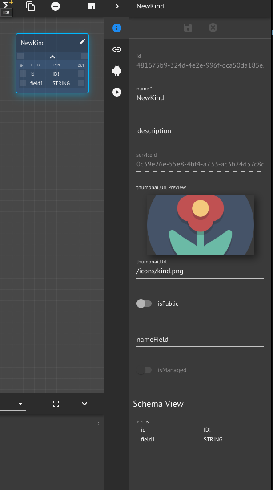

Properties that are not editable are disabled. Changes made in this view can be saved or discarded using the buttons at the top of the pane.

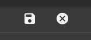


Only Kinds and Functions created within the current Workspace are editable in the Information pane. Kinds and Functions brought in from other Services are not. 


### Links pane

The Links pane displays the Relation based links on the selected Kind or Instance. Selecting one or more and clicking the add button will add the linked Kind\(s\) or Instance\(s\) to the active Knowledge Graph. The Links are organized by Outbound links \(links from the selected Kind or Instance that point to another Kind or Instance\) and Inbound links \(links from another Kind or Instance that point to the selected Kind or Instance\).

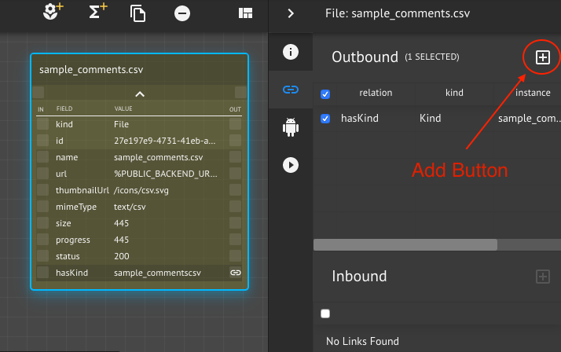

### Bots pane

The Bots pane is used to see any Bots that are available for the current selection and the status of the Bot \(running, stopped, etc.\). If the Bot has an associated Assistant, a button is shown that will open the Assistant in the Assistants panel.

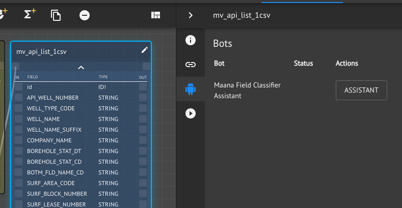

### Run pane

The Run pane has a special purpose. It is used to run Functions with provided sample data. It is only available when a Function is selected. To run a Function, fill in values for the fields \(at a minimum the required fields must have values\), and click the Run button.

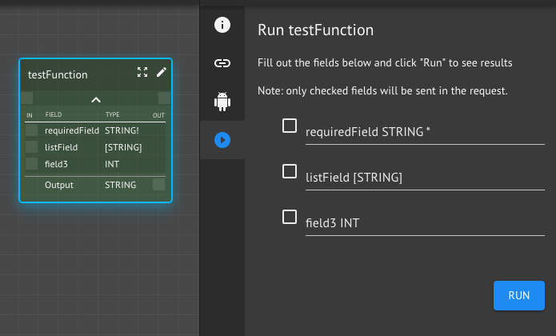

There are many nuances to be aware of when running a Function. See Running Functions for more details:



## The Inventory Panel

The Inventory Panel can be thought of as the pallet containing all of the Microservices, Files, Kinds, and pre-populated Core System Services that can be brought into the workspace.

### **Inventory Panel** activities include:

* Creating a New Knowledge Graph using the listed **Services**.
* Querying a Knowledge Graph using the listed **Services**.
* Uploading a file or group of files into the Workspace from the listed **Services**.
* Removing a Knowledge Graph from the Workspace.


**Note**:  The contents of the Inventory Panel are specifically bound to each individual workspace. So, if you create a new workspace and you want its inventory to mirror that of another workspace, you will need to repeat any efforts you undertook to populate the Inventory Panel of the original workspace.



**Note**:  The limit on the number of Services that can be added to a single workspace is 1000.


## The Assistant Panel

The Assistant Panel allows you to visualize Kinds and data associated with those Kinds like Instances, Entities and Values. Raw Data Kinds can be explored quickly using the Assistant panel, as each entity detected in the data file can be filtered using a “search as you type” capability.

### Assistant **Panel** activities include:

* Visualization of the **Kinds** and **Data** associated with other Kinds - such as Instances, Entities and Values.

The Assistant panel can also be used to query a Knowledge Graph using GraphQL \(see below\).

## Workspace Buttons

This is a map of the various options \(as icons\) offered within the Maana KG screen. The activities mentioned in the following pages utilize or mention a number of these icons, so we would suggest that the User take a moment to familiarize themselves with their function and location on the screen.​

\[TBD\]\[NEED IMAGE - Broken on original GitBook.\]

