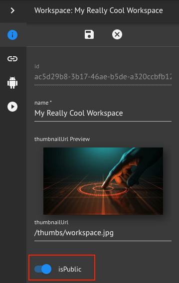
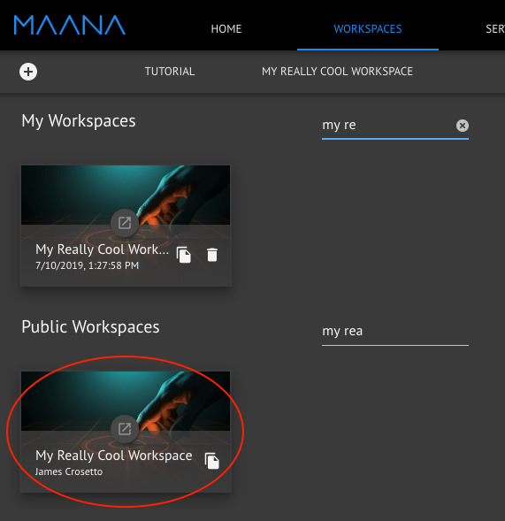
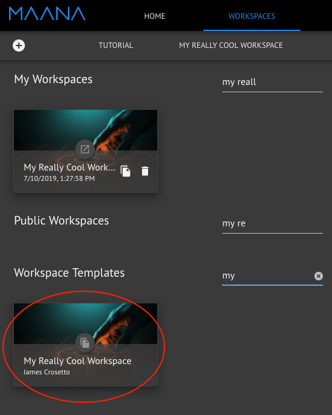

# Public and Template Workspaces

## Public Workspaces

Public Workspaces are Workspaces that are available to anyone to view and change. Set a Workspace as public if you want to collaborate on it with other people.

To set a Workspace as public, open the Workspace and toggle on the isPublic option. Click the save button.

The Workspace is now set as public. It will show up under the Public Workspaces section of the Workspaces tab.

Now anyone can view and edit this Workspace!

## Template Workspaces

Template Workspaces are Workspaces that are available to anyone to clone but cannot be edited. Set a Workspace as a template if you want it to be used as a starting point for other people when they create new Workspaces.

To set a Workspace as a template, open the Workspace and toggle on the isTemplate option. Click the save button.

The Workspace is now set as a template. It will show up under the Workspace Templates section of the Workspaces tab.

Now the Workspace is available for anyone to clone!

For more information on cloning see:



