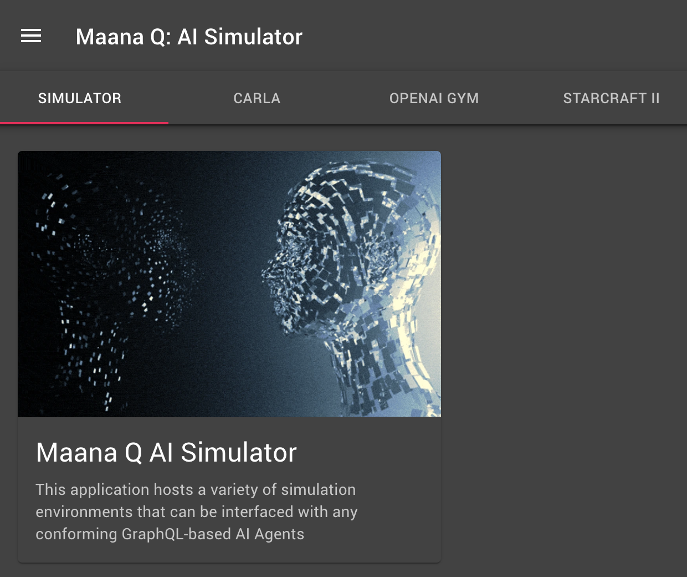

# Maana Q AI Simulator Framework

Simulation is an important tool in the development of intelligent systems and agents that are able to reason about their world, reason, decide on "best" actions, and learn from history.  Simulators are able to constrain the problem being solved and operate under controlled, repeatable circumstances.  Simulations are not limited by what they simulate: physics, driving, strategy, planning, ...

Maana has developed a simulator host user experience along with several ready-to-use simulators \(CARLA, OpenAI Gym, and StarCraft II\), and a number of example agents \(GOAP, Bayes, Q Learning, Deep Q Network\).  These can be explored further in [AI Simulator Framework](../reference-guide/ai-simulator-framework/) reference guide and [agent training examples](../reference-guide/ai-simulator-framework/simulators/openai-gym/taxi-v3-environment.md).

Please see the official [GitHub repository](https://github.com/maana-io/maana-ai-simulator-app) and feel free to contribute!

