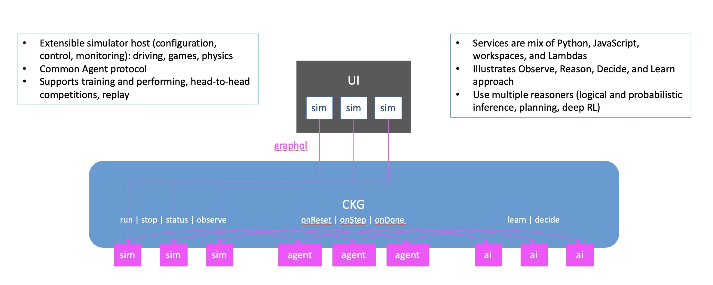

# AI Simulator Framework

When developing solutions to complex problems, it often necessary to create simplified circumstances in which to develop and test.  We have provided a simulation host that can be extended to drive various popular and custom simulators, each with their own environments and protocols.  The purpose of the simulation host is to provide a general framework for using simulators with Q-based Agents that reason about and take beneficial actions.

Each simulator is free to redefine its Agent protocol to address the specific needs, therefore, the protocol is primarily a suggestion.  All simulators will follow the basic flow of:

* `onReset` - allows the agent to initialize for a simulation run
* `onStep` - asks the agent to make a decision at each step of the simulation
* `onDone` - allows the agent to cleanup \(or persist the model\) from the simulation run, incorporating any lessons it learned

There are currently several supported simulators:

* [CARLA](simulators/carla.md) - autonomous driving simulator
* [OpenAI Gym](simulators/openai-gym/) - an easy to set up, general-intelligence [benchmark](https://en.wikipedia.org/wiki/Benchmark_%28computing%29) with a wide variety of different environments
* [StarCraft II](simulators/starcraft-ii/) - a collaboration between Google's DeepMind and Blizzard to develop the StarCraft II game into a rich environment for reinforcement learning research

Please see the official [GitHub repository](https://github.com/maana-io/maana-ai-simulator-app) and feel free to contribute!

## Install

TODO: Docker [https://hub.docker.com/repository/docker/maanainc/maana-ai-simulator-app](https://hub.docker.com/repository/docker/maanainc/maana-ai-simulator-app)

