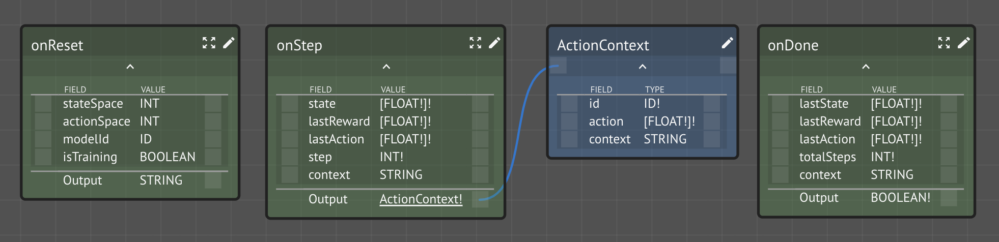

# Base Agent

The "Base" agent [workspace](https://lastknowngood.knowledge.maana.io/workspace/c055ef97-f85b-4e91-bdf7-344d032bf697) is designed to get you started developing your own AI agent for use in simulations. Every simulator is different and usually have their own _base_ agents, such as the [Taxi-v3 Random Agent](simulators/openai-gym/taxi-v3-environment.md).

## onReset

Simulators will first call `onReset`, allowing you to perform any initialization you require and to return a opaque "context" blob \(in the form of a `String`\).

#### Input 

* `stateSpace` is the number of dimensions of the state vector representing the simulation domain \(i.e., the world\)
* `actionSpace` is the number of dimensions of the action vector representing how the agent affects the world \(i.e., does things\)
* `modelId` is the preferred identity of the model to create \(if training\) or use \(if performing\)
* `isTraining` indicates whether or not the simulation is running in Training or Performing mode, thus allowing the agent to perform accordingly

#### Output

* `String` representing the agent's serialized "context blob" that will be returned on all subsequent calls

Generally, the context you return is a serialized Kind instance used to maintain the model state \(or a reference to it\).  This context object will be passed back to you on subsequence calls from the simulator.

## onStep

The `onStep` function is called on every iteration of the simulator.  It passes to you the current state vector \(for OpenAI's Taxi-v3 environment, this is a single value encoding the 500 possible states\), the previous reward and action \(for steps &gt; 0\), and the original context.

## onDone

Lastly, `onDone` function will be called when the simulation has been completed \(i.e., OpenAI's Taxi-v3 environment, when the passenger has been dropped off or some step limit has been reached\).

