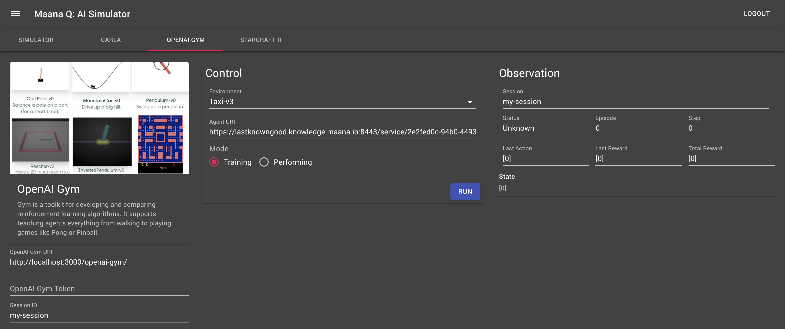

# OpenAI Gym

Please see the official [GitHub repository](https://github.com/maana-io/maana-ai-simulator-openai-gym) and feel free to contribute!

## Configure

The simulator URI, authentication token \(if any\), and the simulation session identifier  to use can be configured on the leftmost panel.  By default, the system assumes the simulator is running via CKG and will automatically use the authentication token  generated at login.

There are no control placed on session id, making it possible for multiple users to supply the same session id, giving them each access to the same controls and observations.  This might be desirable in some situations, but could lead to problems if people are not aware.

## Control

The middle panel is for controlling the simulation, including specifying the agent to use, its security token, and which mode it should operate in \(e.g., Training or Performing\).

## Observation

During a simulation, it is useful to receive feedback about progress.  The rightmost panel provides diagnostic and rendering results from the simulation observation.

