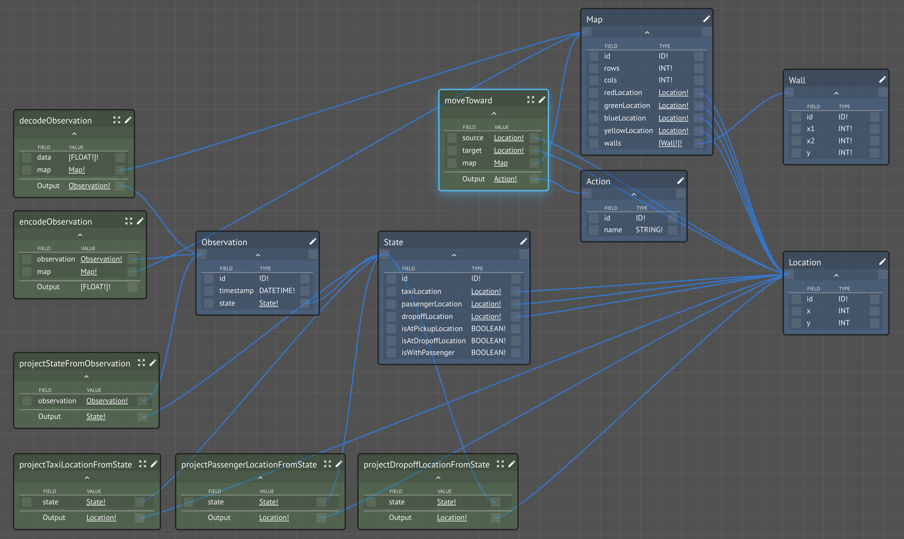

# Taxi-v3


There are four designated locations in the grid world indicated by R\(ed\), G\(reen\), Y\(ellow\), and B\(lue\). When the episode starts, the taxi starts off at a random square and the passenger is at a random location. The taxi drives to the passenger's location, picks up the passenger, drives to the passenger's destination \(another one of the four specified locations\), and then drops off the passenger. Once the passenger is dropped off, the episode ends.

These definitions are taken from the [original source code](https://github.com/openai/gym/blob/master/gym/envs/toy_text/taxi.py).

### Map

The map is a 5x5 grid and walls can separate the roads.  

```text
MAP = [
    "+---------+",
    "|R: | : :G|",
    "| : | : : |",
    "| : : : : |",
    "| | : | : |",
    "|Y| : |B: |",
    "+---------+",
]
```

### Locations

Player location is encoded by:

```text
Passenger locations:
    - 0: R(ed)
    - 1: G(reen)
    - 2: Y(ellow)
    - 3: B(lue)
    - 4: in taxi
```

The destinations are the same colors:

```text
Destinations:
    - 0: R(ed)
    - 1: G(reen)
    - 2: Y(ellow)
    - 3: B(lue)
```

### Actions

There are six discrete, deterministic actions:

```text
Actions:
    - 0: move south
    - 1: move north
    - 2: move east 
    - 3: move west 
    - 4: pickup passenger
    - 5: dropoff passenger
```

### Rewards

There is a reward of -1 for each action and an additional reward of +20 for delivering the passenger. There is a reward of -10 for executing actions "pickup" and "dropoff" illegally.

### Observations

There are 500 discrete states since there are 25 taxi positions, 5 possible locations of the passenger \(including the case when the passenger is in the taxi\), and 4 destination locations.

### Representing the Domain

To help interact with this world, we have created a workspace to provide various Kinds and Functions: "[Taxi-v3 Domain](https://lastknowngood.knowledge.maana.io/workspace/83159cfb-21b5-4609-9429-d4486afb1085)".



```javascript
const ts = new Date().toISOString()

const { map: taxiMap, data } = input

if (data.length !== 1) throw new Error(`Data wrong length: ${data.length} (expecting 1)`)

let i = data[0]

const dest_idx = i % 4
i = Math.floor(i / 4)

const pass_loc = i % 5
i = Math.floor(i / 5)

const taxi_col = i % 5
i = Math.floor(i / 5)

const taxi_row = i % 5
  
const makeLocation = ({x,y}) => ({id: `(${x},${y})`, x, y})

const taxiLocation = makeLocation({x: taxi_col, y: taxi_row})

const location_idx = {
  "0": taxiMap.redLocation,
  "1": taxiMap.greenLocation,
  "2": taxiMap.yellowLocation,
  "3": taxiMap.blueLocation,
  "4": taxiLocation
}

const passengerLocation = location_idx[pass_loc]

const dropoffLocation = location_idx[dest_idx]

const compareLocations = ({a, b}) => a.x == b.x && a.y == b.y

return {
  id: ts,
  timestamp: ts,
  state: {
    id: ts,
    taxiLocation,
    passengerLocation,
    dropoffLocation,
    isAtPickupLocation: pass_loc != 4 && compareLocations({a: taxiLocation, b: passengerLocation}),
    isAtDropoffLocation: compareLocations({a: taxiLocation, b: dropoffLocation}),
    isWithPassenger: pass_loc === 4
  }
}
```

### Encoding the Domain

It is very useful during the development of your agent to give it known inputs.  For this, we provide a means for you to encode a situation in the same way the simulator will.

```javascript
const {observation, map} = input
const {state} = observation

const location_idx = {
  [map.redLocation.id]: 0,
  [map.greenLocation.id]: 1,
  [map.yellowLocation.id]: 2,
  [map.blueLocation.id]: 3
}

let i = state.taxiLocation.y
i *= 5
i += state.taxiLocation.x
i *= 5
i += state.isWithPassenger ? 4 : location_idx[state.passengerLocation.id]
i *= 4
i += location_idx[state.dropoffLocation.id]

return [i]
```

### Agents

A number of tutorial agents have been created to illustrate different AI styles \(e.g., planning, causal inference, reinforcement learning\):

* Random Agent - a [workspace](https://lastknowngood.knowledge.maana.io/workspace/46661294-c682-4cbd-8e05-78e1db2a1229) designed to get you started developing your own Taxi-v3 agent, derived from the [Base Agent](../../agents/base-agent.md), and simply takes random actions on each step.
* [GOAP Agent](../../../../../training/advanced/inference/logical-inference-and-ai-planning.md) - uses a simple but effective AI planning technique to solve the taxi reasoning task
* [Bayes Agent](../../../../../training/advanced/inference/probabilistic-inference-and-causal-networks.md) - uses probabilistic inference \(causal/belief\) to learn the probability distributions for taking favorable actions
* [Q Learning Agent](../../../../../training/advanced/learning/reinforcement-learning-q-learning-with-open-ai-taxi.md) - uses the classic Bellman equation for updating a state/action table
* [Deep-Q Learning Agent](../../../../../training/advanced/learning/reinforcement-learning-deep-q-network-dqn-with-open-ai-taxi.md) - uses TensorFlow to create a deep neural network for solving the taxi problem


