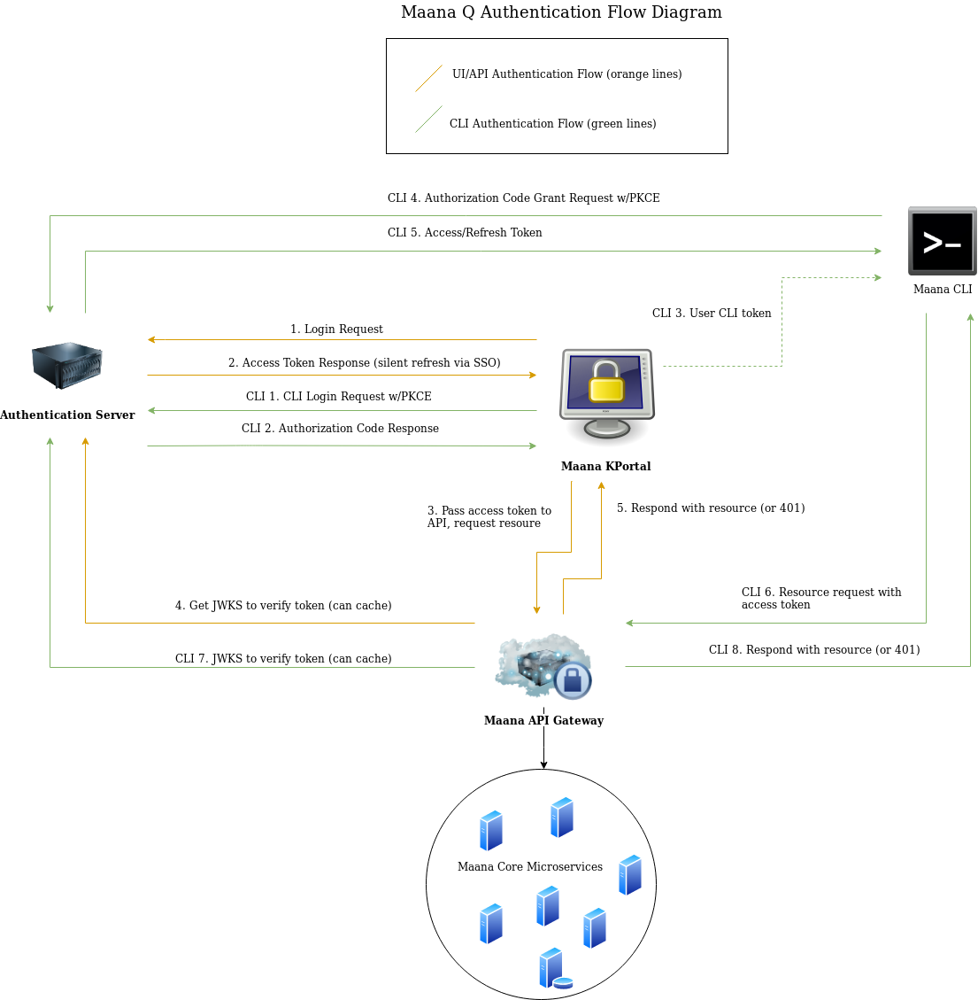

# Keycloak Auth Server Configuration

## Overview

This document describes the steps for correctly configuring a keycloak server to secure access to a Maana Q instance. 

If, at this point, you don't know what 'Keycloak' is, please learn about its features and limitations given your environmental constraints before you proceed. 

Keycloak Documentation[: https://www.keycloak.org/documentation.html](https://www.keycloak.org/documentation.html)

## Audience

This document assumes you are the admin for the keycloak server or Maana Q instance, and need to correctly configure keycloak-maana authentication.

## Prerequisites

The following prerequisites are assumed to have been fulfilled: 

1. Keycloak server is deployed in a manner allowing network access between the keycloak server and the Maana Q instance.
2. Keycloak server is accessible via admin account, i.e. admin can access the keycloak admin console.
3. Admin has created a 'realm' for configuration.
4. IT/admin have an identity provider in-place to support user logins, be it via configuring the keycloak server leverage a third-party provider like Microsoft, or via the keycloak server directly.

## Definitions Relevant to this Guide

**Realm**: A _realm_ manages a set of users, credentials, roles, and groups. A user belongs to and logs into a _realm._ 

**Client**: Clients are entities that can request Keycloak to authenticate a user. Most often, clients are applications and services that want to use Keycloak to secure themselves and provide a single sign-on solution. Clients can also be entities that just want to request identity information or an access token so that they can securely invoke other services on the network that are secured by Keycloak.

**Authentication Flow**: Authentication flows are work flows a user must perform when interacting with certain aspects of the system.

**Audience**: A value that is used to enhance security by providing a limited 'scope'  or purpose for an access token. Audience must configured in the server instance 

**Issuer:** The domain which issues an access token. This value must be present in a JSON Web Token issued by keycloak, as it will be verified when attempting to access the Maana Q API. For a keycloak server, this will usually be formatted like so: 'https://\[your-keycloak-host\]/\[port\#\]/auth/realms/\[your-realm-name\].

\*For more comprehensive definitions, see \[Keycloak Concepts\] in _References_ section.

## Maana Q Authentication Flow Diagram

The following diagram illustrates how Maana Q communicates using your keycloak server:



## Configuring the Keycloak Server

### Ensure Realm is Created and Accessible

Login to admin console. 

This is usually 'https://\[your-keycloak-host\]:\[port\#\]/auth/admin/\[your-realm-name\]/console'

If you can't login, check your deployment and that you have created a realm. \(See \[Keycloak Create Realm\] in references\).

Successful login should give you a page similar to this:


### Additional Realm Configuration

#### General \(tab\)

Name: **\*\*Realm name and REACT\_APP\_PORTAL\_AUTH\_IDENTIFIER environment variable in the Maana Q instance must be configured to match.**

#### Login \(tab\)

This section is largely up to the server administrator. But it is recommended this is not adjusted until initial configuration is verified.

#### Themes \(tab\) 

Themes \(login skins\) are left default, and can be customized locally on the server. 

#### Tokens \(tab\) 

Token lifetimes can be configured here \(and at the client level\), but default settings are recommended. Specifically, token lifetime for CLI tokens should considered \(and usually longer\), as the workflow for CLI is usually slower and more arduous. It is recommended this is not adjusted until initial configuration is verified.

### Create Client Scope and Mapper

Setting a 'client scope' and paired 'mapper' is how to set the 'audience' \('aud'\) property of the JWT, which must be verified by Maana Q API.

1. Under the 'Configure' panel on the left-hand side, select client scopes
2. Create a new client scope
3. In 'Add Client Scope' page, set the name of the client scope: 
   1. In this example we use 'maanaAudience' as the name.
   2. Set 'Display On Consent Screen' to OFF.


5. Now click 'Save'. You should see your screen refresh, displaying the newly created scope:


6. Under the 'Mappers' tab, select 'Create'. 

7. In the 'Create Protocol Mapper' page, set the 'Name' to \[clientScopeName\]\_mapper. Set the 'Mapper Type' to 'Audience'. Now, specify the value of 'Included Custom Audience': **this value and AUTH\_AUDIENCE environment variable in the Maana Q instance must be configured to match.** \(Verify that 'Add to access token' is ON\):


8. Click 'Save'

9. Now, click again 'Client Scopes' under the 'Configure' panel on the left-hand side of the console.

10. Click 'Default Client Scopes'. You should see the client scope you just created under the 'Available Client Scopes':


 11. Add your client to the 'Assigned Default Client Scopes':


This scope will now be added to any clients that are created and the 'Included Custom Audience' value you specified will be present in all client access tokens and verified by the Maana Q API.

Done. 

### Creating the Maana API client

This will create the client used to enforce access to the Maana Q intance's API gateway.

1. Click 'Clients' in the left-hand panel. In the 'Clients' window click 'Create'.
2. In the 'Add Client' window specify the 'Client ID' value. \*\***this value and API\_AUTH\_CLIENT\_ID environment variable in the Maana Q instance must be configured to match.** For this example we will use 'maanaAPI'.
3. Click 'Save' and you will see the window for the client:


4. Set 'Access Type' to 'confidential'

5. Set 'Valid Redirect URIs' to ======\(TBD Bryan\)

6. Set 'Web Origins to: ======\(TBD Bryan\)

7. Click 'Save'

8. Click 'Client Scopes' and check to make sure the Client Scope created last section is added to the 'Assigned Default Clien Scopes'

### Creating the Maana KPortal \(UI\) client

This will create the client used to enforce access to the Maana Q intance's UI \(and therefore the access tokens\).

1. Click 'Clients' in the left-hand panel. In the 'Clients' window click 'Create'.
2. In the 'Add Client' window specify the 'Client ID' value. \*\***this value and REACT\_APP\_PORTAL\_AUTH\_CLIENT\_ID environment variable in the Maana Q instance must be configured to match.** For this example we will use 'maanaKPortal'.
3. Click 'Save' and you will see the window for the client similar to last section.
4. Set 'Implicit Flow Enabled' ON. 
5. Set 'Standard Flow Enabled'  OFF.
6. Set 'Valid Redirect URIs' to 'https://\[host\]:\[port\]/callback'
7. Set 'Web Origins' to 'https://\[host\]:\[port\]'
8. Click 'Save'

### Creating the Maana CLI client

1. Click 'Clients' in the left-hand panel. In the 'Clients' window click 'Create'.
2. In the 'Add Client' window specify the 'Client ID' value. \*\***this value and REACT\_APP\_CLI\_AUTH\_CLIENT\_ID environment variable in the Maana Q instance must be configured to match.** For this example we will use 'maanaCLI'.
3. Click 'Save' and you will see the window for the client similar to last section.
4. \('Standard Flow Enabled should be ON\)
5. \('Implicit Flow Enabled' should be OFF\). 
6. Set 'Valid Redirect URIs' to 'https://\[host\]:\[port\]/user'
7. Set 'Web Origins' to 'https://\[host\]:\[port\]'
8. Click 'Save'

### Try your JWKS URL

Keycloak uses an OIDC certs endpoint to retrieve the JSON Webtoken Keys Set \(JWKS\). This URL must be provided to the Maana Q environment so tokens can be verified by the API. 

By default, the keycloak server should expose its JWKS on 'https://\[your-keycloak-host\]:\[port\#\]/auth/realms/\[your-realm-name\]/openid-connect/certs'

Ensure you can get your JWKS by hitting this endpoint on your keycloak server. It should respond with JSON output similar to this:bitbuc

```text
{
  "keys": [
    {
      "kid": "alksdfjasaW147ZInLbYBDsl6dYhY99_l3SP8",
      "kty": "RSA",
      "alg": "RS256",
      "use": "sig",
      "n": "iLGMGKp0zl_yK-Cly-1j6R7InJkVAG0ijEn8LPXPnhkoNjo0X32lIlh2feIXKa0OShj5g30jn7EMXhySpHNwgLtQ-Xa27NXAm7ixuZ6U2T-H0Onb0nQ4cFMyGUYpIIX8D7ktGefb_aiXkZ2hIYSP3u4GQHJ-whKpz5OXPZzxdfDq2m5uBfZGnHuQqVfGX44pMoZbwjCiQwHt7xf1xQCm4Ka-7IoVk9Bn6aDNI0CcqO3eoVaVlXN92NP772rbFobHWHwLLUebr8fYJHTxZSNhVHbJ3K3dQCsXRxF-iBu7KTcsKpAupwPLq-0FV5keyyNa_yhjVcMJBkmCw",
      "e": "AQAB"
    }
  ]
}
```

If you receive a 404 or a response that doesn't include a key for an RS\*\*\* algorigthm \(as shown above\) review and correct your realm 'Keys' configuration before you proceed.

### Verify Correctness Between Maana Q Environment and Keycloak Config 

Before attempting to deploy/finalize, please ensure the following configurations are correct:

| Maana Q Environment Variable | Keycloak Server Config Value |
| :--- | :--- |
| REACT\_APP\_PORTAL\_AUTH\_DOMAIN | 'https://\[your-keycloak-host\]:\[port\#\]' |
| REACT\_APP\_PORTAL\_AUTH\_IDENTIFIER | keycloak realm name |
| REACT\_APP\_PORTAL\_AUTH\_CLIENT\_ID | keycloak maana k-portal client name |
| REACT\_APP\_CLI\_AUTH\_CLIENT\_ID | keycloak maana CLI client name |
| REACT\_APP\_CLI\_AUTH\_DOMAIN | 'https://\[your-keycloak-host\]:\[port\#\]' |
| API\_AUTH\_DOMAIN | keycloak maana API client name |
| API\_AUTH\_CLIENT\_ID | keycloak realm name |
| AUTH\_AUDIENCE | 'Included Custom Audience' value specified in the Protocol Mapper used for the Client Scope created and added to Assigned Default Client Scope.  |
| AUTH\_JWKS\_URL | 'https://\[your-keycloak-host\]:\[port\#\]/auth/realms/\[your-realm-name\]/openid-connect/certs' |
| AUTH\_ISSUER | 'https://\[your-keycloak-host\]:\[port\#\]/auth/realms/[\[](https://keycloakdev.knowledge.maana.io:8443/auth/realms/maanaDev)your-realm-name\]' |
| AUTH\_ALGORITHM | Must be RSA-type, and value must match value in Realm&gt;Keys&gt; \[RS\*\*\*\]. For example 'RS256'. |
|  |  |

## Testing Functionality Between Keycloak Server and Maana Q 

Open Devtools&gt;Network \(or similar tool\) to view network requests. If at anytime you encounter a problem \(or see a 401 in the network tab\), attempt to reproduce, isolate, and record the network requests/resonses associated with the problematic call/s.

1. Login to Maana K Portal, complete user authentication step \(i.e., login\). 
   1. NOTE: If you can login to Maana Q KPortal and are redriected to the page showing the organization catalog, workspaces, tutorials, etc. this means you were able to 1\) obtain a token from the keycloak server on behalf of the Maana KPortal client, and 2\) verify this via the Maana API using the public key from the JWKS endpoint.
2. Attempt creating a new workspace or opening an existing workspace.
3. Attempt msignin via CLI.

These three steps should validate, generally, that the keycloak server is configured correctly.

## Troubleshooting Authentication Issues

Misconfiguration between Maana Q environment and Keycloak server is the most common source of problems. If you can localize an issue, check the environment/server configuration specific to this area.

If your environment/keycloak configuration appears correct, check settings in the realm and clients. 


### HTTP 401 Status in Maana Q instance logs

Record and read the log message. See if there are variances of 401 messages, they may include a message as to why the 401 occured.

If these errors are associated with the 'maana-gateway' service, they are related to not being able to verify the JWT passed to the API gateway. Three key pieces to this are 1\) ensuring the 'iss' \(issuer\) is correct in the JWT and matches the Maana Q environment AUTH\_ISSUER, 2\) ensuring the 'aud' \(audience\) is correct in the JWT and the Maana Q environment AUTH\_AUDIENCE, 3\) the JWKS\_URL is set and verified to return keys.

### Login to Maana Q Knowledge Portal is not redirecting \(or redirecting incorrectly\)

Symptoms: You are having trouble getting callbacks/redirects from the login screen to KPortal. In this case you may not see HTTP 401 status codes, and could see a 'hanging' redirect call, or blank screen.

Recommended Action: It can be useful set 'Valid Redirect URIs' and 'Web Origins' to \* \(allow all\) in the Maana KPortal client in the keycloak server. This will allow you to determine if your redirect URI or web origin settings are incorrect.  \*\*Do this only in a secured or dev environement, as this can comprise the security of the resources secured by the clients.

### Cannot Login to CLI

These are one-time use authorization codes, a new CLI token must be generated in the KPortal UI for each CLI login attempt. Consider generating another CLI login token in the UI.

Ensure you have actually copied the CLI auth token to the clip-board and are pasting it correctly into the CLI.

Record/Read error messages. 

Verify correct configuration of CLI client in keycloak server. 

## References

\[Keycloak\] Keycloak Documentation. Retrieved on 5.20.19 from [https://www.keycloak.org/documentation.html](https://www.keycloak.org/documentation.html)

\[Keycloak Concepts\] Keycloak Documentation. Core Concepts and Terms. Retrieved on 5.15.19 from [https://www.keycloak.org/docs/2.5/server\_admin/topics/overview/concepts.html](https://www.keycloak.org/docs/2.5/server_admin/topics/overview/concepts.html)

\[Keycloak Create Ream\] Keycloak Documentation. Creating a Realm. Retrieved on 5.15.19 from [https://www.keycloak.org/docs/3.2/server\_admin/topics/realms/create.html](https://www.keycloak.org/docs/3.2/server_admin/topics/realms/create.html)

\[Keycloak Offline Access\] Keycloak Documentation. Offline Token Access. Retrieved on 5.15.19 from [https://www.keycloak.org/docs/3.2/server\_admin/topics/sessions/offline.html](https://www.keycloak.org/docs/3.2/server_admin/topics/sessions/offline.html)

\[Keycloak OIDC\] Keycloak Documentation. OIDC endpoints. Retrieved on 5.20.19 from [https://www.keycloak.org/docs/3.2/server\_admin/topics/identity-broker/oidc.html](https://www.keycloak.org/docs/3.2/server_admin/topics/identity-broker/oidc.html)


---Prepared by Logan Gore, Maana.io, 5.20.19

