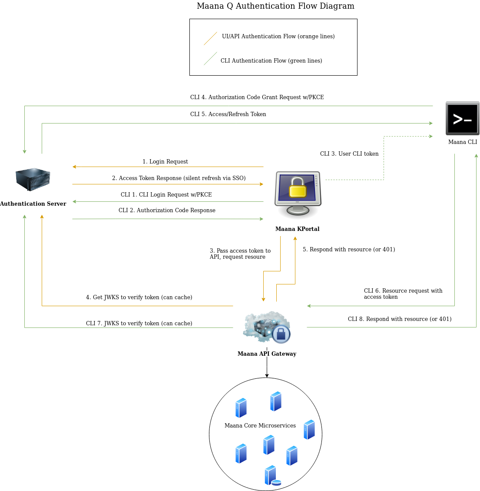
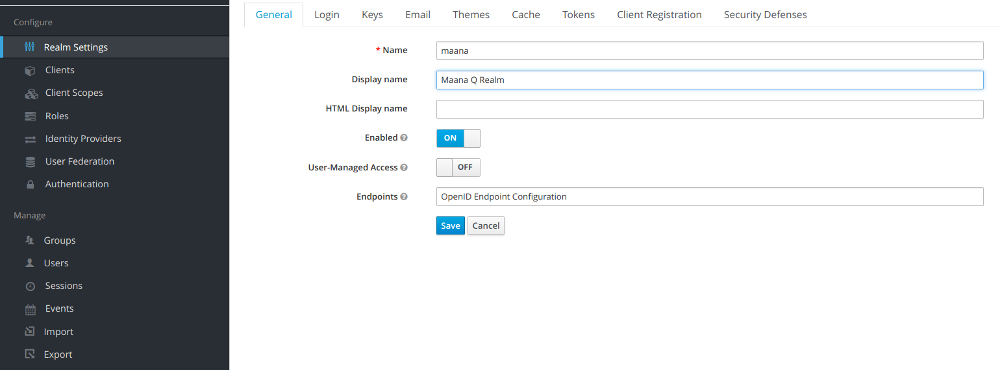
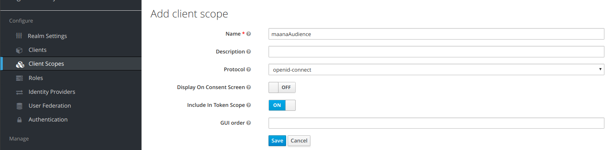
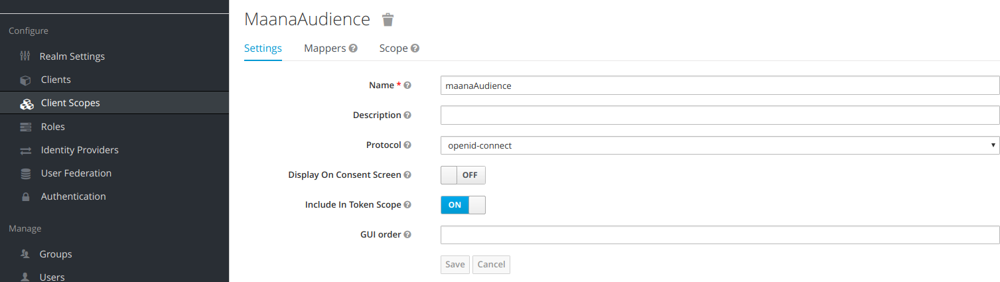
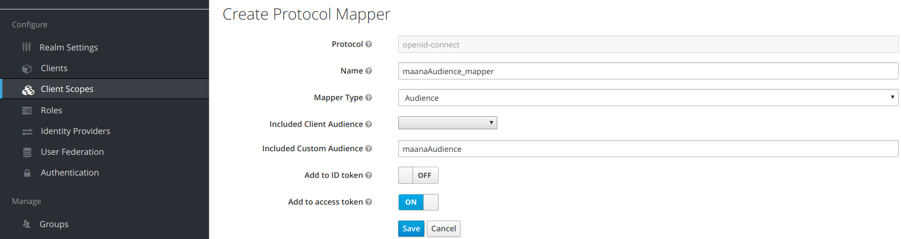
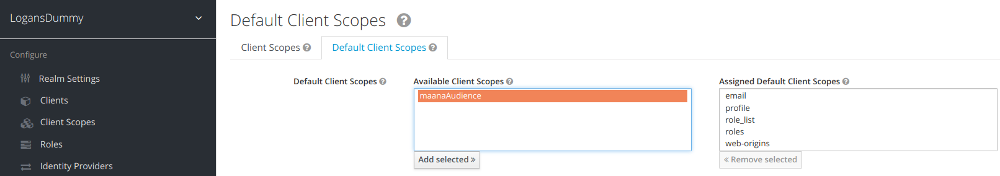
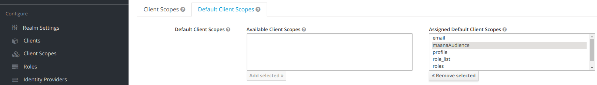
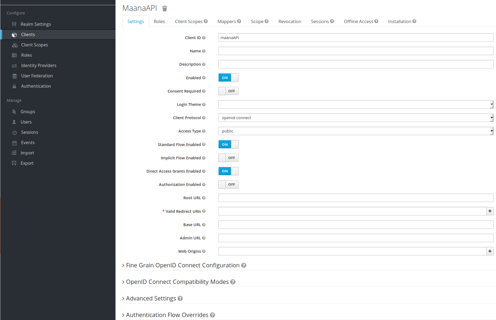

# Keycloak Auth Server Configuration


## Overview

This document describes the steps for correctly configuring a keycloak server to secure access to a Maana Q instance. 

If, at this point, you don't know what 'Keycloak' is, please learn about its features and limitations given your environmental constraints before you proceed. 

Keycloak Documentation[: https://www.keycloak.org/documentation.html](https://www.keycloak.org/documentation.html)

## Audience

This document assumes you are the admin for the keycloak server or Maana Q instance, and need to correctly configure keycloak-maana authentication.

## Prerequisites

The following prerequisites are assumed to have been fulfilled: 

1. Keycloak server is deployed in a manner allowing network access between the keycloak server and the Maana Q instance. Here is a link for getting started with keycloak: [https://www.keycloak.org/docs/latest/getting\_started/index.html](https://www.keycloak.org/docs/latest/getting_started/index.html)
2. Keycloak server is accessible via admin account, i.e. admin can access the keycloak admin console.
3. Admin has created a 'realm' for configuration.
4. IT/admin have an identity provider in-place to support user logins, be it via configuring the keycloak server leverage a third-party provider like Microsoft, or via the keycloak server directly.

## Definitions Relevant to this Guide

**Realm**: A _realm_ manages a set of users, credentials, roles, and groups. A user belongs to and logs into a _realm._ 

**Client**: Clients are entities that can request Keycloak to authenticate a user. Most often, clients are applications and services that want to use Keycloak to secure themselves and provide a single sign-on solution. Clients can also be entities that just want to request identity information or an access token so that they can securely invoke other services on the network that are secured by Keycloak.

**Authentication Flow**: Authentication flows are work flows a user must perform when interacting with certain aspects of the system.

**Audience**: A value that is used to enhance security by providing a limited 'scope'  or purpose for an access token. Audience must configured in the server instance 

**Issuer:** The domain which issues an access token. This value must be present in a JSON Web Token issued by keycloak, as it will be verified when attempting to access the Maana Q API. For a keycloak server, this will usually be formatted like so: 'https://\[your-keycloak-host\]/\[port\#\]/auth/realms/\[your-realm-name\].

**\*For more comprehensive definitions, see \[Keycloak Concepts\] in References section at the end of this guide.**

## Maana Q Authentication Flow Diagram

The following diagram illustrates how Maana Q communicates using your keycloak server:



## Configuring the Keycloak Server

Throughout this section, we note that particular Maana Q environment variables will need to be configured to match certain values you specify in your keycloak server configuration. It will be helpful to keep a list of these in a scratch pad--you can copy the list below and fill it in as you go through the guide \(this will be referred to as your 'environment variable list'\):

* REACT\_APP\_PORTAL\_AUTH\_DOMAIN= 
* REACT\_APP\_PORTAL\_AUTH\_IDENTIFIER=
* REACT\_APP\_PORTAL\_AUTH\_CLIENT\_ID= 
* REACT\_APP\_CLI\_AUTH\_CLIENT\_ID= 
* REACT\_APP\_CLI\_AUTH\_DOMAIN= 
* API\_AUTH\_DOMAIN= 
* API\_AUTH\_CLIENT\_ID= 
* API\_AUTH\_CLIENT\_IDENTIFIER=
* AUTH\_AUDIENCE= 
* AUTH\_JWKS\_URL= 
* AUTH\_ISSUER= 
* AUTH\_ALGORITHM=

 At the end of this guide, there is a table you can use to check your list and instructions for testing.

### Ensure Realm is Created and Accessible

Login to admin console. 

This is usually 'https://\[your-keycloak-host\]:\[port\#\]/auth/admin/\[your-realm-name\]/console'

If you can't login, check your deployment and that you have created a realm. \(See \[Keycloak Create Realm\] in references\).

Successful login should give you a page similar to this:



**DO NOT CHANGE YOUR REALM NAME. THIS MAY PUT YOUR REALM INTO AN UNRECOVERABLE STATE. THE KEYCLOAK ADMIN SHOULD CREATE A NEW REALM IF YOU NEED A DIFFERENT NAME.**

If you can access your realm, set **REACT\_APP\_PORTAL\_AUTH\_DOMAIN, API\_AUTH\_DOMAIN** and **REACT\_APP\_CLI\_AUTH\_DOMAIN** to 'https://\[your-keycloak-host\]:\[port\#\]' in your environment variable list.

Now, set **REACT\_APP\_PORTAL\_AUTH\_IDENTIFIER** and **API\_AUTH\_CLIENT\_IDENTIFIER** in your environment variable list with the value in the 'Name' box.

### Additional Realm Configuration

#### Login \(tab\)

This section is largely up to the server administrator. But it is recommended this is not adjusted until initial configuration is verified.

#### Themes \(tab\) 

Themes \(login skins\) are left default, and can be customized locally on the server. 

#### Tokens \(tab\) 

1. Set 'Default Signature Algorithm' to 'RS256'. **\*\*Set AUTH\_ALGORITHM with this value in your environment variable list.**
2. Set SSO Session Idle to 12 hours.
3. Set SSO Session Max to 1 day.
4. Set Client Login Timeout to 10 minutes.

\(Click 'Save'\)

See the **Adjusting Token Lifespans** section for greater discussion on token lifespans.

### Create Client Scope and Mapper

Setting a 'client scope' and paired 'mapper' is how to set the 'audience' \('aud'\) property of the JWT, which must be verified by Maana Q API.

1. Under the 'Configure' panel on the left-hand side, select client scopes
2. Create a new client scope
3. In 'Add Client Scope' page, set the name of the client scope: 
   1. In this example we use 'maanaAudience' as the name.
   2. Set 'Display On Consent Screen' to OFF.



4. Now click 'Save'. You should see your screen refresh, displaying the newly created scope:



5. Under the 'Mappers' tab, select 'Create'. 

6. In the 'Create Protocol Mapper' page, set the 'Name' to \[clientScopeName\]\_mapper. 

7. Set the 'Mapper Type' to 'Audience'. 

8. Specify the value of 'Included Custom Audience'. \*\***Set AUTH\_AUDIENCE with this value in your environment variable list.** \(Verify that 'Add to access token' is ON\):



9. Click 'Save'

10. Now, click again 'Client Scopes' under the 'Configure' panel on the left-hand side of the console.

11. Click 'Default Client Scopes'. You should see the client scope you just created under the 'Available Client Scopes':



12. Add your client to the 'Assigned Default Client Scopes':



This scope will now be added to any clients that are created and the 'Included Custom Audience' value you specified will be present in all client access tokens and verified by the Maana Q API.

Done. 

### Creating the Maana API client

This will create the client used to enforce access to the Maana Q intance's API gateway.

1. Click 'Clients' in the left-hand panel. In the 'Clients' window click 'Create'.
2. In the 'Add Client' window specify the 'Client ID' value. \*\***Set API\_AUTH\_CLIENT\_ID with this value in your environment variable list.** For this example we will use 'maanaAPI'.
3. Click 'Save' and you will see the window for the client:



4. Set 'Access Type' to 'confidential'

5. Set 'Valid Redirect URIs' to 'https://\[maana-q-host\]:\[maana-q-UI-port\]/callback' -- see also \[Keycloak Redirect URL Security\] in the references section.

6. Set 'Web Origins' to 'https://\[maana-q-host\]:\[maana-q-UI-port\]'

7. Click 'Save'

### Creating the Maana KPortal \(UI\) client

This will create the client used to enforce access to the Maana Q intance's UI \(and therefore the access tokens\).

1. Click 'Clients' in the left-hand panel. In the 'Clients' window click 'Create'.
2. In the 'Add Client' window specify the 'Client ID' value. \*\***Set REACT\_APP\_PORTAL\_AUTH\_CLIENT\_ID with this value in your environment variable list.** For this example we will use 'maanaKPortal'.
3. Click 'Save' and you will see the window for the client similar to last section.
4. Set 'Standard Flow Enabled'  OFF.
5. Set 'Implicit Flow Enabled' ON.
6. Set 'Valid Redirect URIs' to 'https://\[maana-q-host\]:\[maana-q-UI-port\]/callback' -- see also \[Keycloak Redirect URL Security\] in the references section.
7. Set 'Web Origins' to 'https://\[maana-q-host\]:\[maana-q-UI-port\]'
8. Click 'Save'

### Creating the Maana CLI client

1. Click 'Clients' in the left-hand panel. In the 'Clients' window click 'Create'.
2. In the 'Add Client' window specify the 'Client ID' value. \*\***Set REACT\_APP\_CLI\_AUTH\_CLIENT\_ID with this value in your environment variable list.** For this example we will use 'maanaCLI'.
3. Click 'Save' and you will see the window for the client similar to last section.
4. \('Standard Flow Enabled should be ON\)
5. \('Implicit Flow Enabled' should be OFF\). 
6. Set 'Valid Redirect URIs' to 'https://\[maana-q-host\]:\[maana-q-UI-port\]/user' -- see also \[Keycloak Redirect URL Security\] in the references section.
7. Set 'Web Origins' to 'https://\[maana-q-host\]:\[maana-q-UI-port\]'
8. Under 'Advanced Settings' \(usually at the bottom of the client page\) set the 'Access Token Lifespan' to 10 hours. See the **Adjusting Token Lifespans** section for greater discussion around this.
9. Click 'Save'

### Try your JWKS URL

Keycloak uses an OIDC certs endpoint to retrieve the JSON Webtoken Keys Set \(JWKS\). This URL must be provided to the Maana Q environment so tokens can be verified by the API. 

By default, the keycloak server should expose its JWKS on 'https://\[your-keycloak-host\]:\[port\#\]/auth/realms/\[your-realm-name\]/protocol/openid-connect/certs'

Ensure you can get your JWKS by hitting this endpoint on your keycloak server. It should respond with JSON output similar to this:

```
{
  "keys": [
    {
      "kid": "alksdfjasaW147ZInLbYBDsl6dYhY99_l3SP8",
      "kty": "RSA",
      "alg": "RS256",
      "use": "sig",
      "n": "iLGMGKp0zl_yK-Cly-1j6R7InJkVAG0ijEn8LPXPnhkoNjo0X32lIlh2feIXKa0OShj5g30jn7EMXhySpHNwgLtQ-Xa27NXAm7ixuZ6U2T-H0Onb0nQ4cFMyGUYpIIX8D7ktGefb_aiXkZ2hIYSP3u4GQHJ-whKpz5OXPZzxdfDq2m5uBfZGnHuQqVfGX44pMoZbwjCiQwHt7xf1xQCm4Ka-7IoVk9Bn6aDNI0CcqO3eoVaVlXN92NP772rbFobHWHwLLUebr8fYJHTxZSNhVHbJ3K3dQCsXRxF-iBu7KTcsKpAupwPLq-0FV5keyyNa_yhjVcMJBkmCw",
      "e": "AQAB"
    }
  ]
}
```

If this works, **set the AUTH\_JWKS\_URL with this URL in your environment variable list**.

If you receive a 404 or a response that doesn't include a key for an RS\*\*\* algorithm \(as shown above\) review and correct your realm 'Keys' configuration before you proceed.

### Verify Correctness Between Maana Q Environment and Keycloak Config 

Before attempting to deploy/finalize, please ensure the following configurations are correct:

| Maana Q Environment Variable | Keycloak Server Config Value |  |
| :--- | :--- | :--- |
| REACT\_APP\_PORTAL\_AUTH\_DOMAIN | 'https://\[your-keycloak-host\]:\[port\#\]' |  |
| REACT\_APP\_PORTAL\_AUTH\_IDENTIFIER | keycloak realm name |  |
| REACT\_APP\_PORTAL\_AUTH\_CLIENT\_ID | keycloak maana k-portal client name |  |
| REACT\_APP\_CLI\_AUTH\_CLIENT\_ID | keycloak maana CLI client name |  |
| REACT\_APP\_CLI\_AUTH\_DOMAIN | 'https://\[your-keycloak-host\]:\[port\#\]' |  |
| API\_AUTH\_DOMAIN | 'https://\[your-keycloak-host\]:\[port\#\]' |  |
| API\_AUTH\_CLIENT\_ID | keycloak maana API client name |  |
| API\_AUTH\_CLIENT\_IDENTIFIER | keycloak realm name |  |
| AUTH\_AUDIENCE | 'Included Custom Audience' value specified in the Protocol Mapper used for the Client Scope created and added to Assigned Default Client Scope.  |  |
| AUTH\_JWKS\_URL | 'https://\[your-keycloak-host\]:\[port\#\]/auth/realms/\[your-realm-name\]/protocol/openid-connect/certs' |  |
| AUTH\_ISSUER | 'https://\[your-keycloak-host\]:\[port\#\]/auth/realms/[\[](https://keycloakdev.knowledge.maana.io:8443/auth/realms/maanaDev)your-realm-name\]'  \*\*Please check to make sure this matches EXACTLY--an unnessesary trailing "/", for instance, will lead to a 401 for incorrect issuer. |  |
| AUTH\_ALGORITHM | Must be RSA-type, and value must match value in Realm&gt;Keys&gt; \[RS\*\*\*\]. For example 'RS256'. |  |
|  |  |  |

These values can now be used for environment configuration on the Maana Q instance.

\*\*Make sure the Maana Q environment has its AUTH\_PROVIDER evironment variable set as: **AUTH\_PROVIDER=keycloak**

## Testing Functionality Between Keycloak Server and Maana Q 

Open Devtools&gt;Network \(or similar tool\) to view network requests. If at anytime you encounter a problem \(or see a 401 in the network tab\), attempt to reproduce, isolate, and record the network requests/resonses associated with the problematic call/s.

1. Login to Maana K Portal, complete user authentication step \(i.e., login\). 
   1. NOTE: If you can login to Maana Q KPortal and are redriected to the page showing the organization catalog, work spaces, tutorials, etc. this means you were able to 1\) obtain a token from the keycloak server on behalf of the Maana KPortal client, and 2\) verify this via the Maana API using the public key from the JWKS endpoint.
2. Attempt creating a new workspace or opening an existing workspace.
3. In KPortal profile, select 'Get CLI Auth Token' \(login may be required\). Copy the CLI token for use in next step.
4. In Maana CLI, attempt 'msignin' via CLI.
5. If 'msignin' succeeds, attempt 'mrefreshauth'.

These steps should validate, generally, that the keycloak server is configured correctly.

## Adjusting Token Lifespans

Token lifespans can be configured on the realm- or the client-level. Although lifespans are within the purview of the keycloak admin, certain token lifespans will impact the usability of the Maana Q platform or CLI. 

Go to **Realm Settings &gt; Tokens** to see your realm token settings.

### Access Tokens

Specifically, the CLI token lifespan should be long enough to perform long-running CLI operations, as there is no auto-refresh functionality in the CLI \(refresh is command-based\). Recommendation is 10 hours. This can be configured under **Clients &gt; \[MaanaCLIClient\] &gt; Settings &gt; Advanced Settings &gt; Access Token Lifespan.** 

### Refresh Tokens

Go to **Realm Settings &gt; Tokens** to see your realm token settings.

Keycloak refresh token lifespans are controlled via two settings within the realm: **SSO Session Idle** and **SSO Session Max**. 

**SSO Session Idle** is a 'renewable' lifespan for refresh tokens. This correlates directly with refresh token expiration and applies to all clients. Access tokens may be refreshed within this time frame, and once refreshed, it restarts/clears the idle time. 

**SSO Session Max** is a 'hard' lifespan for a refresh token. Even if a refresh token is continuously 'bumping' its **SSO Session Idle**, it will expire once the **SSO Session Max** time has been reached. 

In short, **SSO Session Idle** dictates how frequently you must refresh, **SSO Session Max** dictates for how long you can continue to refresh.

\*\*In General, **SSO Session Idle** should be longer than CLI access token lifespan to support expected behavior in Maana CLI. **SSO Session Max** should be longer than both the **Access Token Lifespan** and the **SSO Session Idle**.

## Troubleshooting Authentication Issues

Incorrect configuration between Maana Q environment and Keycloak server is the most common source of problems. If you can localize an issue, check the environment/server configuration specific to this area.

If your environment/keycloak configuration appears correct, check settings in the realm and clients. 

### HTTP 401 Status in Maana Q instance logs

Record and read the log message. See if there are variances of 401 messages, they may include a message as to why the 401 occured.

If these errors are associated with the 'maana-gateway' service, they are related to not being able to verify the JWT passed to the API gateway. Three key pieces to this are 1\) ensuring the 'iss' \(issuer\) is correct in the JWT and matches the Maana Q environment AUTH\_ISSUER, 2\) ensuring the 'aud' \(audience\) is correct in the JWT and the Maana Q environment AUTH\_AUDIENCE, 3\) the JWKS\_URL is set and verified to return keys.

### Login to Maana Q Knowledge Portal is not redirecting \(or redirecting incorrectly\)

Symptoms: You are having trouble getting callbacks/redirects from the login screen to KPortal. In this case you may not see HTTP 401 status codes, and could see a 'hanging' redirect call, or blank screen.

Recommended Action: It can be useful set 'Valid Redirect URIs' and 'Web Origins' to \* \(allow all\) in the Maana KPortal client in the keycloak server. This will allow you to determine if your redirect URI or web origin settings are incorrect.  \*\*Do this only in a secured or dev environment, as this can comprise the security of the resources secured by the client[.](https://stackoverflow.com/questions/45352880/keycloak-invalid-parameter-redirect-uri?rq=1)

### Cannot Login to CLI

These are one-time use authorization codes, a new CLI token must be generated in the KPortal UI for each CLI login attempt. Consider generating another CLI login token in the UI.

Ensure you have actually copied the CLI auth token to the clip-board and are pasting it correctly into the CLI. Alternatively, you can paste the CLI token as a second argument to 'msignin' to see the token itself.

Record/Read error messages. 

Verify correct configuration of CLI client in keycloak server. 

## Configuring Identity Providers

If you plan on using a keycloak-supported identity provider such as Microsoft AD, please use the following link to learn about the process:

[https://www.keycloak.org/docs/latest/server\_admin/index.html\#\_identity\_broker](https://www.keycloak.org/docs/latest/server_admin/index.html#_identity_broker)  
  
**WARNING:** If you are using ONLY a third-party IDP for login and therefore have no use for the default username/password boxes displayed by Keycloak, it is recommended a custom 'theme' be used to remove access to these fields. This will also prevent a known issue with keycloak SSO logins where a user account can be put into a bad state by the following steps:

1. NEW user \(one with no user instance stored in the keycloak server\) attempts to login through the user/pass credentials boxes, at which point this fails \(because they were supposed to use SSO login button\).
2. Then in the SAME BROWSER TAB clicks the SSO signin
3. The result is that a user is added to the keycloak server user list with no identity provider link.

At this point the user account will be in a permanently broken state, requiring the admin to manually remove them from the user list so they can perform a clean login. 

## Themes/Skins

Appearance of keycloak login screens can be adjusted between default theme for keycloak and a custom theme uploaded to the keycloak server and displayed during user login. 

Here is an external resource for this:

[https://medium.com/@auscunningham/create-a-custom-theme-for-keycloak-8781207be604](https://medium.com/@auscunningham/create-a-custom-theme-for-keycloak-8781207be604)

## References

\[Keycloak\] Keycloak Documentation. [https://www.keycloak.org/documentation.html](https://www.keycloak.org/documentation.html)

\[Keycloak Concepts\] Keycloak Documentation. Core Concepts and Terms. [https://www.keycloak.org/docs/latest/server\_admin/index.html\#core-concepts-and-terms](https://www.keycloak.org/docs/latest/server_admin/index.html#core-concepts-and-terms)

\[Keycloak Create Ream\] Keycloak Documentation. Creating a Realm. [https://www.keycloak.org/docs/latest/getting\_started/index.html\#\_create-realm](https://www.keycloak.org/docs/latest/getting_started/index.html#_create-realm)

\[Keycloak Offline Access\] Keycloak Documentation. Offline Token Access. [https://www.keycloak.org/docs/latest/server\_admin/index.html\#\_offline-access](https://www.keycloak.org/docs/latest/server_admin/index.html#_offline-access)

\[Keycloak OIDC\] Keycloak Documentation. OIDC endpoints. [https://www.keycloak.org/docs/latest/server\_admin/index.html\#openid-connect-v1-0-identity-providers](https://www.keycloak.org/docs/latest/server_admin/index.html#openid-connect-v1-0-identity-providers)

\[Keycloak Redirect URL Security\] Keycloak Documentation. Unspecific Redirect URIs. [https://www.keycloak.org/docs/latest/server\_admin/index.html\#threat-model-mitigation](https://www.keycloak.org/docs/latest/server_admin/index.html#threat-model-mitigation) [https://www.keycloak.org/docs/latest/server\_admin/index.html\#\_unspecific-redirect-uris](https://www.keycloak.org/docs/latest/server_admin/index.html#_unspecific-redirect-uris)


---Prepared by Logan Gore, Maana.io, 5.20.19

