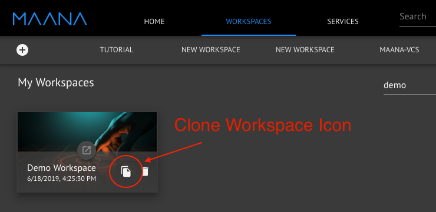

# What's New in 3.2.0

There are a number of new features and capabilities added to Maana Q 3.2.0.  Read more about those here:

## Support for Microsoft Edge

Microsoft's Edge browser is now officially supported!

## **Keycloak added as an Identity Provider**

[Keycloak](https://www.keycloak.org/) identity provider support has been added. This is in addition to continued support for Auth0. Keycloak can be used to provide an on-prem authentication solution for deployments.

## Workspace Cloning

Workspaces can now be cloned on the Workspaces page by clicking the clone workspace icon. 

Cloning a workspace creates a new workspace with copies of all of the Kinds, Functions, and Knowledge Graphs that were created in the original Workspace. References to these Kinds and Functions will be updated to refer to the copies created in the new Workspace.

References to Kinds and Functions imported from other services will have the references copied to the new Workspace. For example, if the Workspace being cloned has a Kind \(or Function\) that came from service "A", the new Workspace created will also have that same Kind \(or Function\) that came from service "A".


Instances of Kinds \(including Files and Documents created within the Workspace\) are not copied when cloning a Workspace. However, references to Instances will be copied. This means the new Workspace will refer to the same Instances that the original Workspace referred to.


Learn more:



## Workspace Templates

A Workspace template is basically a Workspace designed to be cloned. Any Workspace marked as a template will show up in the Workspace Templates section of the Workspaces page. See the Workspace Templates link below for more information on creating templates.

Learn more:



## Expanded support for changing Field types in Kind Schema 

Field types within a Kind used to be unable to be changed between incompatible types \(such as between Int and String\) once the Kind was saved.  Now, changing between incompatible types is allowed until there are Instances added to the Kind.

## Function Duplication now includes the Function's implementation!

Duplicating a Function will now duplicate its implementation in addition to the Function definition.


When duplicating a Function, the Functions that comprise the implementation of the duplicated Function will not be copied. Only references to the Functions are copied. The new Function's implementation will refer to the same Functions in the original implementation. 


## Assistants

A new type of service is available - an Assistant! An Assistant provides a custom UI to enhance the user experience within a Workspace.

Assistants can be added through the UI using the same process as adding a GraphQL service. Just choose "Assistant" as the type instead of "GraphQL".

See Service Assistants for more details on what an Assistant is:



## Deletion of Services and Workspaces

Services and Workspaces can now be deleted!


Beware of the implications of deleting a Workspace or service. All Kinds and Functions that were created within the workspace or service will be deleted as well. Any references to the deleted service, workspace service, Kinds, or Functions within other Workspaces, Functions, or elsewhere will no longer be valid.


Learn more:





## As fast as lightning

Performance improvements was a large focus of this release. Both the platform front-end and back-end have been revamped with massive performance improvements.

## A Whole new UI

The UI color scheme, fonts, icons, and layout have been meticulously scrutinized and updated to provide a consistent, professional, and intuitive user experience.

## System Information page

There is now a System Information page that contains versions of all deployed services within the platform.

Learn more:



## Improved metrics for monitoring

There are new dashboards for monitoring the health and performance of the platform.

Fixed an issue preventing loss of metrics in the event of a prometheus crash.

## Improved Search

Kinds, Functions, and services that are added through the UI are now immediately available within search results. No more waiting!

The categorization within search results has also been improved to provide a better user experience.

## Relaxed mandatory requirements in Function Composition

This means that in some cases, connections between mandatory and non-mandatory outputs and inputs within Functions are supported.

## Support for larger requests and responses in Functions

The size limit has been increased from 8MB to 500MB in CKG. This means Functions that accept or return large amounts of data now have an increased limit of 500MB.

## Add command to deploy a service to Kubernetes via the CLI

There is now an "mdeploy" command in the CLI that deploys a service to Kubernetes.

## Query Graph is now Deprecated

Existing Query Graphs will still be accessible however the ability to create new ones has been removed from the UI. Query Graphs will be removed in the future.

## Other UI Improvements

Other improvements made to the UI include:

* Categorization and alphabetical sorting of Kinds, Functions, Instances, Files, Documents, Knowledge Graphs, and Services within the Explorer and Inventory panels
* Auto-refresh of the browser when a new version of the platform is available
  * This ensures that the Portal UI is always up to date
* Updated Kind Data Preview panel with "infinite" scrolling capabilities
* Much faster to load Services page
* The Function Run pane \(in the Context panel\) now supports comma separate lists of scalars
* During type selection for Fields of Kinds and Functions, the Tab key \(in addition to Enter\) can now be pressed to accept the current selection
* Added support for making a Workspace "public"

## General Stability and Usability Improvements

As always, there is a whole slew of stability and usability improvements not captured above in this release!


A list of known 3.2.0 issues can be found [here](v3.1.5-known-issues/).


