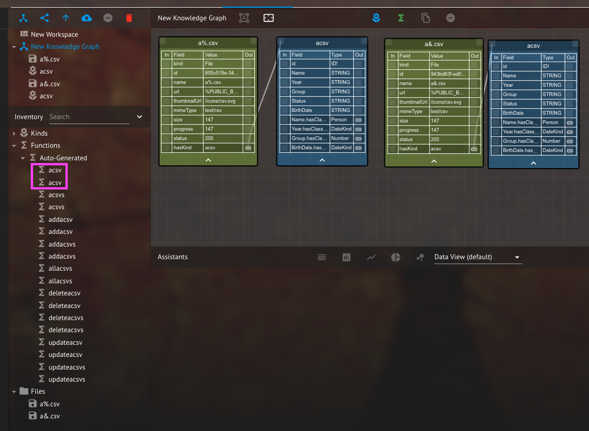

# RC2-009: Unable to distinguish auto-generated kinds and functions when 2 kinds have the same name



As a result of boilerplate auto-generation, one is unable to distinguish provenance of kinds and functions when 2 kinds have the same name. Function execution fails resulting in CKG errors.




1. On a WS, drag two csv files which will generate the same kind name \(after skipping all disallowed chars\) 
2. Refresh \(if needed\), then create kinds from the csv files 
3. Expand the "Auto-Generated" functions or kinds 

NOTE: For the actual kind nodes on KG, one can make a distinction when they are linked to the File kind



Distinct kinds and functions are created with qualifying provenance of distinction even if names are the same. In the least, disallow the ability to create duplicate kinds and functions with the same names. CKG executes functions successfully.



Inability to distinguish between auto generated kinds and functions with the same names. CKG function execution fails and throws errors. 



