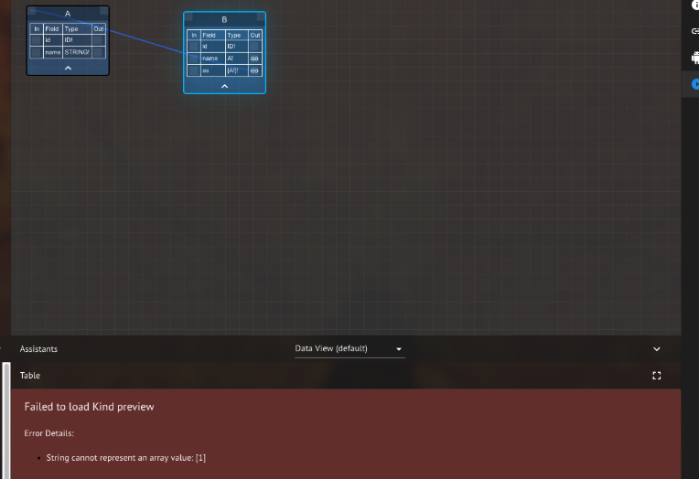

# RC2-010: Changing schema of populated kind leads to query exceptions



Editing the schema of a populated kind is not prevented. 

Changing the schema of populated kinds leads to query exceptions.

NOTE:

Changing kind B back to the original state re-enables successful query execution.




1. Create kinds via UI:

   a. type A{ id: ID! name: String! }

   b. type B{ id: ID! name: \[A\]! }

2. Add an instance to Kind A, then Kind B
3. Edit Kind B on knowledge graph to have:

   type B{ id: ID! name: STRING! as \[A!\]! }

4. Select kind A then select kind B again



Kind B is never allowed to be modified given the breaking incompatibility introduced.



Instance populated Kind edits are allowed, leading to thrown errors when trying to query the kind \(B\).



