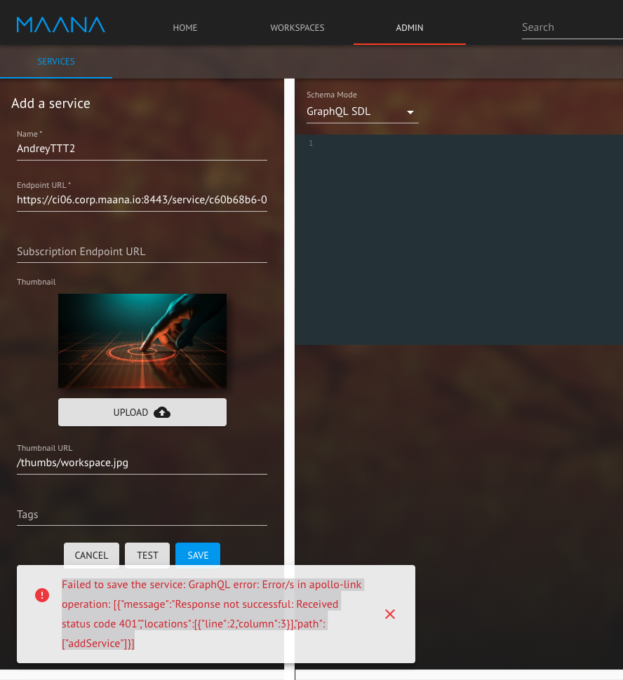

# RC2-012: Unable to save workspace as a service



An error is thrown when adding a service through the Admin Panel using the URL of a Workspace saved as a service. The service requires authentication which is not supported by the platform presently. As this is a service that was added manually, the platform treats it as external service and cannot optimize to bypass authentication.



`Workaround: In GraphQL, use the addService mutation on maana-portal (or maana-catalog) by including isManaged: true in the request.`



1. Create a Workspace
2. Open the info panel of Workspace and copy "Workspace Service URL" field
3. Open Admin Panel
4. Create a service based on the copied service URL



The service is successfully created.



Error is thrown as follows:

```text
Failed to save the service: GraphQL error: 
Error/s in apollo-link operation: 
[{"message":"Response not successful: 
Received status code 401","locations":[{"line":2,"column":3}],
"path":["addService"]}]
```



