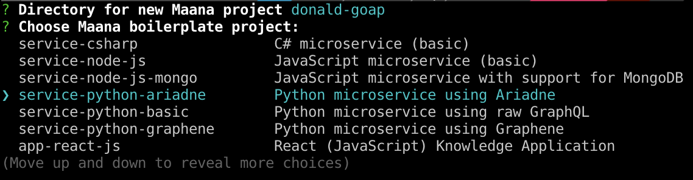
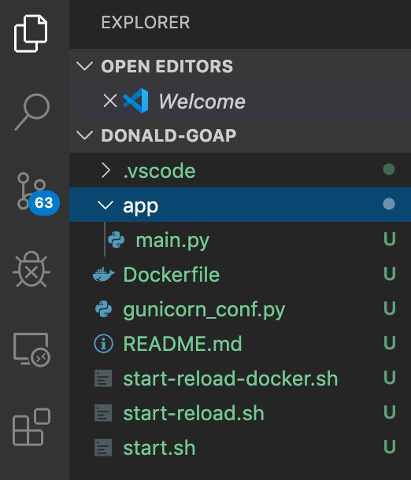
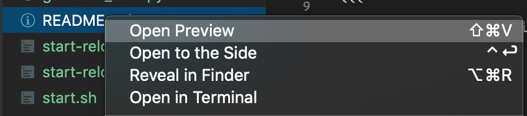
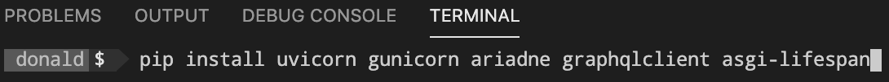
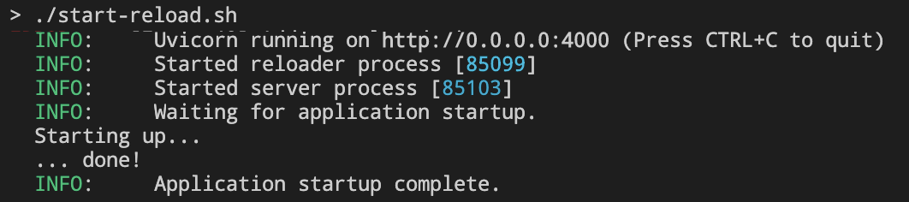
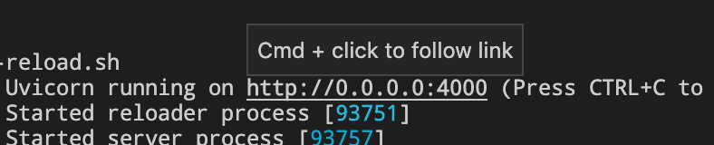

# Create a Microservice using the CLI

In this lesson, you will use the Maana Command Line Interface \(CLI\) to create scaffolding for a [Python-based Knowledge microservice](https://github.com/maana-io/q-template-service-python-ariadne).  You will then build and test it locally.

### Prerequisites

* Familiarity with the terminal \(e.g., Bash\)
* **Dependencies**:
  * VS Code
  * Maana CLI
  * Python 3.7 \(+PIP\)
  * Docker

## Step-by-Step Instructions

**Step 1.** Create your project scaffolding

Open your preferred terminal \(e.g., Bash\) and `cd` to your source code root folder, then run the CLI command `gql mcreate`: to create an [Ariadne](https://ariadnegraphql.org)-based Python 3,7 microservice:

* **Project**: `<your name>-goap`
* **Boilerplate**: `service-python-ariadne`



Note that this template \(along with the others\) are available via [Maana's GitHub.](https://github.com/maana-io/q-template-service-python-ariadne)

**Step 2.** Open the folder in VS Code



**Step 3.** Open the `README.md` file in Preview mode



**Step 4.** Install the Python dependencies

From within the VS Code terminal, copy the `PIP` commands from the `README`:




**Step 5.** Test the service

The project scaffolding works out-of-the-box as a sample.  We will replace the schema with our own soon, but let's ensure that it works as-is.

This project template includes several shell scripts that make it easy to work with.  They made need to be set as executable, if they aren't already.

**Step 5a.**  Ensure the scripts are executable by your account

You can check to see the attributes on the shell files as follows:

```bash
ls -la *.sh
-rw-rw-rw-  1 donald  staff   804 Dec  7 07:51 start-reload-docker.sh
-rw-rw-rw-  1 donald  staff   393 Dec  7 07:51 start-reload.sh
-rw-rw-rw-  1 donald  staff  1039 Dec  7 07:51 start.sh
```

Note the absence of the `x` attributes on the left.  These files are **not** executable.

To make them executable, use the following command and verify the results:

```bash
chmod +x *.sh
ls -la *.sh
-rwxrwxrwx  1 donald  staff   804 Dec  7 07:51 start-reload-docker.sh
-rwxrwxrwx  1 donald  staff   393 Dec  7 07:51 start-reload.sh
-rwxrwxrwx  1 donald  staff  1039 Dec  7 07:51 start.sh
```

Note the presence of the `x` attributes on the left.  These files **are** executable.

**Step 5b.** Run the start-reload.sh script



**Step 6.**  Test your new service

With the dependencies installed and the service running, we can test it right in the browser.

**Step 6a.** Open the endpoint URL

Each Knowledge-based microservice from a Maana template includes the GraphQL IDE.



**Step 6b.** Issue a GraphQL query

This Python template project includes the [GraphQL Playground IDE](https://github.com/prisma-labs/graphql-playground), which is a slightly nicer \(or at least darker\) version of the official [Graph_i_QL](https://github.com/graphql/graphiql).


**Step 7.** Familiarize yourself with the project structure

Now that we know it runs, let's take a moment to understand how it works.  Open the `app/main.py` file.

**Step 7a.**  Examine the imports


This Python 3.7 project uses the excellent [Ariadne](https://ariadnegraphql.org/) GraphQL library, which provides "schema-first" \(i.e., allows you to focus on GraphQL SDL\), and has support for the  standard [Asynchronous Server Gateway Interface \(ASGI\)](https://asgi.readthedocs.io/en/latest/) to provide high-performance HTTP serving.  [ASGI Lifespan](https://pypi.org/project/asgi-lifespan/) middleware has also been included for you to hook startup and shutdown events for special processing.

**Step 7b.**  Examine the GraphQL SDL

Ariadne's `gql` function provides schema validation.


**Step 7c.**  Examine the GraphQL resolvers

As you know, GraphQL requires _resolvers_ for at least the root `QueryType` object.  If your service exposes mutations, then it defines a `MutationType` object.


If your service provides resolvers for types you define, then they require their own `ObjectType` objects.


**Step 7d.** Examine creating the executable GraphQL schema

Include any Query, Mutation, or Object type definitions in the collection passed to the function.


**Step 7e.** Examine the application server lifecycle

Your GraphQL schema is served from an HTTP server provided by a Python application server.  The remaining code creates this server and provide hooks for the startup/shutdown lifecycle events.


**Challenge**: extend the schema by adding a mutation to add a new `Person`

This project is configured for hot-reloading, which means that anytime you change one of the project files, the running service will restart automatically.  This is extremely convenient when developing your service.  Try it now by changing your schema to include a mutation and corresponding resolver to add additional people instances to the in-memory collection.

## Conclusion

We covered the following concepts in this lesson:

* Using the Maana CLI to create the scaffolding for a Knowledge microservice
* Installing dependencies
* Running the microservice
* Testing the microservice
* The structure of the Ariadne-based Python template

