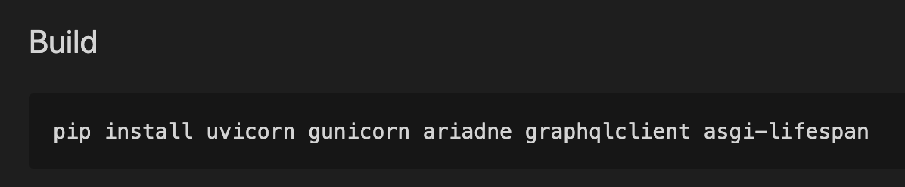

# Create a Microservice using the CLI

In this lesson, you will use the Maana Command Line Interface \(CLI\) to create scaffolding for a Python-based Knowledge microservice.  You will then build and test it locally.

### Prerequisites

* Familiarity with the terminal \(e.g., Bash\)
* **Dependencies**:
  * VS Code
  * Maana CLI
  * Python 3.7 \(+PIP\)
  * Docker

## Step-by-Step Instructions

**Step 1.** Create your project scaffolding

Open your preferred terminal \(e.g., Bash\) and `cd` to your source code root folder, then run the CLI command `gql mcreate`: to create an [Ariadne](https://ariadnegraphql.org)-based Python 3,7 microservice:

* **Project**: `<your name>-goap`
* **Boilerplate**: `service-python-ariadne`


**Step 2.** Open the folder in VS Code


**Step 3.** Open the `README.md` file in Preview mode


**Step 4.** Install the Python dependencies

From within the VS Code terminal, copy the `PIP` commands from the `README`:




**Step 5.** Test the service

The project scaffolding works out-of-the-box as a sample.  We will replace the schema with our own soon, but let's ensure that it works as-is.

This project template includes several shell scripts that make it easy to work with.  They made need to be set as executable, if they aren't already.

**Step 5a.**  Ensure the scripts are executable by your account

You can check to see the attributes on the shell files as follows:

```bash
ls -la *.sh
-rw-rw-rw-  1 donald  staff   804 Dec  7 07:51 start-reload-docker.sh
-rw-rw-rw-  1 donald  staff   393 Dec  7 07:51 start-reload.sh
-rw-rw-rw-  1 donald  staff  1039 Dec  7 07:51 start.sh
```

Note the absence of the `x` attributes on the left.  These files are **not** executable.

To make them executable, use the following command and verify the results:

```bash
chmod +x *.sh
ls -la *.sh
-rwxrwxrwx  1 donald  staff   804 Dec  7 07:51 start-reload-docker.sh
-rwxrwxrwx  1 donald  staff   393 Dec  7 07:51 start-reload.sh
-rwxrwxrwx  1 donald  staff  1039 Dec  7 07:51 start.sh
```

Note the presence of the `x` attributes on the left.  These files **are** executable.

**Step 5b.** Run the start-reload.sh script


