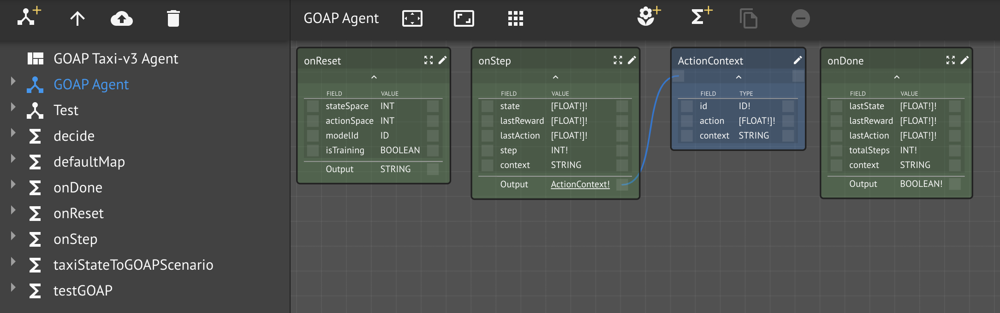
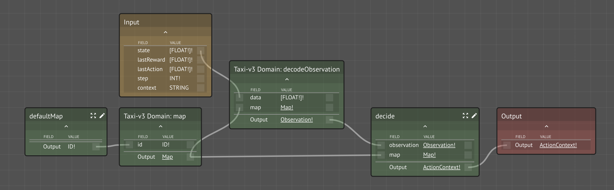

# Logical Inference and AI Planning with GOAP

## Overview

[Goal-Oriented Action Planning \(GOAP\)](http://alumni.media.mit.edu/~jorkin/goap.html) is a simple, but effective AI planner that uses logical chaining to achieve goals by performing a sequence of actions that change the world state \(from preconditions to postconditions\).  States are generally boolean conditions and actions can have associated costs and the planner will find the cheapest sequence.

For a nice explanation and example, see the blog post "[Goal Oriented Action Planning for a Smarter AI](https://gamedevelopment.tutsplus.com/tutorials/goal-oriented-action-planning-for-a-smarter-ai--cms-20793)."

## Introduction

The best way to introduce the GOAP concepts is by way of an example.  We will use the [OpenAI Gym simulation](../../../product-guide/reference-guide/ai-simulator-framework/simulators/openai-gym/) environment [Taxi-v3](../../../product-guide/reference-guide/ai-simulator-framework/simulators/openai-gym/taxi-v3-environment.md).  Please familiarize yourself with the scenario, concepts, and goals of this simulation task.


Goal-Oriented Action Planning is an artificial intelligence system for agents that allows them to plan a sequence of actions to satisfy a particular goal. The particular sequence of actions depends not only on the goal but also on the current state of the world and the agent. This means that if the same goal is supplied for different agents or world states, you can get a completely different sequence of actions., which makes the AI more dynamic and realistic.

We have an agent, a **taxi,** that moves around the city \(N,S,E,W\) and picks-up and drops-off passengers.  We can model this situation as the following boolean \(true/false\) states:

* `AT_PICKUP_LOCATION`
* `AT_DROPOFF_LOCATION`
* `IS_WITH_PASSENGER`
* `IS_DONE`

The _world_, at any given time, will be represented as the set of states along with their values.

The taxi is capable of taking the following actions:

* `MOVE_TO_PICKUP_LOCATION`
* `MOVE_TO_DROPOFF_LOCATION`
* `PICKUP`
* `DROPOFF`

Each action has a **precondition** and a **postcondition** of the world.  For example, it is a precondition of PICKUP that the taxi is `AT_PICKUP_LOCATION=T` and `IS_WITH_PASSENGER=F`, while the postcondition \(i.e., after having performed the action\) will be `IS_WITH_PASSENGER=T`. 

When we give the _goal_ as `IS_DONE=T`, the GOAP planner will consider the sequence of actions to perform in order to transform the world state from its current condition into the desired condition.  For example, if the taxi were not at the pickup location and not with the passenger, then the GOAP planner would suggest:

1. `MOVE_TO_PICKUP_LOCATION`
2. `PICKUP`
3. `MOVE_TO_DROPOFF_LOCATION`
4. `DROPOFF`

In more realistic examples, many different agents might be acting with possibly conflicting goals, each action might have an associated cost, making it possible to find the least cost path sequence.

Let's implement this scenario using the Maana Q AI Simulator framework.

## Setup

You will need several things for this tutorial:

### Install the AI Simulator Framework

* Please take a few minutes to familiarize yourself with the purpose and operation of the [Maana Q AI Simulator framework](../../../product-guide/reference-guide/ai-simulator-framework/).
* Follow the installation instructions and confirm that you can login to the Q instance.

### Clone the GOAP Agent Workspace

* Login to Q and find and clone the "**GOAP Taxi-v3 Agent**" workspace.
* Rename it to "&lt;your name&gt; GOAP Taxi-v3 Agent".

### Test your agent

* Copy the workspace's **service id** from the Workspace -&gt; Context Panel -&gt; Info.
* Paste it into the **Agent URI** field of Simulator -&gt; OpenAI Gym -&gt; Control panel.
* Press the "Run" button and confirm the successful operation.

## Services

### External: maana-ai-goap

A standard Maana Q service provides a GOAP-based AI Planner written in Python, [maana-ai-goap](https://github.com/maana-io/maana-ai-goap).  This is a generic planning service exposing the following core schema:

```javascript
type State {
  id: ID!
  val: Boolean!
}
type Action {
  id: ID!
  pre: [State!]!
  post: [State!]!
}
type Scenario {
  id: ID!
  goal: [State!]!
  state: [State!]!
  actions: [Action!]!
}
type Query {
  plan(scenario: ScenarioInput!): [ID!]!
}
```

As this is a generic algorithm usable by any domain, it is our responsibility to map our taxi environment to this model in order to use its planning functionality.  This is a common pattern, [Model Mapping](../../basics/design-patterns/model-mapping.md), found in Q solutions.

### Workspace: GOAP Taxi-v3 Agent

As with any Gym environment, the top-level Knowledge Graph has the familiar agent protocol:



#### onReset

At the beginning of a simulation run, the simulator host will ask the simulator to reset itself for a new simulation.  In turn, the simulator will ask its agent\(s\) to prepare themselves for a new simulation, including some configuration information:

* `stateSpace`: how many possible states \(500\)
* `actionSpace`: how many possible actions \(6\)
* `modelId`: the ID of the model \(if any\) to create/use
* `isTraining`: indicates whether the simulation is training or performance

This function is expected to return optional state it wishes to be returned to it during the simulation run, i.e., `context`.

What state do we wish to maintain?  Do we have initial conditions that need to be established?  Do we know enough about our solution to answer these questions?

#### onStep

This is really the heart of the agent.  It takes the current observation:

* `state`: corresponds to one of the 500 possible states the taxi environment can be in
* `lastReward`: one of -1, -10, or 20 based on the appropriateness of the last action in the world in its state
* `lastAction`: what action was previously taken by the agent
* `step`: current step within the current episode
* `context`: our internal state \(if any\) 

It is expected to return the `Action` the simulator should perform along with any updated internal state, `context`, the agent needs in subsequent calls.



The first thing to notice is our reliance on the Taxi-v3 Domain service.

#### onDone

#### taxiStateToGOAPScenario

```javascript
  const { taxiState } = input
  const { isAtPickupLocation, isAtDropoffLocation, isWithPassenger } = taxiState
  
  return {
    id: 'taxi-v3',
    goal: [
      {
        id: 'IS_DONE',
        val: true
      }
    ],
    state: [
      {
        id: 'AT_PICKUP_LOCATION',
        val: isAtPickupLocation
      },
      {
        id: 'AT_DROPOFF_LOCATION',
        val: isAtDropoffLocation
      },
      {
        id: 'WITH_PASSENGER',
        val: isWithPassenger
      },
      {
        id: 'IS_DONE',
        val: false
      }
    ],
    actions: [
      {
        id: 'MOVE_TO_PICKUP_LOCATION',
        pre: [
          {
            id: 'AT_PICKUP_LOCATION',
            val: false
          },
          {
            id: 'WITH_PASSENGER',
            val: false
          }
        ],
        post: [
          {
            id: 'AT_PICKUP_LOCATION',
            val: true
          }
        ]
      },
      {
        id: 'PICKUP',
        pre: [
          {
            id: 'AT_PICKUP_LOCATION',
            val: true
          },
          {
            id: 'WITH_PASSENGER',
            val: false
          }
        ],
        post: [
          {
            id: 'AT_PICKUP_LOCATION',
            val: false
          },
          {
            id: 'WITH_PASSENGER',
            val: true
          }
        ]
      },
      {
        id: 'MOVE_TO_DROPOFF_LOCATION',
        pre: [
          {
            id: 'AT_DROPOFF_LOCATION',
            val: false
          },
          {
            id: 'WITH_PASSENGER',
            val: true
          }
        ],
        post: [
          {
            id: 'AT_DROPOFF_LOCATION',
            val: true
          }
        ]
      },
      {
        id: 'DROPOFF',
        pre: [
          {
            id: 'AT_DROPOFF_LOCATION',
            val: true
          },
          {
            id: 'WITH_PASSENGER',
            val: true
          }
        ],
        post: [
          {
            id: 'IS_DONE',
            val: true
          }
        ]
      }
    ]
  }


```

