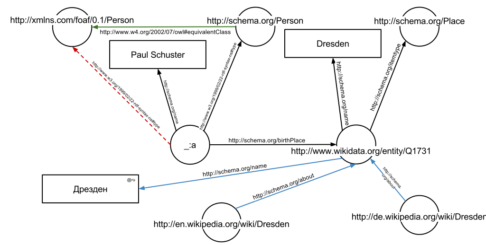

# Logical Inference and Semantic Graphs

A semantic graph is a graph \(node and edges\) whose nodes represent **entities** and **values** and whose edges represent **predicates**  and **relationships**.  Inference in a semantic graph essentially involves discovering new relationships.

For example, if we say that Bob is the child of Mary and Mary is the child of Sonja, then, with just this information, we can infer that Bob is the grandchild of Sonja.  And these relationships can be expressed in the opposite direction: parent instead of child, grandparent instead of grandchild.

So, inference is fundamentally about saying as little and then deriving as much as possible through various _rules_.

## Introduction

Within the field of Computer Science, the Semantic Web is a well-researched set of technologies, such as Resource Description Framework \(RDF\) and the Web Ontology Language \(OWL\), that aims to enable machines to more meaningfully communicate at a _semantic_ level \(i.e., meaning\).  Standardizing on _vocabularies_, _taxonomies_, and _ontologies_ \(all various means of symbolically encoding a domain\), are intended to provide a coordinate way for data to be encoded, represented, queried, shared, and reasoned about in consistent and deterministic ways.

In this section, we illustrate how the various concepts of both Semantic Graphs and particularly inference are performed in Q. 

## Setup

