# Probabilistic Inference and Causal Networks

## Overview

Bayesian networks \(belief networks, decision networks\) are compact graphical representations of the observables of a system and the probabilistic relationships between them. Bayesian networks, and can be used to answer stochastic questions about unobserved variables \( e.g. Given that it is January, and without knowledge of whether the sprinklers ran or if it rained, what is the likelihood that the grass is wet?" \).

Inference over Bayesian networks can be used to simulate more realistic random behavior by conditionally predicting the action to take in response to observed variables. This can be coupled with either batch or inline machine learning to provide predictions that improve over time.

For a nice introduction to Bayesian networks, check out this blog post [https://www.probabilisticworld.com/bayesian-belief-networks-part-1/](https://www.probabilisticworld.com/bayesian-belief-networks-part-1/)

## Introduction

Bayesian networks are a compact graphical representation of the probabilistic relationship between variables. Bayesian networks can be visualized as a directed graph where each node is a probability density function for a random variable. Each arrow of the network represents a conditional dependency of the probability of the variable at the head of the arrow on the value of the variable at the tail of the arrow.

In this tutorial, we will use the [OpenAI Gym simulation](https://maana.gitbook.io/q/v/3.2.1/product-guide/reference-guide/ai-simulator-framework/simulators/openai-gym) environment [Taxi-v3](https://maana.gitbook.io/q/v/3.2.1/product-guide/reference-guide/ai-simulator-framework/simulators/openai-gym/taxi-v3-environment) to train a Bayesian network model and use it to answer stochastic problem questions.


Bayesian networks are an artificial intelligence tool that are used visualize the conditional probabilities between observables of a system. As a taxicab driver in Gridland, our world has three observables: `LOCATION`, `HAS_PASSENGER`, and `ACTION`.

The `HAS_PASSENGER` observable can take on two values, `HAS_PASSENGER=T` and `HAS_PASSENGER=F` which denote whether there is a passenger \(presumably the correct one\) in the cab.

When we observe the taxi's `LOCATION` it can have three possible values: `AT_PICKUP_LOCATION`, `AT_DROPOFF_LOCATION`, `AT_OTHER_LOCATION`

The `ACTION` observable represents an action that the cabby took, and can be one of the following: `MOVE_TO_PICKUP`, `MOVE_TO_DROPOFF`, `DROPOFF_PASSENGER` and `PICKUP_PASSENGER`.

We will model each of these observables as a discrete probability distribution with the initial Bayesian network structure below.

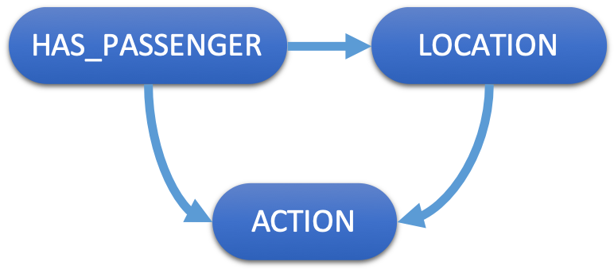

This means that the observed `LOCATIONS` are conditional upon the values of `HAS_PASSENGER`, and the observed `ACTION`are conditional upon both the other observables.     
  
At each step of the simulation, we will be provided with a single observation for the `LOCATION` and `HAS_PASSENGER` variables and predict the conditional probability distribution for `ACTION`.   We will then use that conditional probability distribution to generate a random action for the agent to take.

## Setup

You will need several things for this tutorial:

### Install the AI Simulator Framework

* Please take a few minutes to familiarize yourself with the purpose and operation of the [Maana Q AI Simulator framework](../../../product-guide/reference-guide/ai-simulator-framework/).
* Follow the installation instructions and confirm that you can login to the Q instance.

### Clone the Bayes Agent Workspace

* Login to Q and find and clone the "**Bayes Taxi-v3 Agent**" workspace.
* Rename it to "&lt;your name&gt; Bayes Taxi-v3 Agent".

### Test your Agent

* Copy the workspace's **service id** from the Workspace -&gt; Context Panel -&gt; Info.
* Paste it into the **Agent URI** field of Simulator -&gt; OpenAI Gym -&gt; Control panel.
* Press the "Run" button and confirm the successful operation.

## Services

### External: maana-ai-bayes-net

A standard Maana Q service for performing inference \(predictions\) over Bayesian networks.   This is a generic service that could be used for multiple stochastic modeling applications, and across any domain.    This service exposes the following core schema:

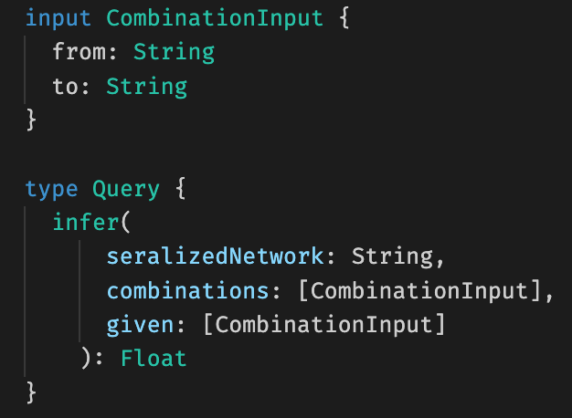

Where the user must provide a network in the form of a serialized JSON object with the following lexical structure:

```text
network := { nodes }
nodes := node | node "," nodes
node := observablename ": {" idspec "," statespec "," parentspec "," cptspec "}"
idspec := "id :" identifier
statespec := "[" possiblevalue "]"
parentspec := "parents: [" parentidentifier* "]"
cpt := "cpt : [" cptrows "]"
cptrows := cptrow | cptrow "," cptrows
cptrow := [ whenspec, "," ]  thenspec
whenspec := "when : {" whenvalue* "}"
thenspec := "then : {" thenvalues "}"
whenvalue := parentidentifier ":" possiblevalue
thenvalues := thenvalue | thenvalue "," thenvalues
thenvalue := possiblevalue ":" float  
```

The CombinationInput type is used to represent both a conditional/constraint \(givens\) and unknown values for which the probabilities should be predicted.    Future versions of the maana-ai-bayes-net service will feature improvements for constructing, inspecting and inferring values from Bayes network structures.

### Workspace: GOAP Taxi-v3 Agent

A Maana service which utilizes Goal-Oriented Action Planning to simulate the behavior of a taxi in the  [Taxi-v3](https://maana.gitbook.io/q/v/3.2.1/product-guide/reference-guide/ai-simulator-framework/simulators/openai-gym/taxi-v3-environment) environment.   We will be using this service to produce evidence vectors in the learning portion of our tutorial.

### Workspace: Bayes Taxi-v3 Agent

The Bayes Taxi-v3 Agent is a template for creating your own Bayesian network agent for the  [Taxi-v3](https://maana.gitbook.io/q/v/3.2.1/product-guide/reference-guide/ai-simulator-framework/simulators/openai-gym/taxi-v3-environment) environment.   As with any Gym agent, the top-level KnowledgeGraph has has the familiar agent protocol.

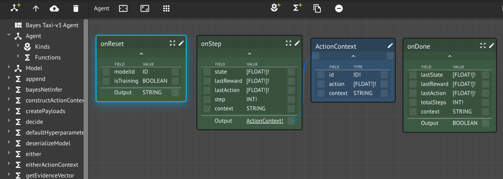

#### onReset

At the beginning of a simulation run, the simulator host will ask the simulator to reset itself for a new simulation.  In turn, the simulator will ask its agent\(s\) to prepare themselves for a new simulation, including some configuration information:

* `modelId`: the ID of the model \(if any\) to create/use
* `isTraining`: indicates whether the simulation is training or performance

This function is expected to return optional state it wishes to be returned to it during the simulation run, i.e., `context`.   For the Bayes Taxi Agent, we return a serialized `Model`, which includes the number of steps taken, and the serialized Bayesian network.   The function `makeModel` can be used to create a new instance of a model kind.  The `deserializeModel` and `serializeModel` functions provide type safe methods for parsing and string encoding model instances.


#### onStep

This function is the brains of our agent.   It takes the current observations of 

* `state`: corresponds to one of the 500 possible states in the [Taxi-v3](https://maana.gitbook.io/q/v/3.2.1/product-guide/reference-guide/ai-simulator-framework/simulators/openai-gym/taxi-v3-environment) environment,
* `context`: our bayesian network

and returns a random `Action` that the simulator should perform.   The `decide` function contains makes this decision by calling the `maana-ai-bayes-net` service with the current observation and then choosing at random from the returned conditional probability distribution.     
  
The `onStep` function also implements online learning based on Bayesian updates.   At each step, it observes the behavior of an exemplar.   Ideally this would be one or more human taxi cab drivers.   For this tutorial we utilize the GOAP taxi-v3 service to provide exemplary behavior.    The logic for performing the parameter updates is contained in the `learn` function.  
  
Upon completion, the `onStep` function also returns the posterior Bayesian network, which reflects the learnings from the current step.    The `lastReward` and `lastAction` inputs are not used this agent.

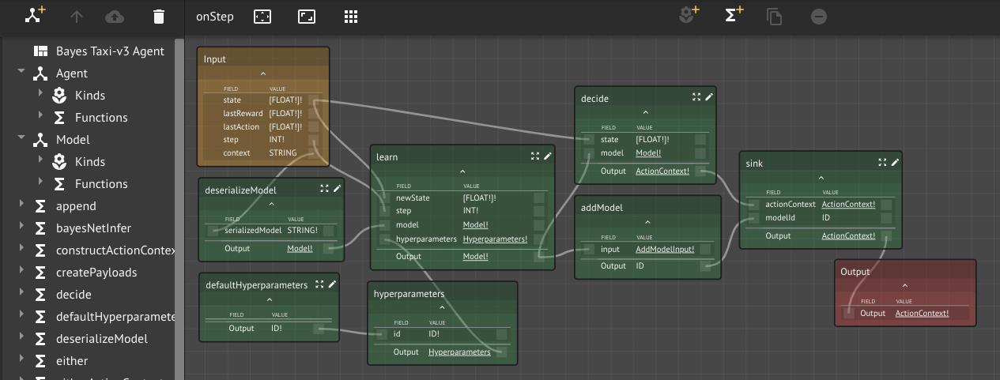

#### onDone

The `onDone` can be used to perform actions each time that the agent completes a simulation.   This might be used, for example, to store performance metrics.   The Bayes taxi-v3 Agent template does not make use of this capability. 

## Exercises

### EXERCISE 1: Creating A Prior Network

The probability density functions associated with the Bayesian network control how often the simulation will predict each action in response to observed conditions.   The `makeModel` function is used to create the Bayesian network used by the Agent.     Although the agent is capable of learning the correct \(conditional\) probability density functions for each observable, using some common sense may help it get converge faster.

The default implementation of the `makeModel` function encodes the following probability density functions:

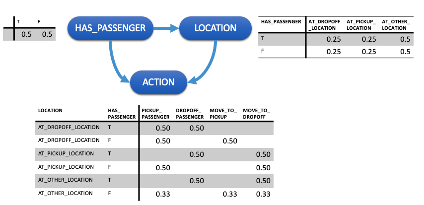

Although for some observables these seem reasonable \( 50% of the time the taxi has a passenger \), others of these assumptions seem dubious \(e.g. 25% of the time the taxi will be at the drop-off location when they have no passengers, etc.\).

Take a moment to decide on what more reasonable values for the \(conditional\) probabilities should be.   Once you have decided, you will need to modify the `makeModel` function in your workspace.   This function has been implemented in javascript using the Maana lambda service.        
  
Search for the `makeModel` function in the inventory panel and then select the "Maana Lambda Assistant" from the dropdown menu in the assistant panel.   

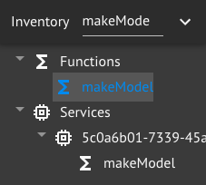

Once you have selected the Maana Lambda assistant, you should see the code below:

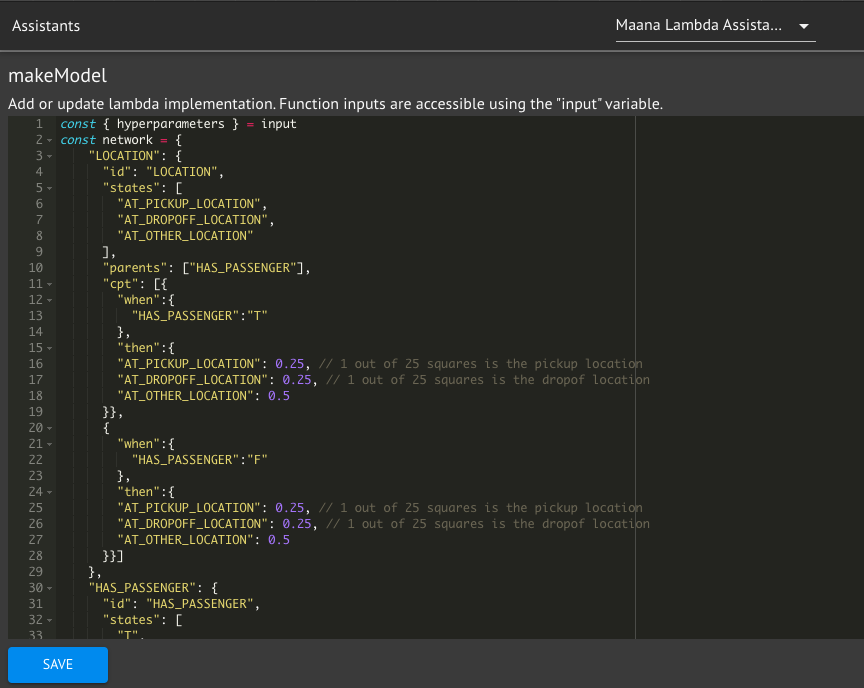

Edit the `network` variable to encode your probability density functions.    If you are having difficulty choosing values, there are some helpful hints in the code.   When you are done making your changes, press the save button.  


You can test your work by running the `makeModel` function in the context panel.  


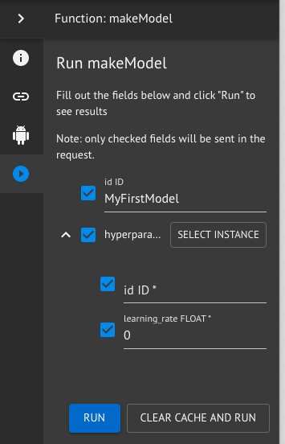

If you were successful, you should be able to view your results with graphQL output in the `Function Results` assistant in the assistants panel.    Your results should look something like this:

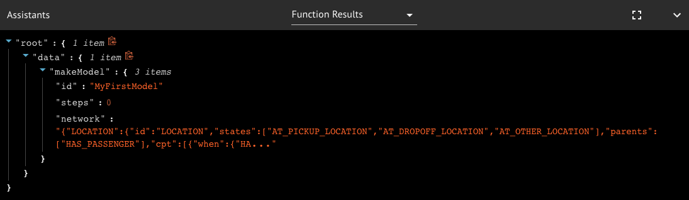

### EXERCISE 2: Make A Prediction with your network

In this exercise we will answer the problem question:

> Given that a passenger is in the cab, how likely are they to be dropped off this step?

We will do this using function composition, to take the output from the `makeModel` function and send it to the the `maana-ai-bayes-net` service to perform the prediction.   To make the function more useful, we will expose the `given` and `combinations` arguments from the `infer` function so that we can answer additional \(conditional\) probability questions from our network.

We will start by creating a new Knowledge Graph called `Excercise-2` and creating a new function `excercise2` on it.    This `exercise2` function should have the type indicated below:

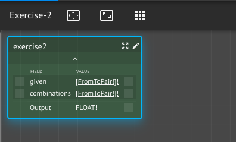

Open the Function Graph for `excersise2`and drag the following functions from the inventory onto it:

* `defaultHyperparameters` this is a lambda that returns the identifier for the default hyperparameter instance.   It has been implemented using the Maana lambda assistant and returns the value "0".
* `hyperparameters` is an auto-generated function that given a identifier, reads an instance of hyperparameters from KindDB.
* `makeModel` creates a new model instance for use with the simulator.   We modified it in exercise 1.
* `maana-ai-bayes-net:infer` This is the function the performs inference over a Bayesian network.

Also create a new function on the canvas called `projectSerializedNetwork`.   The purpose of this function is to return the network field of a model kind.   Connect the inputs and outputs as shown below:

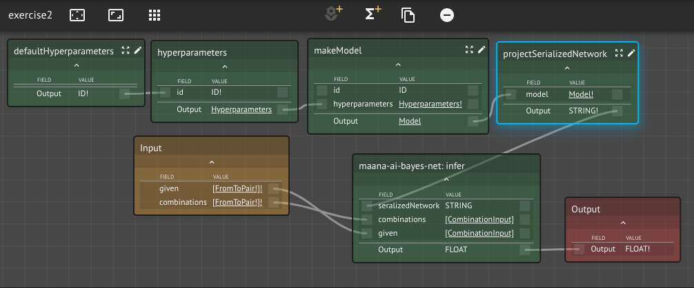

Before we can run our function, we need to create an implementation for the `projectSerializedNetwork` function using the Maana Lambda assistant.   Select the Maana Lambda Assistant from the dropdown in the Assistants panel, and then select the `projectSerializedNetwork`function.  Then use the Lambda assistant to implement the projection function and then press save.

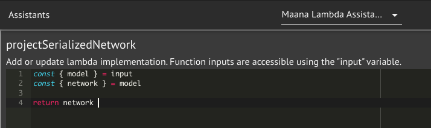

When you are done saving, you can run `exercise2` from the context panel.   You can answer the problem question by providing the following inputs:

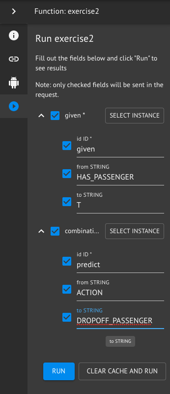

When your function is done executing you should be able to view your results in the `Function Results` assistant of the Assistant panel.  Your results may differ from those shown below depending upon the values you chose for your probability density functions in exercise 1.

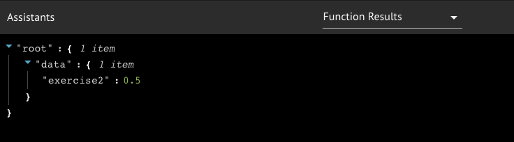

### EXERCISE 3: Simulation

As we saw in exercise 2,  provided any set of givens \(conditions\), we can use inference over our Bayesian network to compute the conditional probabilities of any of the other observables.   Using this knowledge, we our inference engine to predict the likelihood of each possible `Action` given the observed `LOCATION` and `HAS_PASSENGER` values.     
  
The implementation of the `onStep` function uses exactly this technique to construct the conditional probability density function for a the current state, and then randomly selects a `ACTION` from that distribution.    This allows us to easily deploy our Bayesian network as a simulation using the AI Simulator Framework.  
  
In this exercise we will Simulate your taxi agent using the AI Simulator framework.

Begin by copying your workspace's **service id** from the Workspace -&gt; context panel -&gt; info.  Then open the Maana AI Simulator framework in your browser.   Paste the copied service id into the `agent URI` field of the Simulator -&gt; OpenAI Gym -&gt; Control Panel.  
  
When you are ready, press the run button to begin the simulation.   You should see something like the animation below:  
  
  



### EXERCISE 4: Learning 

Machine learning can be applied to Bayesian networks both to discover the structure of the directed graph and for learning the optimal values of \(conditional\) probability density functions to describe the observed behavior.    In this example we will use online supervised learning to continuously improve the predictions from our network.     
  
`Online machine learning` is a ML technique which can be used when data arrives in incrementally over time,  and it is infeasible to obtain the entire dataset.    As each observation arrives, it is used to update the previous best model.    This differs from batch learning techniques which generate the best model by training on the entire data set all at once.      
  
What we are interested in is an update rule that we can apply to the network as our agents explore the state-action space. There is good research and information on this problem in "[Update rules for parameter estimation in Bayesian networks](https://arxiv.org/pdf/1302.1519.pdf)" and "[Parameter Estimation in Bayesian Networks](https://courses.cs.ut.ee/2009/bayesian-networks/orasmaa-liin-chapter-6.pdf)." The From \[Bauer, et al. 1997\], the general update rule for the parameters is:

$$
\theta^T_{ijk} = \left\{ \begin{array}{ll} \theta_{ijk}^{T-1} + \eta\left( \frac{P^{T-1}(z_i^k,p_i^j|y_T)}{P^{T-1}(p_i^j|y_T)} -  \theta_{ijk}^{T-1}\right) & when\ P^{T-1}(p_i^j|y_T) \neq 0\\ \theta_{ijk}^{T-1} \end{array}\right.
$$

where $$y_T$$is the evidence vector, $$p_i$$denotes the set of parents of i, $$p_i^j$$ to be a configuration values for the parent observables, and $$z_i^k$$is one of the values for the observable.    $$\theta_{ijk}$$ is an entry in a cumulative probability table for observable i having value k and parent values j.      


The parameter $$\eta$$is the learning rate and controls how much the new evidence impacts the posterior distributions.  It needs to be kept small needs to ensure convergence, and will diverge when it is greater than 1

Due the specifics of our problem, each new evidence vector provides us with an observation of all observables \( e.g. the state and the action taken\). The update rule in this case becomes very simple, with the above equation reducing to:

$$
\theta^T_{ijk} = \left\{ \begin{array}{ll} \theta_{ijk}^{T-1} + \eta\left( 1 -  \theta_{ijk}^{T-1}\right) & when\ z^k_i \in y_T\ and\ p_i^j \subseteq y_T\\
\theta_{ijk}^{T-1}\left(1-\eta\right) & when\ p_i^j\subseteq y_T\\
\theta_{ijk}^{T-1}
 \end{array}\right.
$$

These equations are simple enough to implement in a lambda. and have been implemented in the `learn` function of the Bayes Taxi v3 template.   

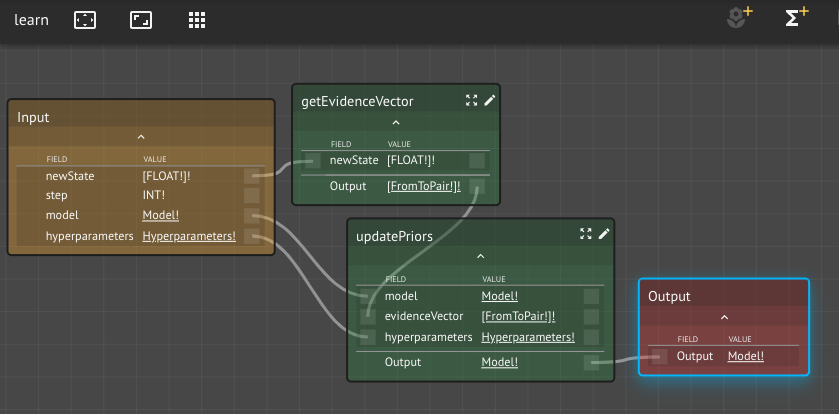

The learn function is the composite of the `updatePriors` function as defined above, and the `getEvidenceVector` function.   In real life, evidence would be collected through observation of the actual system;   for this tutorial we are using the GOAP simulator as a surrogate  exemplar.  
  
Parameter updating is applied by default with a learning rate of $$\eta = 0.01$$.      
  
Take a moment to use the function that you created in example 2 to inspect the results of parameter updating.   For comparison, here are the results of applying parameter updates to the default network after 10 and 100 episodes.  
  


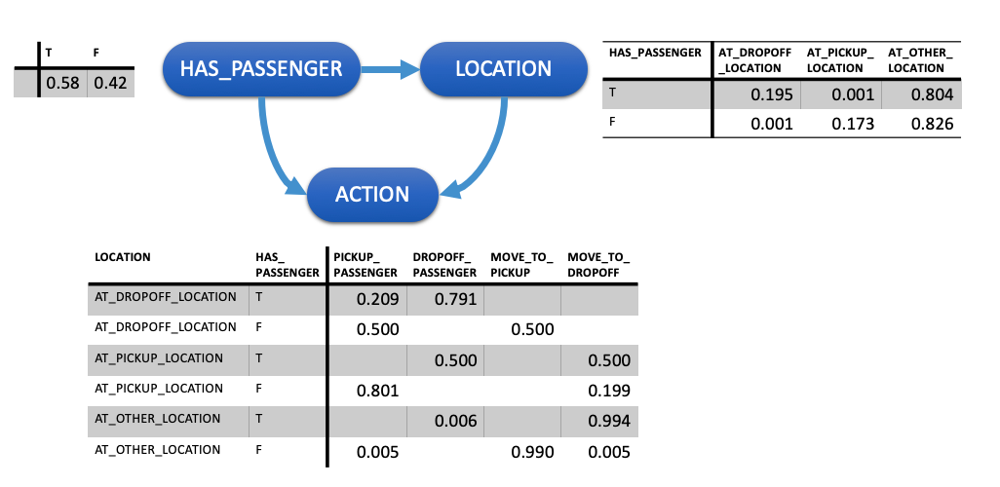

After only 10 episodes of simulation, the model has learned with a high degree of certainty the correct action to take when the taxi is at some other location.   These are the most frequently occurring states, comprising about 80% of all those observed.    It has also started to learn that there is a strong negative correlation between being at the drop-off location without a passenger and pickup location with a passenger.

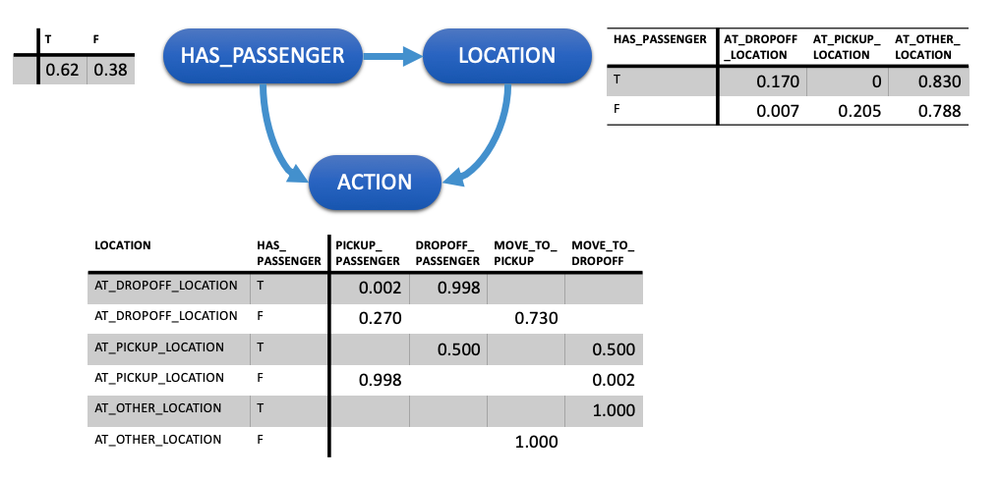

After 100 episodes, it has learned the correct action to take with a high degree of certainty for all but the least frequently occurring states.   The one row that has not changed corresponds to the state where the taxi is at the pickup location and the passenger is in the cab; however, since this state cannot occur during normal simulation, these values are of no consequence to making inferences.   
  
How did your results compare?   Do you expect that those differences will change the behavior of the simulation?

