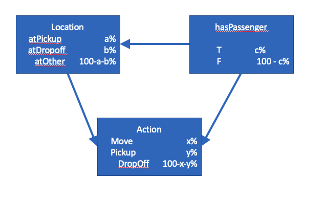
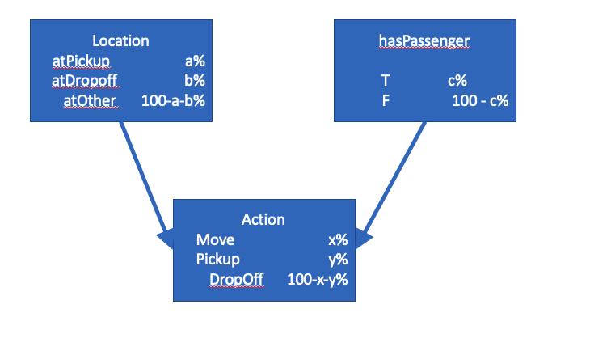
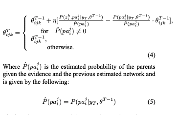

# Probabilistic Inference and Causal Networks

## Overview

Bayesian networks \(belief networks, decision networks\) are compact graphical representations of the observables of a system and the probabilistic relationships between them. Bayesian networks, and can be used to answer stochastic questions about unobserved variables \( e.g. Given that it is January, and without knowledge of whether the sprinklers ran or if it rained, what is the liklihood that the grass is wet?" \). This process is called inference.

Inference over Bayesian networks can be used to simulate more realistic random behavior by conditionally predicting the action to take in response to observed variables. This can be coupled with either batch or inline machine learning to provide predictions that improve over time.

For a nice introduction to Bayesian networks, check out this blog post [https://www.probabilisticworld.com/bayesian-belief-networks-part-1/](https://www.probabilisticworld.com/bayesian-belief-networks-part-1/)

## Introduction

Bayesian networks are a compact graphical representation of the probabilistic relationship between variables. Baysian networks can be visualized as a directed graph where each node is a probability density function for a random variable. Each arrow of the network represents a conditional dependency of the probability of the variable at the head of the arrow on the value of the variable at the tail of the arrow.

In this tutorial, we will use the 

## Setup

### Initial Network

The structure of our taxicab network might initially look something like this. This says that `Location`, `hasPassenger` and `Action` are all discrete distributions, and that we believe _a priori_ that probabilities location and action may be conditional upon the value fo `hasPassenger`.

## Learning

Updates of Bayesian networks is an online learning rather than batch training/update method. The agent has prior distributions for the conditional probabilities of states and actions and can learn incrementally as it observes actual behavior of the simulation \(i.e., consequences of taking actions in various states\).

Imagine at each time step you are presented with a new collection of observations for what the correct action to be taken is. This knowledge can be used to incrementally adapt the network structure or of the conditional probabilities \(via MLE or Bayesian arithmetic\), \([https://arxiv.org/pdf/1302.1538.pdf](https://arxiv.org/pdf/1302.1538.pdf)\). This is referred to as _structural learning_ vs _parameter learning_, respectively, and will be discussed below.

### Structural Learning

For _structural learning_, we expect that over time, we learn that `Location` and `hasPassenger` are independent \(i.e., not connected\):

### Parameter Learning

For _parameter learning_, we would expect that we would eventually learn that:

$$
P( Action = DropOff | Location = atDropOff, hasPassenger = T ) = 100\%
$$

$$
P( Action = Pickup  | Location = atPickup, hasPassenger = F ) = 100\%
$$

$$
P( Action = Move | Location = atOther ) = 100\%
$$

What we are interested in is an update rule that we can apply to the network as our agents explores the state-action space. There is good research and information on this problem in "[Update rules for parameter estimation in Bayesian networks](https://arxiv.org/pdf/1302.1519.pdf)" and "[Parameter Estimation in Bayesian Networks](https://courses.cs.ut.ee/2009/bayesian-networks/orasmaa-liin-chapter-6.pdf)." The general update rule for the parameters is:

However due the specifics of our problem, each new evidence vector provides us with an observation of all variables \( e.g. the state and the action taken\). The update rule in this case becomes very simple, with equation 5 reducing to:

$$
P\hat(pa^j_i) = 1\ if\ yT\ provides\ evidence\ of\ the\ parents\ pa_i^j\ otherwise\ 0.
$$

and the top line for equation 4 becomes:

$$
theta^T = theta^{T-1} + eta * (  (1\ if\ yT\ provides\ evidence\ of\ z\ otherwise\ 0) - theta^{T-1})
$$

These equations are simple enough to implement in a lambda.

The learning rate, eta, needs to be kept sufficiently small to ensure convergence, and will diverge when it is greater than 1.

