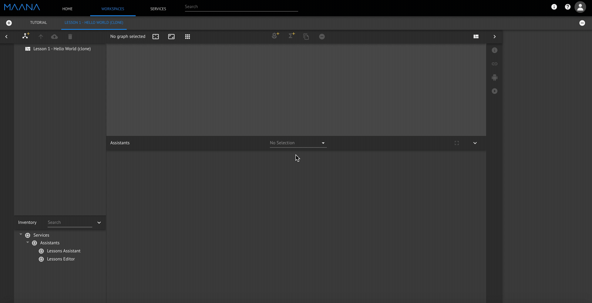
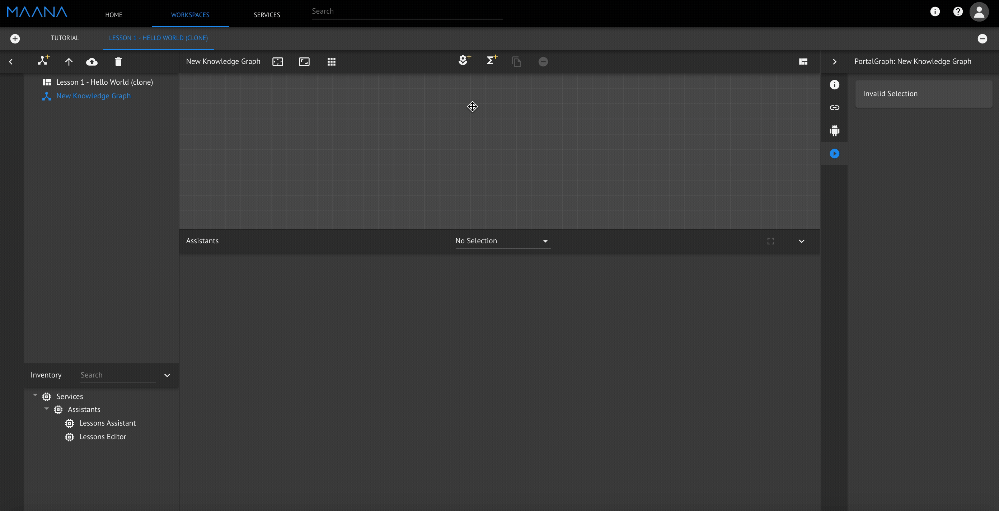
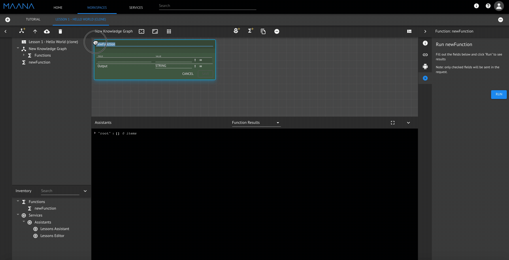

# Hello, world!

-------------------------------------------------------------------------------------------------------**Material Development Checklist**

* [ ] **Azure import \(pending\)**

-------------------------------------------------------------------------------------------------------

**Case Description:**

This is a hands-on example that will get you started with MaanaQ. In this case, learn how to create your own sayHello function, add a function field, and import a service from the inventory to your workspace. Get MaanaQ to greet you!

Before you start, please refer to [Workspace](../../product-guide/getting-started-with-maana/workspaces/#what-is-a-workspace) if you do not what this is... 

**Step by Step Instructions:**

1. Once inside your newly created Workspace, create a Knowledge Graph
2. In the Knowledge Graph you created, create a function
3. Name the function, "sayHello"
4. Inside the function, create a field called "input" of type string and click save
5. Expand the sayHello function. We will use a pre-existing service called "Greetings" to create a sub function. Go to the search bar and type in Greetings. Drag and drop "Greetings" to Inventory
6. Expand "Greetings" in Inventory to locate the "helloWorld" function. Drag and drop "helloWorld" from Inventory to the Canvas. Wire input and output. sayHello function is now complete.
7. To test the functionality we just created, locate sayHello function in the Explorer panel and hit Run in the Context Panel . Provide an input. In the Assistant Panel, we see the result.

**Recordings:**

Hello World Step 1

[GIF](https://maanaimages.blob.core.windows.net/maana-q-documentation/QTraining_videos/HelloWorld_gifs/HelloWorld_Step7.gif)   [MOV](https://maanaimages.blob.core.windows.net/maana-q-documentation/QTraining_videos/HelloWorld_movc/HelloWorld_Step1.mov)

Hello World Step 2

[GIF](https://maanaimages.blob.core.windows.net/maana-q-documentation/QTraining_videos/HelloWorld_gifs/HelloWorld_Step2.gif) [MOV](https://maanaimages.blob.core.windows.net/maana-q-documentation/QTraining_videos/HelloWorld_movc/HelloWorld_Step2.mov)

Hello World Step 3

[GIF](https://maanaimages.blob.core.windows.net/maana-q-documentation/QTraining_videos/HelloWorld_gifs/HelloWorld_Step3.gif) [MOV](https://maanaimages.blob.core.windows.net/maana-q-documentation/QTraining_videos/HelloWorld_movc/HelloWorld_Step3.mov)

[Hello World Step 4](https://maanaimages.blob.core.windows.net/maana-q-documentation/QTraining_videos/HelloWorld_gifs/HelloWorld_Step4.gif)

[GIF](https://maanaimages.blob.core.windows.net/maana-q-documentation/QTraining_videos/HelloWorld_gifs/HelloWorld_Step4.gif) [MOV](https://maanaimages.blob.core.windows.net/maana-q-documentation/QTraining_videos/HelloWorld_movc/HelloWorld_Step4.mov)

Hello World Step 5

[GIF](https://maanaimages.blob.core.windows.net/maana-q-documentation/QTraining_videos/HelloWorld_gifs/HelloWorld_Step5.gif) [MOV](https://maanaimages.blob.core.windows.net/maana-q-documentation/QTraining_videos/HelloWorld_movc/HelloWorld_Step5.mov)

Hello World Step 6

[GIF](https://maanaimages.blob.core.windows.net/maana-q-documentation/QTraining_videos/HelloWorld_gifs/HelloWorld_Step6.gif) [MOV](https://maanaimages.blob.core.windows.net/maana-q-documentation/QTraining_videos/HelloWorld_movc/HelloWorld_Step6.mov)

Hello World Step 7

[GIF](https://maanaimages.blob.core.windows.net/maana-q-documentation/QTraining_videos/HelloWorld_gifs/HelloWorld_Step7.gif) [MOV](https://maanaimages.blob.core.windows.net/maana-q-documentation/QTraining_videos/HelloWorld_movc/HelloWorld_Step7.mov)

