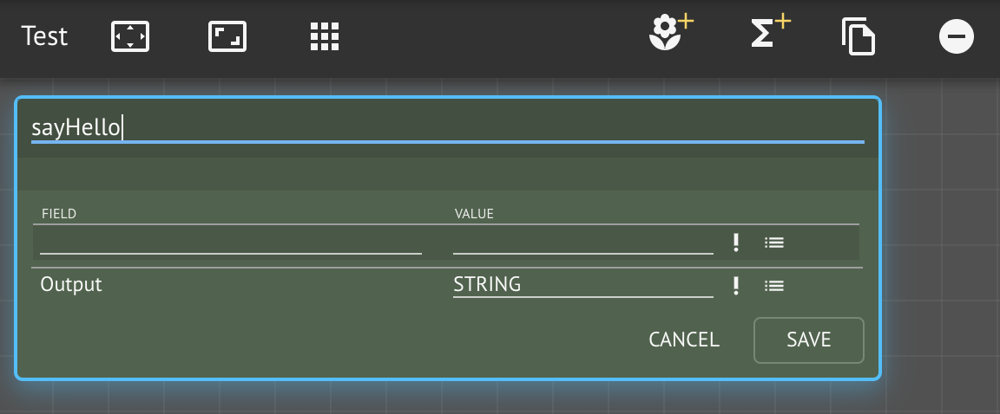

# Creating Your First Service

## **Step-by-Step Instructions**

**Step 1.** Create a new [workspace](../../../product-guide/getting-started-with-maana/workspaces/#what-is-a-workspace) from the dashboard or the Workspaces tab bar

Workspaces are where you design a sub-graph within the CKG.  These take the form of **live** cloud-based \(or on-prem\) GraphQL-based microservices.  You can think of them like "projects" and are often used just to _sketch_ out different design ideas.

**Step 2.** Name the workspace to `<your name> Hello World`

When you create a workspace, you are asked to give it a name.  The name does **not** need to be unique.  You can also optionally give your workspace's _associated_ service a **unique** identifier.  If you leave this field blank, the system will create a unique identifier.  Giving your service a unique name allows it to be easily recognized and migrated between Q instances.


Workspace service identifiers can only be assigned once **at time of creation**


**Step 3.** Familiarize yourself with the Workspace layout

The portal workspace user interface consists of various _panels_, such as:

* **Explorer**: a [Knowledge Graph](../../../product-guide/reference-guide/technical-design-and-architecture/kinds-and-fields/) and [Function Graph](../../../product-guide/reference-guide/technical-design-and-architecture/function-modeling/) browser, with its control panel for creating new graphs, uploading content, deleting elements from workspace
* **Inventory**: everything available within your workspace, organized by type; think of this as your _palette_
* **Canvas**: where you create and manage graphs, with its control bar grid resizing, snapping, node creation, cloning, removal
* **Assistants**: plug-ins that provide custom interactions for authoring, visualization, interaction, diagnostics
* **Context**: deeper interactions \(e.g., edit settings, run functions\) with the currently focused item, such as the workspace itself, Kinds, functions, services

**Step 4.** Rename the default `New Knowledge Graph`node in the Explorer panel

A workspace can contain multiple Knowledge Graphs, which are simply _views_ on the Kinds, functions, and instances from the inventory.  The same Kind and Function can be on multiple Knowledge Graphs at the same time.  There is only a single copy of any element within the workspace and all elements must have unique names.

**Step 4a.** Select the "New Knowledge Graph" node in the Explorer panel

**Step 4b.** Rename the Knowledge Graph to "Test" using the Info Context panel.

Changing information in the context panel requires **explicitly saving**, while general workspace operations \(e.g., creating graphs, Kinds, functions\) do not.

**Step 4c.** Save your changes.

**Step 5.** Create a new function "sayHello"

We wish to create a function that accepts a person's name as input and returns a customized greeting.  Click on the _sigma_ button on the canvas toolbar to add a Function node to the current Knowledge Graph \(and add it to the Workspace inventory\).

Add a new function to the **canvas** by clicking the _sigma_ button:

**Step 6.** Rename the Function `sayHello` using the in-node editor

Instead of using the Info Context panel like we did when renaming the Knowledge Graph, to rename a function \(or other node\), we can do so directly in the node.


Kinds and Functions must have **unique names** within a Workspace


**Step 7.** Define the function's **type signature**

Functions take zero-or-more **inputs** and produce exactly one **output**.  Each input and output has a **type** and whether or not it is **optional** or **required** and if it is a **list** \(_aka_ collection, array\).

Types can be _primitive_, computer data types, called **scalars** \(denoted in all capitals\):

* **STRING**: am arbitrary sequence of _symbols_ or _characters_, alpha-numeric, mathematics, emojis, Japanese, ... \(any valid unicode\)
* **INT**: the whole numbers `(..., -1, 0, +1, ...)`
* **FLOAT**: the rational numbers \(i.e., with decimal points\)
* **BOOLEAN**: true or false values
* **ID**: can be a number or a string that is unique within some context
* **DATE/DATETIME/TIME**: temporal quantities in ISO standard form
* **JSON**: a common hierarchical [data format](https://www.json.org)

**Step 7a.** Create an input field called `name` of type `STRING` and click save


**TODO: screenshot**


Nodes on the Canvas can be in one of several states:

* **Expanded** or **collapsed**: show or hide the node contents \(e.g., Fields\)
* **Display** or **edit** mode: switch between read-only display or allow node contents to be modified

A node can be expanded or collapsed by clicking the up/down arrow button beneath the title bar.  Try it now.


**TODO: screenshot**


**Step 8.** Expand the `sayHello` Function

_Expanding_ a Function means to edit its **composition**. 


**TODO: screenshot**


9. Search for the `Greetings` Service and drag-and-drop it to Workspace Inventory.

[MOV](https://maanaimages.blob.core.windows.net/maana-q-documentation/QTraining_videos/HelloWorld_movc/HelloWorld_Step5.mov)


**TODO: screenshot**


10. Expand "Greetings" in Inventory to locate the "helloWorld" function. Drag and drop "helloWorld" from Inventory to the Canvas. Wire input and output. sayHello function is now complete.

[MOV](https://maanaimages.blob.core.windows.net/maana-q-documentation/QTraining_videos/HelloWorld_movc/HelloWorld_Step6.mov) 


**TODO: screenshot**


7. To test the functionality we just created, locate sayHello function in the Explorer panel and hit Run in the Context Panel . Provide an input. In the Assistant Panel, we see the result.

[MOV](https://maanaimages.blob.core.windows.net/maana-q-documentation/QTraining_videos/HelloWorld_movc/HelloWorld_Step7.mov)


**TODO: screenshot**


