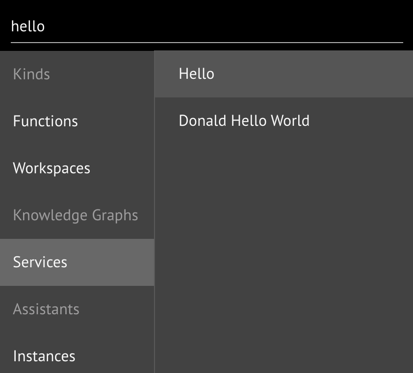

# Your First Service

## **Step-by-Step Instructions**

**Step 1.** Create a new [workspace](../../../product-guide/getting-started-with-maana/workspaces/#what-is-a-workspace) from the dashboard or the Workspaces tab bar

Workspaces are where you design a sub-graph within the CKG.  These take the form of **live** cloud-based \(or on-prem\) GraphQL-based microservices.  You can think of them like "projects" and are often used just to _sketch_ out different design ideas.

**Step 2.** Name the workspace to `<your name> Hello World`

When you create a workspace, you are asked to give it a name.  The name does **not** need to be unique.  You can also optionally give your workspace's _associated_ service a **unique** identifier.  If you leave this field blank, the system will create a unique identifier.  Giving your service a unique name allows it to be easily recognized and migrated between Q instances.


Workspace service identifiers can only be assigned once **at time of creation**


**Step 3.** Familiarize yourself with the Workspace layout

The portal workspace user interface consists of various _panels_, such as:

* **Explorer**: a [Knowledge Graph](../../../product-guide/reference-guide/technical-design-and-architecture/kinds-and-fields/) and [Function Graph](../../../product-guide/reference-guide/technical-design-and-architecture/function-modeling/) browser, with its control panel for creating new graphs, uploading content, deleting elements from workspace
* **Inventory**: everything available within your workspace, organized by type; think of this as your _palette_
* **Canvas**: where you create and manage graphs, with its control bar grid resizing, snapping, node creation, cloning, removal
* **Assistants**: plug-ins that provide custom interactions for authoring, visualization, interaction, diagnostics
* **Context**: deeper interactions \(e.g., edit settings, run functions\) with the currently focused item, such as the workspace itself, Kinds, functions, services

**Step 4.** Rename the default `New Knowledge Graph`node in the Explorer panel

A workspace can contain multiple Knowledge Graphs, which are simply _views_ on the Kinds, functions, and instances from the inventory.  The same Kind and Function can be on multiple Knowledge Graphs at the same time.  There is only a single copy of any element within the workspace and all elements must have unique names.


Knowledge Graphs capture _structural_ relationships and definitions


**Step 4a.** Select the "New Knowledge Graph" node in the Explorer panel

**Step 4b.** Rename the Knowledge Graph to "Test" using the Info Context panel.

Changing information in the context panel requires **explicitly saving**, while general workspace operations \(e.g., creating graphs, Kinds, functions\) do not.

**Step 4c.** Save your changes.

**Step 5.** Create a new function "sayHello"

We wish to create a function that accepts a person's name as input and returns a customized greeting.  Click on the _sigma_ button on the canvas toolbar to add a Function node to the current Knowledge Graph \(and add it to the Workspace inventory\).

Add a new function to the **canvas** by clicking the _sigma_ button:

**Step 6.** Rename the Function `sayHello` using the in-node editor

Instead of using the Info Context panel like we did when renaming the Knowledge Graph, to rename a function \(or other node\), we can do so directly in the node.


Kinds and Functions must have **unique names** within a Workspace


**Step 7.** Define the function's **type signature**

Functions take zero-or-more **inputs** and produce exactly one **output**.  Each input and output has a **type** and whether or not it is **optional** or **required** and if it is a **list** \(_aka_ collection, array\).

Types can be _primitive_, computer data types, called **scalars** \(denoted in all capitals\):

* **STRING**: am arbitrary sequence of _symbols_ or _characters_, alpha-numeric, mathematics, emojis, Japanese, ... \(any valid unicode\)
* **INT**: the whole numbers `(..., -1, 0, +1, ...)`
* **FLOAT**: the rational numbers \(i.e., with decimal points\)
* **BOOLEAN**: true or false values
* **ID**: can be a number or a string that is unique within some context
* **DATE/DATETIME/TIME**: temporal quantities in ISO standard form
* **JSON**: a common hierarchical [data format](https://www.json.org)

**Step 7a.** Create an input field called `name` of type `STRING!` \(required\)

**Step 7b.** Ensure the return type is `STRING!` \(required\)

**Step 7c.** Click **Save**

**Step 8.**  Working with nodes on the canvas

Nodes on the Canvas can be in one of several states:

* **Expanded** or **collapsed**: show or hide the node contents \(e.g., Fields\)
* **Display** or **edit** mode: switch between read-only display or allow node contents to be modified

**Step 8a.** A node can be expanded or collapsed by clicking the up/down arrow button beneath the title bar.  Try it now.

**Step 8b.** To enter node editing, double-click anywhere on the node or use the _pen_ button on the title bar.  Try it now.

**Step 8c.** Snap to Grid and Expand to Fit

It is a good practice to keep a tidy graph, since it helps with legibility.  Enable grid snap and move the node around.

You can zoom the graph to fit or return it to the default level using the first set of buttons on the button bar.  Try that now.


Zooming the graph in/out can also be performed using the mouse wheel or _pinching_ on a touch device


**Step 9.** Implement the `sayHello` Function

Functions _do_ things - they transform data, calculate numbers, predict outcomes, classify text, etc.  A function, therefore, must have an _implementation_.  We can give our new function an implementation by **composing** \(i.e., combining\) it with an existing function provided by another service.  We compose functions on **Function Graphs** that constitute the function _body._

Enter your function's Function Graph using the _compose_ button in the title bar of the function node.

**Step 10.** Add a service to your workspace

One of the primary ways of accelerating software development is **reusability** and is one of the key principles of Maana Q.  We can include a third-party service, which provides Kinds and functions, by searching the **Catalog**.

**Step 10a.** Search for the `Hello` service in the Catalog

Use the Search field in the application bar at the top of the page.  Notice that results are categorized by type.  We are interested in services that have something to do with "hello" \(e.g., in the name or other metadata\).  Alternatively, we could just bring in the function we need, but let's import the full service.

**Step 10b.** Drag-and-drop the `Hello` service to the workspace inventory

From the search results, simply drag-and-drop the service name into the inventory area of the workspace, which will alight as a drop target when hovered.  The inventory, too, is categorized and we can see our service accordingly:

**Step 11.** Explore the newly added service

From the Inventory, we can see an outline of the functions and Kinds that imported services provide \(as seen in the previous screenshot\).  By selecting a Kind or function, its details can be examined in the Info Context panel.

Note that the `hello` function has the same type signature as the `sayHello` function: both take a required `STRING!`and return a required `STRING!`.

Since this is a full GraphQL service, we can also use the standard Graph_i_QL interactive development environment \(IDE\), which Q provides as default **Assistant** in every workspace.

Here, you can explore the service documentation and issue live queries.

**Step 12.** Compose the hello function to implement sayHello

In order to implement our sayHello function, we need to compose it with the imported hello function.

A function graph \(i.e., the body of a function\) has two special nodes representing the **input node** \(i.e., the _givens_\) and the **output node** \(i.e., the _unknown_\).

The goal of function composition is to chain together a set of functions that takes the inputs and flows them through the graph to produce the output.  This is sometimes referred to as "wiring" the function graph.


Function Graphs capture explicit _flows_ of typed values through a network of functions provided by one or more services


**Step 12a.** Drag-and-drop the `hello` function from inventory onto the canvas

**Step 12b.**  Connect the node outputs to the corresponding node inputs

We need to complete the circuit, so to speak, by flowing name from the `Input` node to the name slot on the `hello` function, and from the `Output` slot on `hello` to the `Output` slot on the `Output` node.

**Step 13.**  Run the `sayHello` function

With the function wired up, we can test it.  Any function can be run from the Run Context panel.

Ensure the check box is selected, since this is a required argument.  Add a value to the field and click the **RUN** button.

The results of functions can be seen in the default **Function Results Assistant**.

## Conclusion

In this lesson, you learned the fundamental of Maana Q solutions:

* The concept of a Computational Knowledge Graph
  * Concepts, properties, relations, and instances \(i.e., ontology\)
  * Functions \(e.g., calculations, inferences, predictions, simulations\)
* Using the Intelligence Designer
  * Create and name a new workspace
  * Define a new function on a knowledge graph
  * Search for and import a third-party service
  * Compose a function graph
  * Use the built-in GraphiQL and Function Results Assistants

Let's now build on this simple example to explore additional concepts in Maana Q.

