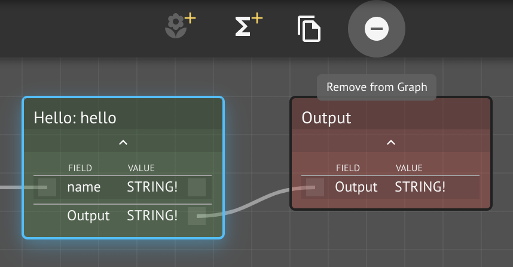
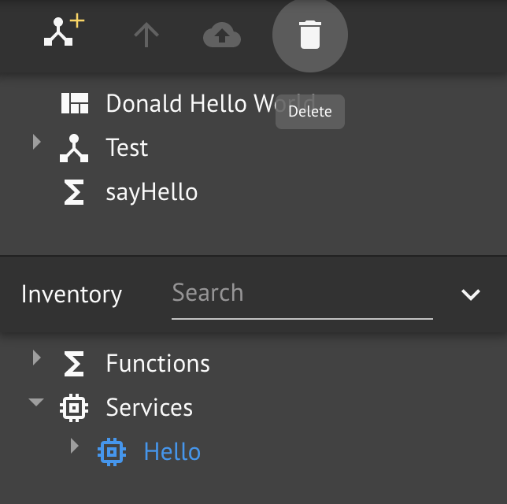
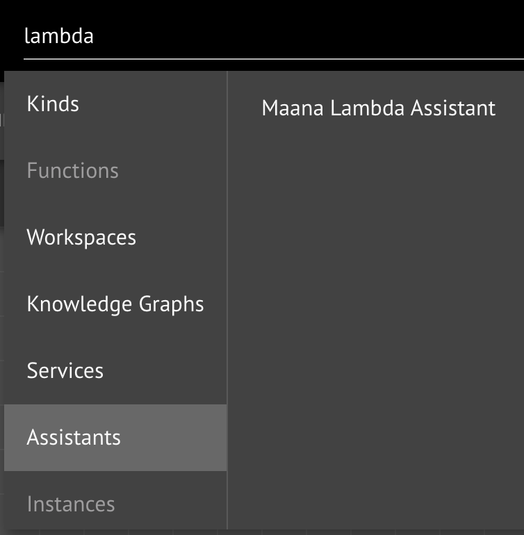
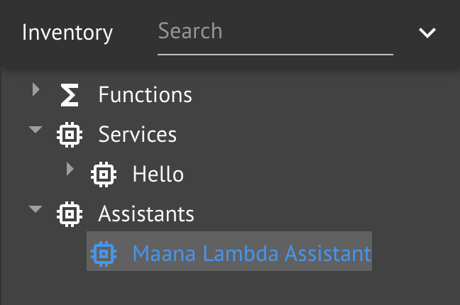
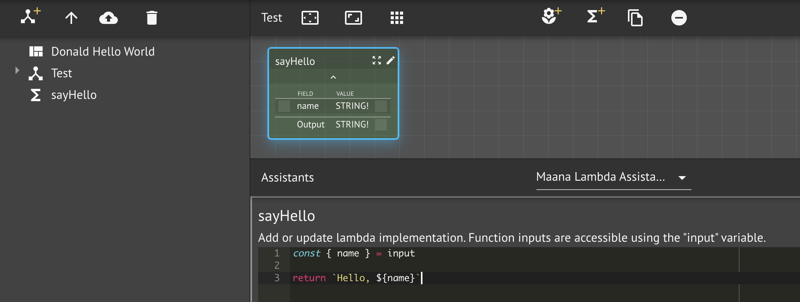
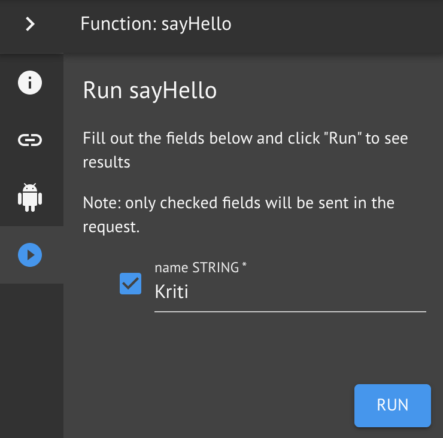
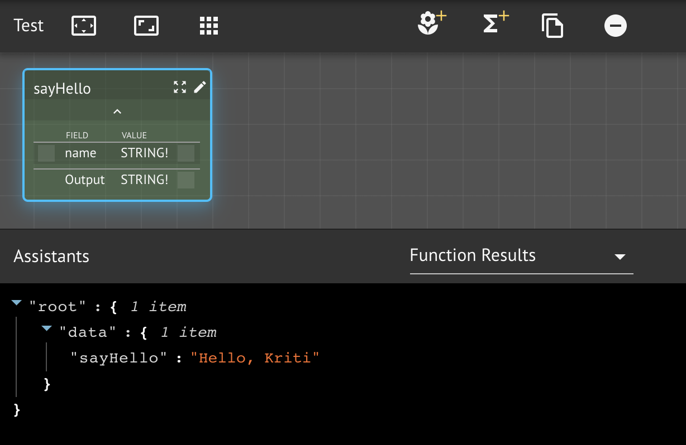

# Custom Lambda Function

It is often desirable to use a small code snippet to implement a function, rather than use function composition or building and deploying a full-blown Java, .NET, or other Dockerized microservice.  Maana enables you to attach short code snippets to a function for execution through the use of [**Lambda** functions](https://en.wikipedia.org/wiki/Anonymous_function).

In the last example, you created a sayHello service based on a third-party service.  In this follow-up lesson, we will replace the third-party service with a simple JavaScript function using the [**Maana Lambda Assistant**](https://maana.gitbook.io/q/v/3.2.1/catalog/assistants#lambda-assistant).

### Prerequisites

* Familiarity with basic programming concepts
* Very light JavaScript \(cut-and-paste\)

## Step-by-Step Instructions

**Step 1.**  Delete the sayHello service composition

We need to first undo what we just did.  We can remove the function from the graph using the the _remove_ button on the canvas button bar.  This will disconnect the function, while keeping it in the workspace inventory.



Since we don't need the service, we can also completely remove it from the workspace using the _delete_ button on the Explorer button bar.



**Step 2.**  Add the Lambda Assistant to the workspace

In the last lesson, we searched for and imported a third-party service.  We can also do the same for **Assistants**.  Search for "lambda," find it in the Assistant category, and drag-and-drop it into the workspace inventory.





**Step 3.** Use the Lambda Assistant to implement the function

With the `sayHello` function selected in the `Test` Knowledge Graph, use the assistant drop-down in the Assistant panel to select the Lambda Assistant.



Add the following JavaScript code and click **Save**.

```javascript
const { name } = input

return `Hello, ${name}`
```

**Step 4.** Test the function using  the Context Panel

Now that we have implemented the function using a JavaScript Lambda function, we can run it just like any function.



Select the **Function Results Assistant** from the assistant panel drop-down and examine the results from running your Lambda function.



## Conclusion

In this lesson, you learned how to:

* Remove a node from the canvas
* Delete a service from a workspace
* Search for and add an assistant to a workspace
* Use the Lambda Assistant to create a Lambda function

In the next lesson, we'll better understand that workspaces are themselves just services.

