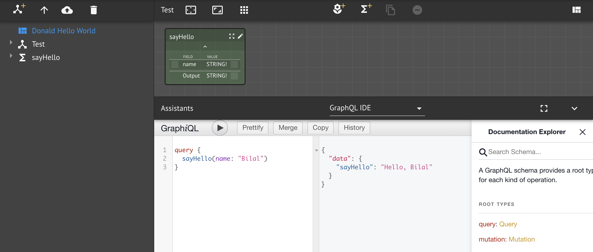
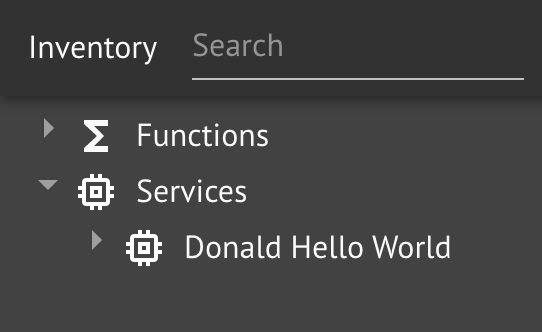
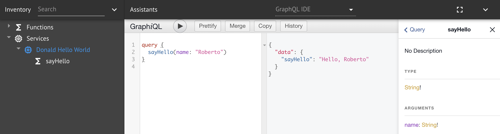
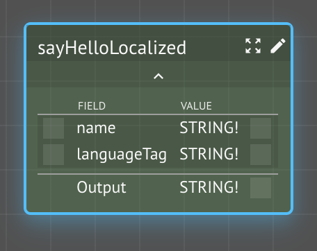
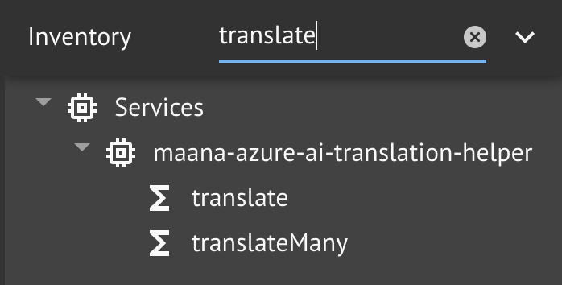
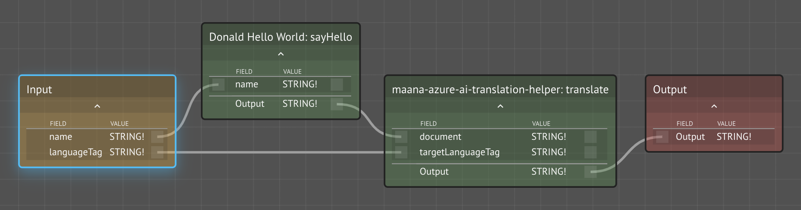
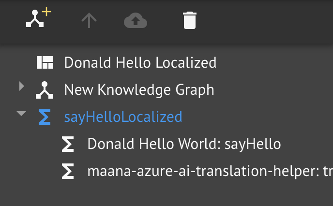
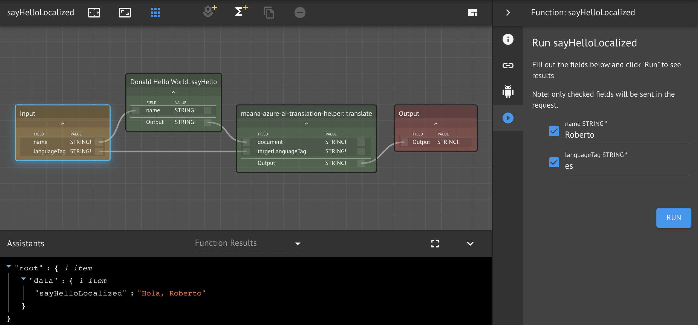

# Workspaces Are Services

In the first lesson, you searched for and composed the `Hello` service in your workspace.  This service is, in fact, just another workspace implemented in the exact same way you implemented yours.  This allows teams to work independently on different aspects of a solution or to develop completely generic and reusable services and to combine everything incrementally.


Every workspace is a cloud microservice being hosted by Maana Q's [Computational Knowledge Graph.](../../../product-guide/platform-features/computational-knowledge-graph/)


In this lesson, you will explore your workspace as a service.

### Prerequisites

* Previously completed `<your name>-hello-world` service
* **Dependencies:** `maana-azure-ai-translation-helper`

## Step-by-Step Instructions

**Step 1.** Use GraphiQL to query your service

The first thing that demonstrates your workspace is really just a GraphQL service in disguise is that you can use the same **GraphiQL** **Assistant** we used earlier on your own workspace.  Simply select the workspace node \(top-most\) in the Explorer panel, then select the GraphiQL Assistant \(if it isn't automatically selected\).

Use the Documentation Explorer to inspect the queries and mutations, along with the various types being exposed.

Issue a query to the `sayHello` function.

**Step 2**.  Create a new workspace `<your name> Hello Localized`with a unique id of `<your name>-hello-localized`

Use the _add workspace_ button on the tab bar and fill-in the modal dialog with the name.  Leave the workspace ID blank.

**Step 3.** Search for and import your workspace **service**`<your name>-hello-world` workspace as a service


Be careful not to drag-and-drop the workspace itself, rather you want the service category of results.


**Step 4.** Verify in Graph_i_QL that you can access your workspace as a service

**Step 5.** Create a new function `sayHelloLocalized`

Instead of just taking a `STRING!`, our new function also takes an [ISO-639-1 standard language tag](https://en.wikipedia.org/wiki/ISO_639-1), also a required `STRING!`.

**Step 6.**  Import the `maana-azure-ai-translation-helper` service

Search for and import the [Microsoft Azure AI Translation REST API](https://azure.microsoft.com/en-us/services/cognitive-services/translator-text-api/) service.  Use GraphiQL to explore the documentation and experiment with queries.

**Step 7.** Wire-up and test natural language translation

In the first lesson, we imported the `Hello` service and we used function composition to wire its hello function as the implementation of our `sayHello` function.  Let's do the same thing, except use your own `sayHello` function from your first workspace to provide the implementation of `sayHelloLocalized`.

**Step 7a.** Open the `sayHelloLocalized` function graph

**Step 7b.** Drag-and-drop your `sayHello` into the function graph

**Step 7c.** Search the workspace inventory for `translate`

**Step 7d.** Drag-and-drop the `translate` function onto the function graph

**Step 7e.** Wire-up the functions to translate the greeting

**Step 8.**  Test your function

Function compositions as a whole can be tested from within a Function Graph by selecting the Function Graph node in the explorer:

or with either the `Input` or `Output` node selected:

## Conclusion

In this lesson, we demonstrated that a workspace is just a service like any other and can be used in function compositions or as programmatic endpoints for applications.

We also performed a more sophisticated function composition and used a cognitive service by Microsoft.

In the next lesson set, we will go deeper into Kinds and functions, building more advanced services.

