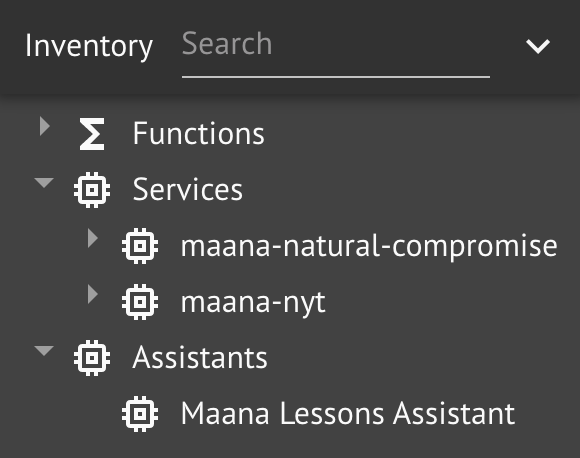

# Natural Language Processing \(NLP\)

Much of our knowledge is locked away in unstructured content, such as documents, comments, notes, messages, etc.  The area of natural language processing \(NLP\) develops technology for extracting and deriving computational meaning from language.  For example, named entity recognition \(NER\) is concerned with identifying various entity classes, like People, Places, and Organization mentions in text, which is often important for understanding what a text is about.  In this challenge exercise, you will use a Maana Q NLP service to perform entity extraction on text from NY Times headlines.

## Step-by-Step Instructions

**Step 1.**  Clone the `NLP Challenge` template workspace

Remember to name it `<your name> NLP Challenge`.

**Step 2.** Implement the function graph for the top-level `extractHeadlineEntities`

Your workspace has been preconfigured with a single function, `extractHeadlineEntities`, that you are expected to implement.  It takes a single `STRING!` input, topic.

Several services have also been added to your workspace inventory, which you may find useful:

