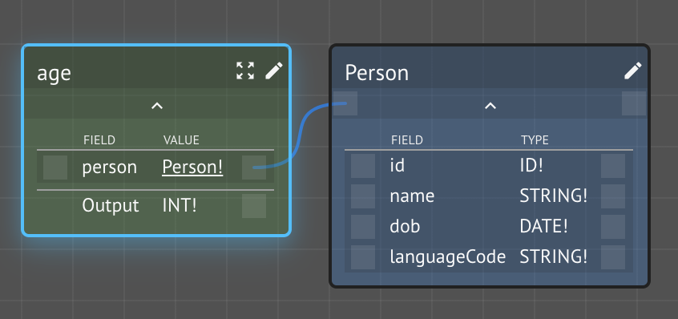
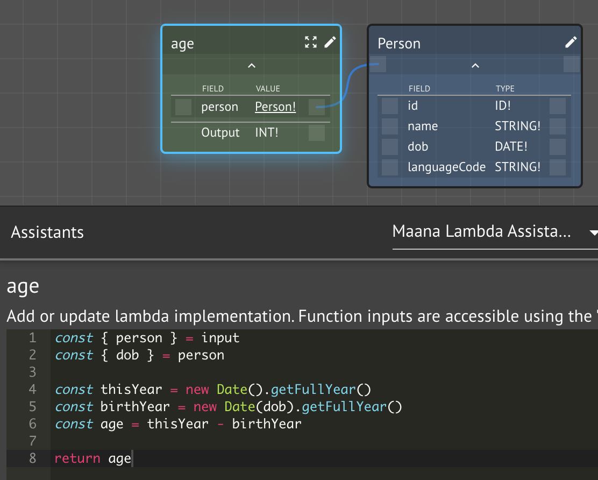
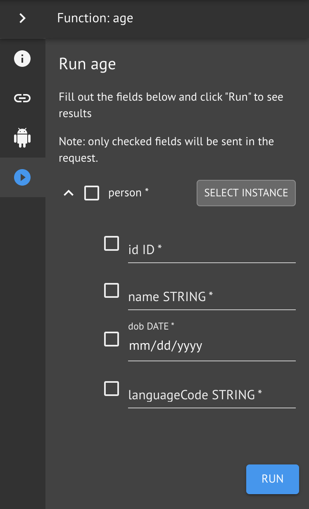
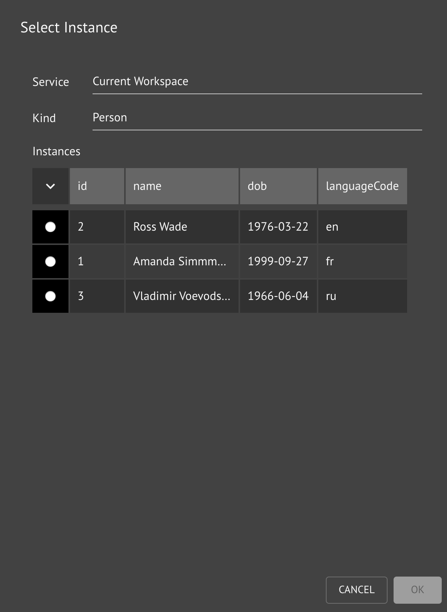
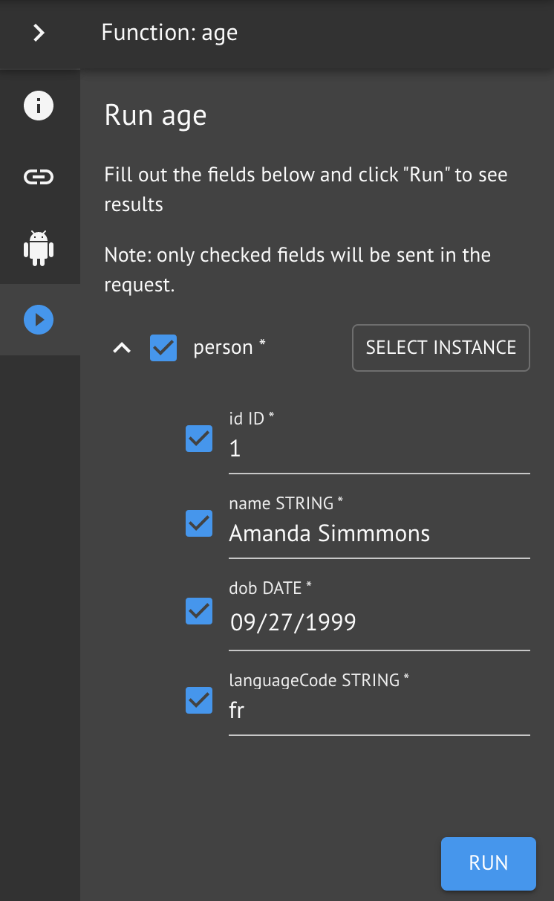
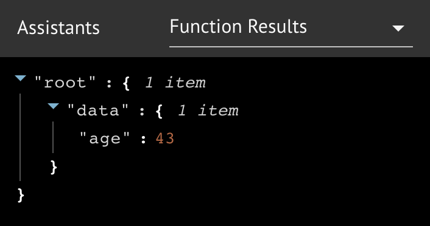

# Age

Using functions with Kind instances is not much different from using them with scalars.  In this lesson, you will create a lambda function to calculate the age of a Person from their date of birth.

## Step-by-Step Instructions

**Step 1.** Create a new function `age`.

**Step 2.**  Implement the `age` lambda function

**Step 2a.** Search for and add the Lambda Assistant to your workspace inventory

**Step 2b.** Write the JavaScript code snippet and save

Notice that the input object contains all the input arguments to the functions.  In this case, there is only one: `person: Person!`.  We can _destructure_ the input arguments into their individual values, then access them directly.

**Step 3.** Run the function

We can test our function by using the familiar Run Context panel.  However, instead of filling in the individual values we can use the _instance picker_.

**Step 3a.**  Open the Run Context panel for the `age` function

**Step 3b.** Select a Person Kind instance

Select one of the option buttons and click **OK**.

**Step 3c.** Notice how the Run Context panel is now populated with the instance you selected.  Click **RUN**.

**Step 3d.**  Select the Function Results Assistant and expand the result JSON

The function should produce the correct age for the person.  If there is a problem with the lambda code or something else had gone wrong, errors would be shown here.


Remember that GraphQL can return valid data AND errors in the same request, so always check both.


## Conclusion

In this lesson, we create a function and wrote a lambda function to calculate a person's age from their date of birth.  We learned about selecting Kind instances for the Run Context panel.

Next, we'll create relationships between Kinds.

