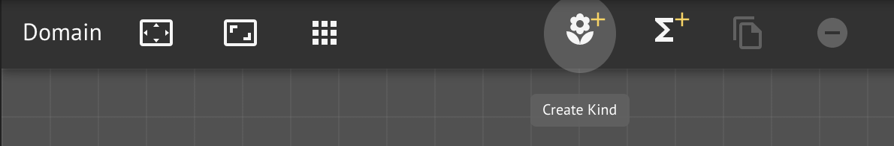

# Your First Kind

In this lesson, you will create a custom Kind, `Person` and add several properties to it.  You will use then the automatically generated boilerplate function to create a few people instances.

## Step-by-Step Instructions

**Step 1.** Create a new workspace `<your name>  People`

We begin with a clean workspace in which to define a small domain for reasoning about people.

**Step 2.** Rename the default Knowledge Graph to `Domain`

**Step 3.** Create a new Kind

Similar to creating a function, click the _flower_ button on the canvas button bar.

**Step 4.** Rename the Kind and add fields

In the same way you renamed a function and added arguments, you can rename a Kind and add field.  A field can be a **property** \(i.e., data; scalar values\) or a **relation** \(i.e., a link to another Kind\).  Properties are for simple attributes that are best thought of like _stored data_.

Notice that every Kind **must** have an identity field of signature `id: ID!`.  This what uniquely identifies each instance of a Kind **within** the Kind \(i.e., identities are not required to be universally unique\).


Every Kind must have a unique identity for its instances


We'll cover identity in more detail in a [future lesson](../design-patterns/identity.md).

**Step 5.** Add a few people

We've defined the basic concept of a Person as some _thing_ with an `id`, `name`, `dob`, and `languageCode`.  Let's create a few instances using the auto-generated CRUD operation, `addPerson`.

**Step 5a.** Search for `addPerson` in the workspace inventory

Search for the `addPerson` function in your inventory and drag to the Knowledge Graph beside `Person` Kind.

**Step 5b.**  Add instances using the Run Context panel

With the addPerson function node selected, activate the Run Context panel and fill in the requested instance data.

Add a few more people on your own.  Be sure to change their dates of birth.

**Step 6.**  View Kind instances using the Data View Assistant

With the `Person` Kind selected, activate the **Data View Assistant** \(if it isn't automatically activated\), and examine the instance data for the Kind.

## Conclusion

You've created and populated your first concept.  Now, let's do something with it.

