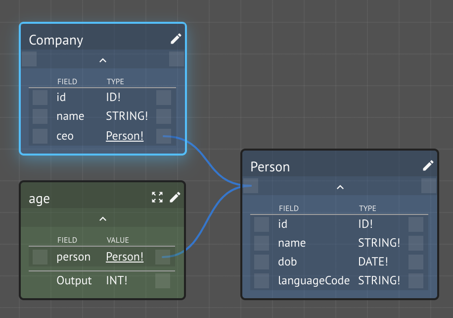
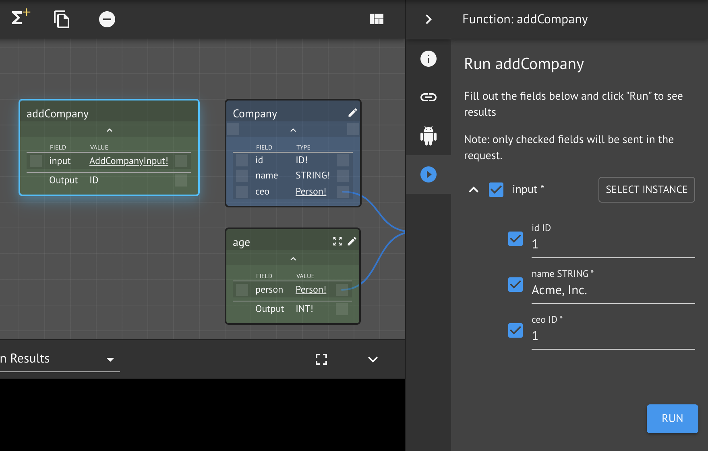
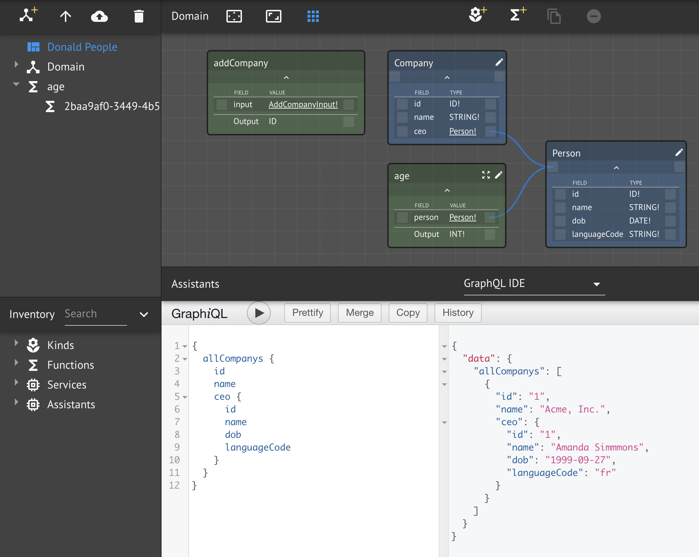
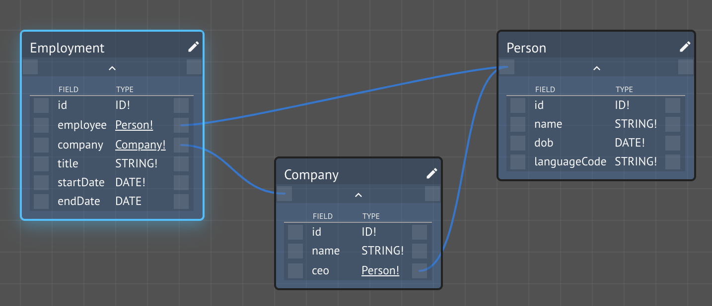

# Relations Between Kinds

Properties are simple, scalar values that describe attributes of a Kind.  Kinds can have relationships with other Kinds, forming a network of connectivity.  As with most things, a balance between conceptual purity and operational pragmatism needs to be struck.  In this lesson, we explore various considerations in modeling relationships between Kinds.

## Step-by-Step Instructions

This lesson continues from the [Functions on Kinds](age.md) lesson, using the same workspace.

**Step 1.**  Create a new Kind `Company`

In this model, a `Company` has a CEO, which is a `Person`.  Note the line from `Person` slot on `Company` to the `Person` node on the Knowledge Graph canvas.

**Step 2.**  Add a `Company` instance

Relations such as this are internally represented as a **foreign key** reference using the unique identities of the Kind instances.  Thus, when creating an instance of a `Company`, the CEO reference is to its unique id:

**Step 3.** Query your model using Graph_i_QL

In GraphQL, this arrangement allows queries to _flow_ through to the linked data in order to return _hierarchical_ data:

When using function composition, the CKG does not know what fields of a Kind to retrieve or how deep in the hierarchy to go when passing data from boilerplate operations \(i.e., when the data comes from KindDB\).


KindDB will request up-to **8 levels** deep in the hierarchy


This can have significant implications with large applications with deep, complex structure.  Keep in mind the connectivity between your Kinds:

* **One-to-one \(unidirectional\):** a Kind has a single reference to another Kind
  * e.g., `Company` has a single reference to a `ceo: Person!`
* **One-to-one \(bidirectional\):** each Kind has a single reference to the other
  * e.g., if `Company` had `ceo: Person!` and `Person` had `ceoOf: Company!`
* **One-to-many \(unidirectional\):** a Kind has a reference to a _collection_ \(list\) of another Kind
  * e.g., if  `Company` had a collection of `employees: [Person!]!`
* **One-to-many \(bidirectional\):** one Kind has a reference to a collection of another Kind, which has a single reference to the first
  * e.g., if `Company` had `employees: [Person!]!` and `Person` had `employer: Company!`
* **Many-to-many:** each Kind has a collection of references to the other
  * e.g., if `Company` had `employees: [Person!]!` and `Person` had `employers: [Company!]!`

**Step 4.**  Create an `Employment` Kind

We wish to model the relationship between an `Employee` and an `Employer`.  We could model it by adding a field to the `Company` Kind, such as`employees: [Person!]!` \(i.e., a collection of `People`\) and add a new field to the `Person` Kind, like `employer: Company!`.

This would establish a connection between the two concepts.  However, it has two drawbacks.  Can you think of them?

Firstly, the traversal problem we just described.  In this case, we have one-to-many \(bidirectional\), where one `Company` points to many `People`, which each point back to `Company`.  This isn't necessarily a concern, only if the volumes and complexity increase.

Secondly, we can't add any additional information, such as when the employment began, what the role or title is, salary information, current or prior titles, etc.

We can accommodate this by modeling the relationship itself as a Kind, as in: 

In this approach, a single Kind, `Employment`, points to both participants in the relationship and supplies additional information beyond mere connectivity.

Lastly, a function itself is a form of relation \(mathematically and conceptually\).  It relates a set of input Kinds to an output Kind.  In fact, a function can be viewed as a graph [_hyperedge_](https://en.wikipedia.org/wiki/Hypergraph)_._

## Conclusion

In this lesson, we discussed the various ways Kinds can be related to one another.  We also discussed several design considerations, some conceptual, some operational.

Next, let's explore collection in more depth.

