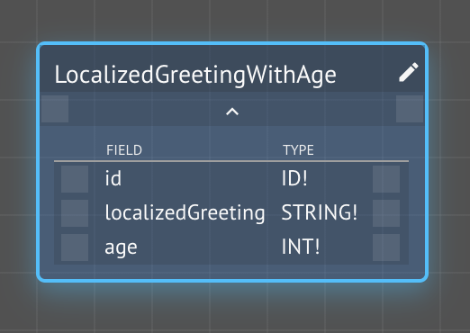
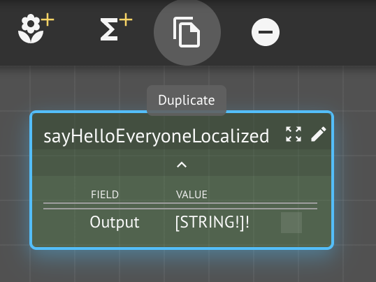
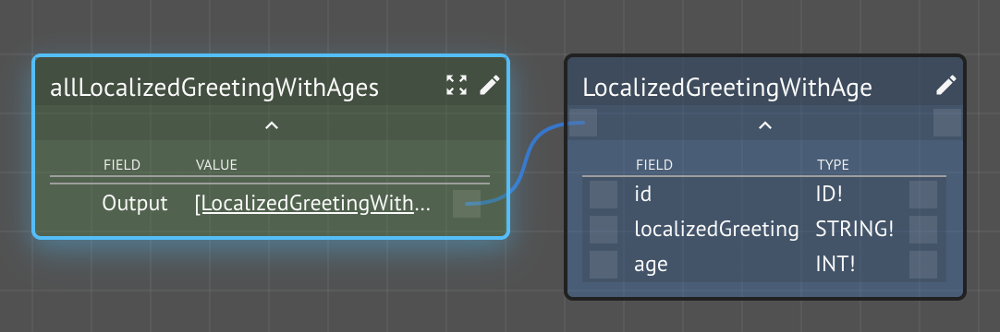
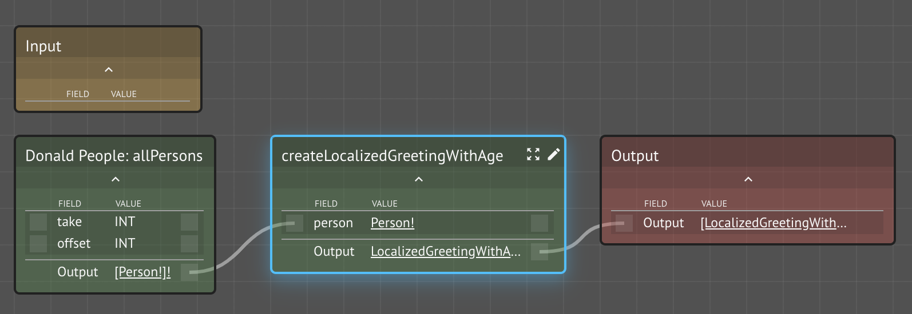
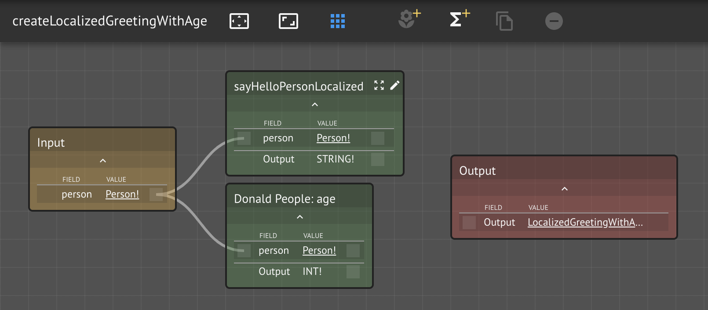
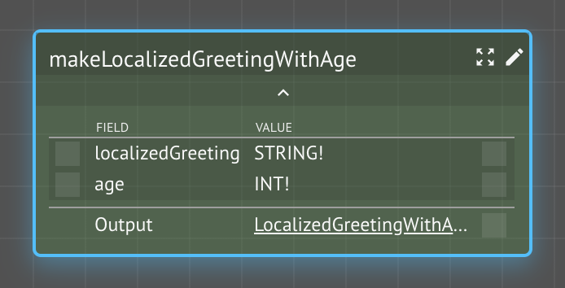
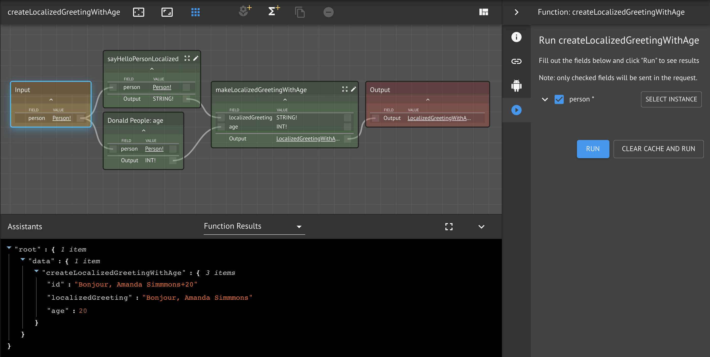
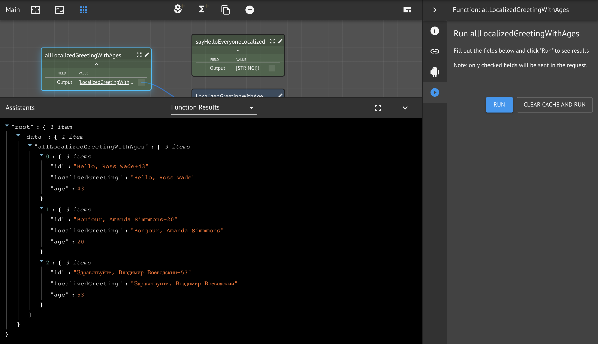

# Synthesizing Kind Instances

In this lesson, we will learn how to generate a list of Kind instances derived from iterating over the instances of another Kind.  The example is a little contrived, but it allows us to introduce other important Maana Q concepts, which is the true focus of the exercise.

### Prerequisites

* Your previous workspace `<your name> Hello Everyone`
* **Dependencies**: Lambda Assistant

## Step-by-Step Instructions

**Step 1.** Open your `<your name> Hello Everyone` workspace

**Step 2.** Create a new Kind `LocalizedGreetingWithAge`

Our goal is have both the localized greeting and the age of the person together in a single Kind.  We can start by defining the Kind we wish to produce instance for.  Use your knowledge of the type previously defined.



**Step 3.** Duplicate the `sayHelloEveryoneLocalized`

In the previous lesson, we created a function that iterated over each person and created a greeting.  Now, we'd like to do that but also calculate the person's age, then combine the results into an instance for a new Kind.  We can begin by taking advantage of the previous function that already does some of what we need.



**Step 4.** Edit the cloned function

Recall that every Kind we create in a workspace is automatically _managed_ by KindDB, i.e., the Maana Q graph database is preconfigured to persist your graph instances.  In general, this is extremely convenient and productive.  However, there are times where you'd like to take over management of Kind persistence \(or _virtualization_\) your self.  In the current example, we are synthesizing the LocalizedGreetingsWithAge Kind.  We can **override** a boilerplate function by simply using the same name.

**Step 4a.** Rename the cloned function to `allLocalizedGreetingWithAges`

**Step 4b.** Change the output type to be a required list of `LocalizedGreetingWithAge`



The CKG will now prefer your function to its own.  This could provide an inconsistent experience for your service consumers, if you leave things in a mixed state of some overrides and others not for the same Kind.

**Step 5.**  Edit the cloned function graph

We wish to modify the flow of the original function by having it generate a `LocalizedGreetingWithAge` for each person.  To do this, we can replace the existing `sayHelloPersonalized` function with another function, with the same signature, `createLocalizedGreetingWithAge`.

**Step 5a.** Open the `allLocalizedGreetingWithAges` function graph

**Step 5b.** Remove \(not delete\) the `sayHelloPersonLocalized` from this function graph

**Step 5c.** Create a new `createLocalizedGreetingWithAge` function and wire it



**Step 6.** Open the `createLocalizedGreetingWithAge` function graph

**Step 7.** Add the `sayHelloPersonLocalized` function and wire it to the `Input` node

After having just removed this function from outer function graph, we can add it back, since it is still useful toward our goal.

**Step 8.** Add the `age` function an wire it to the `Input` node


The same value can flow **from** a node slot, but multiple values can't flow **into** a node slot.




**Step 9.** Create a constructor function `makeLocalizedGreetingWithAge`

Previously, we learned about and created Kind field projectors, which extracts individual fields from a Kind.  The inverse concept is a Kind **constructor**, which accepts a number of arguments needed populate a particular Kind instance.  There is typically one constructor per Kind.  By convention, constructor function names follow the form: `"make" + Kind name`.  Since the Kind, `LocalizedGreetingWithAge`, is in this workspace, then its constructor belongs in this workspace, too.  \(Technically, we should also create projector functions, too, to be thorough.\)



**Step 10.** Implement `makeLocalizedGreetingWithAge` with a lambda

Because the inputs are sent to our JavaScript function in a single JSON object that also matches our output type, we can return it.  However, we also need to synthesize a unique id, which is required for all Kind instances.  We can create a unique id using the values of the fields, since, if the fields are all the same, then the entity is the same.

```javascript
const { localizedGreeting, age } = input

return { id: `${localizedGreeting}+${age}`, ...input }
```

**Step 11.** Test the function graph

Click on the Input node of the function graph, select a person instance, and run the function.



**Step 12.** Test the top-level function 



## Conclusion

In this lesson, we covered the following topics:

* Duplicating a \(function\) node on the graph
* Overriding an auto-generated boilerplate function
* Modifying a function graph
* Reusing functions deeper in the graph
* Constructor function


