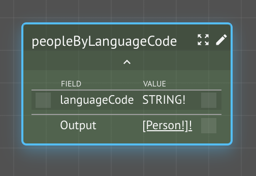
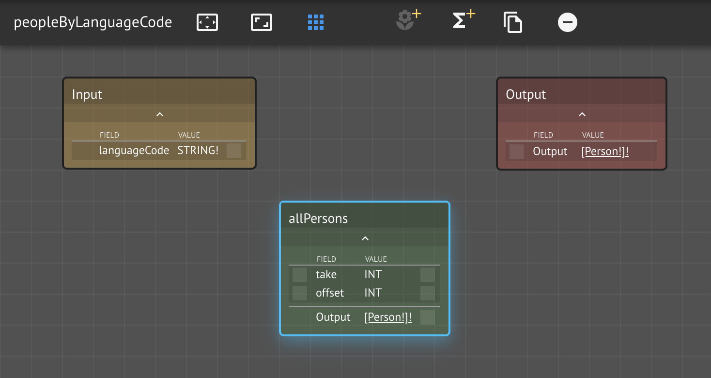

# Filtering

In this lesson, we will explore three different approaches to filtering collections:

* Implicit mapping with arguments
* Batch filtering
* KindDB filter boilerplate

We'll try the same example using each technique and discuss the tradeoffs.

### Prerequisites

* Your previous workspace `<your name> People`
* **Dependencies**: Lambda Assistant

## Step-by-Step Instructions

**Step 1.** Open your `<your name> People` workspace

**Step 2.** Create a new Knowledge Graph `Filters`

**Step 3.** Create a new function `peopleByLanguageCode`

**Step 4.** Open the `peopleByLanguageCode` function graph

Now we must decide how to return a collection of Kind `Person` instance that have a specific language code.

We've already seen how we can use `allPersons` boilerplate to retrieve all of the people, so let's start there.

**Step 5.** Add `allPersons` to the function graph

We need a filter that takes a `Person` and a language code and determines whether or not the the condition is satisfied.  This type of function is generally known as a **predicate**, which is thought of as a test that results in `true` or `false`.

The only way we've seen how to iterate over a collection is through implicit mapping, where CKG recognizes the pattern `[X] -> f(X):Y -> [Y]`.  Examining our \(incomplete\) function graph, we see that we have a source `[Person!]!` with `allPersons` and we need to ultimately output `[Person!]!`, but our filter function takes two inputs: `Person!` and `STRING!`. 

## Conclusion

