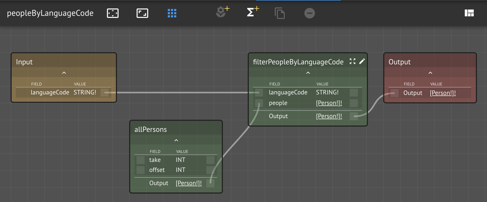
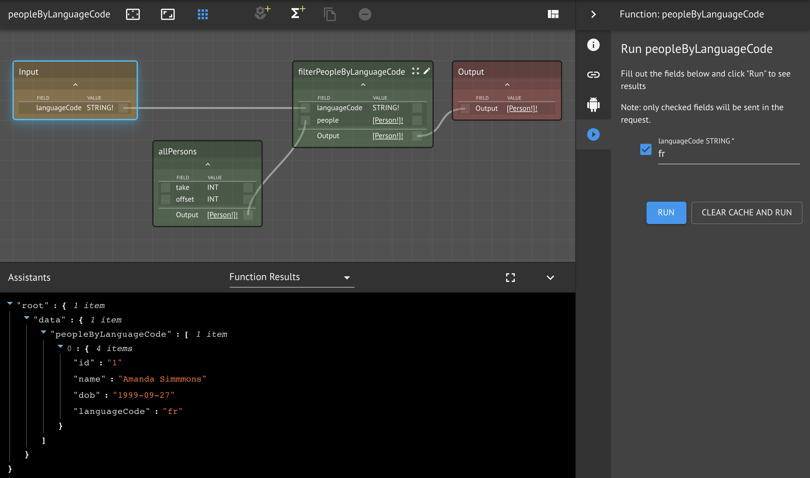
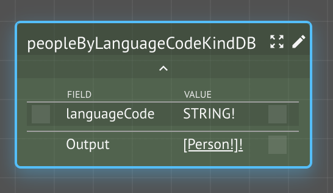
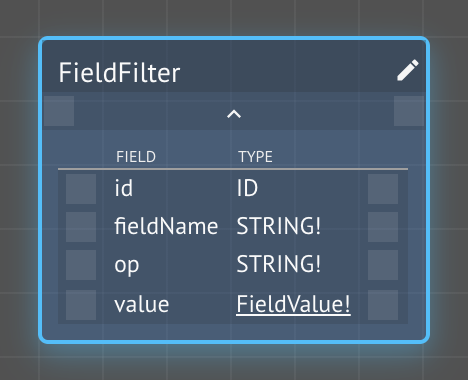
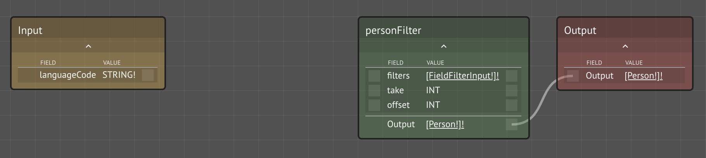
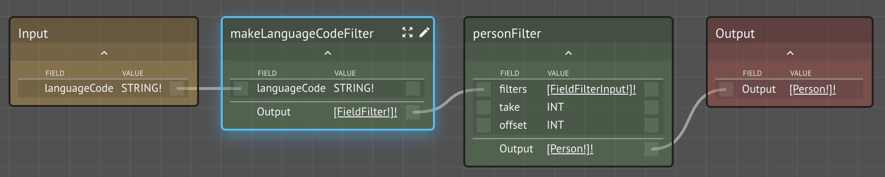
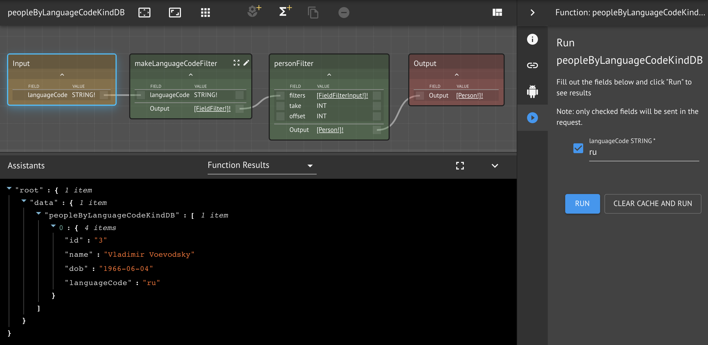

# Filtering

In this lesson, we will explore two different approaches to filtering collections:

* Batch filtering
* KindDB filter boilerplate

We'll try the same example using each technique and discuss the tradeoffs.

### Prerequisites

* Your previous workspace `<your name> People`
* **Dependencies**: Lambda Assistant

## Step-by-Step Instructions

**Step 1.** Open your `<your name> People` workspace

**Step 2.** Create a new Knowledge Graph `Filters`

**Step 3.** Create a new function `peopleByLanguageCode`


**Step 4.** Open the `peopleByLanguageCode` function graph

Now we must decide how to return a collection of Kind `Person` instance that have a specific language code.

We've already seen how we can use `allPersons` boilerplate to retrieve all of the people, so let's start there.

**Step 5.** Add `allPersons` to the function graph


The only way we've seen so far how to iterate over a collection is through implicit mapping, where CKG recognizes the pattern `[X] -> f(X):Y -> [Y]`.  Examining our \(incomplete\) function graph, we see that we have a source `[Person!]!` with `allPersons` and we need to ultimately output `[Person!]!`, but our filter function takes two inputs: `Person!` and the language code, `STRING!`.

Recall that with implicit mapping, CKG only supports single parameter functions, as the type pattern suggests.  Instead, we can simply filter the collection in batch by creating a lambda function.

**Step 6.** Create and wire new function `filterPeopleByLanguageCode`



**Step 7.** Implement and test the `filterPeopleByLanguageCode` lambda

```javascript
const { languageCode, people } = input

return people.filter(person => 
  person.languageCode === languageCode)
```

**Step 8.** Test the top-level function `peopleByLanguageCode`



And with that, we've demonstrated how to batch filter a collection using a lambda function.  Alternatively, since we are using managed Kinds, we can take advantage of the `xFilter` auto-generated function.  This approach is beneficial in that you let the storage engine apply the filtering where the data resides in a highly efficient manner.  This is especially useful for very large data volumes that can't be sent to a service in batch.


Use native filtering for scale and efficiency


**Step 9.** Open the `Filters` Knowledge Graph

**Step 10.** Create a new function `peopleByLanguageCodeKindDB`

We could undo our existing implementation, but instead let's create a second top-level function with the same signature as the original.



**Step 11.** Duplicate the `FieldFilter` Kind


Setting up the workspace for filtering in KindDB currently requires an extra step due to a UI limitation.  This next step will not be required in the next update.


**Step 11a.** Search inventory and add `personFilter` to `Filters` Knowledge Graph

It accepts an argument of Kind `FieldFilterInput`.  We need to duplicate this Kind and make it part of our workspace.

**Step 11b.**  Hover over `FieldFilterInput` and click on its preview to add it to the canvas

**Step 11c.** Duplicate and rename the clone to `FieldFilter`



**Step 12.** Open the `peopleByLanguageCodeKindDB` function graph

**Step 13.** Add the `personFilter` function to the graph

As part of the automatically generated boilerplate, every managed Kind has an associated filter function. In this case, it is `personFilter`. 



We can also wire the output of the function to the output of the function graph, since it will be the last node in the chain.  How do we connect the input to the function graph to the filter?  It takes as input a FieldFilterInput collection.  We need a function that constructs a filter.

**Step 14.** Create and wire a new function `makeLanguageCodeFilter`



**Step 15.** Implement the makeLanguageCodeFilter lambda and test it

```javascript
const { languageCode } = input

return [{
  id: languageCode,
  fieldName: "languageCode",
  op: "==",
  value: {
    id: "0",
    STRING: languageCode
  }
}]
```

**Step 16.** Test the top-level peopleByLanguageCodeKindDB



## Conclusion

In this lesson, we covered how to filter a collection using a batch approach, where we sent the collection to a \(lambda\) function, where it performed filtering logic and only returned items satisfying the condition.  We also learned how to construct and issue a filter to KindDB, which is appropriate only for managed kinds and is generally useful when data volumes are high and maximum performance is required.

