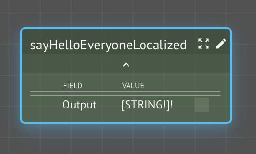
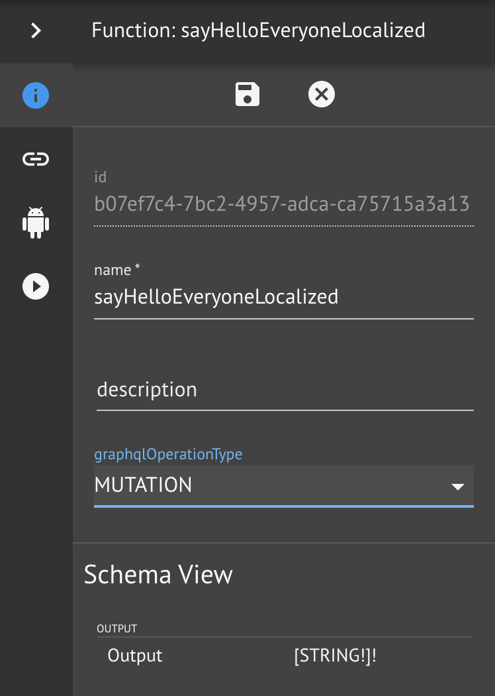

# Localized Greetings

In this lesson, we will create a function graph that iterates over a collection of people and generates greetings in their preferred language.

## Step-by-Step Instructions

**Step 1.**  Create a new workspace `<your name> Hello Everyone`with id `<your name>-hello-everyone`

**Step 2.**  Import your previous workspace **services** `<your name>-hello-localized` and `<your name>-people`

**Step 3.**  Create a new function `sayHelloEveryoneLocalized`

Note that this function takes no input, yet it produces output, as all functions must.  This implies that it is producing a _side-effect_.  Will the results be the same each time it is called?  What is it internally dependent upon in order to produce its output?  **Discuss**.

The CKG runtime will _memoize_ \(cache\) the results of function execution for efficiency.  It assume that, unless specifically indicated, that functions are _pure_ \(i.e., don't produce side-effects\) and that it is safe **not** to call them with the same inputs it has been called with previously \(within limits of cache eviction policies\).


Is your function **pure** \(QUERY\) or **impure** \(MUTATION\)?


**Step 4.** Mark your function as a MUTATION

Since our function takes no inputs, it must obtain its data from some source.  Our goal is to issue localized greetings to a set of people.  We will use the `Person` Kind instances we created earlier using the CRUD boilerplate provided by KindDB.  Therefore, we want to _read_ these instances, which we do with another CRUD function, `allPersons`.

And since our function takes no inputs, the results of the first call will be cached by CKG, since it assumes purity by default.  This means that any changes to the underlying people instance would not be reflected in subsequent calls to our function.  Therefore let's mark the function as a **mutation**, which indicates that it is _impure_ and for CKG to call it and not cache the results.

