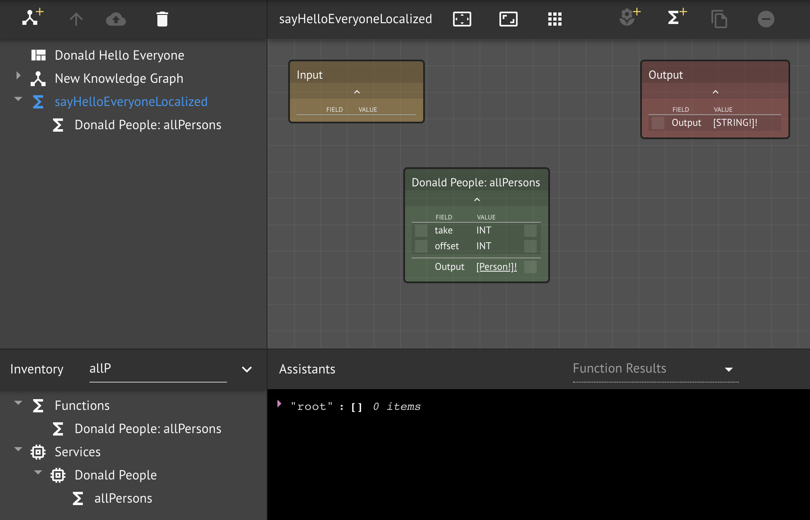
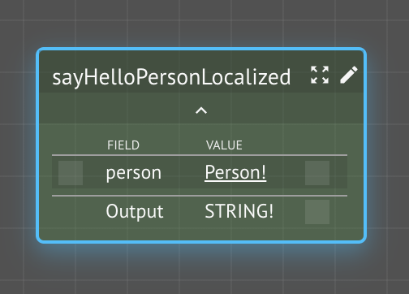
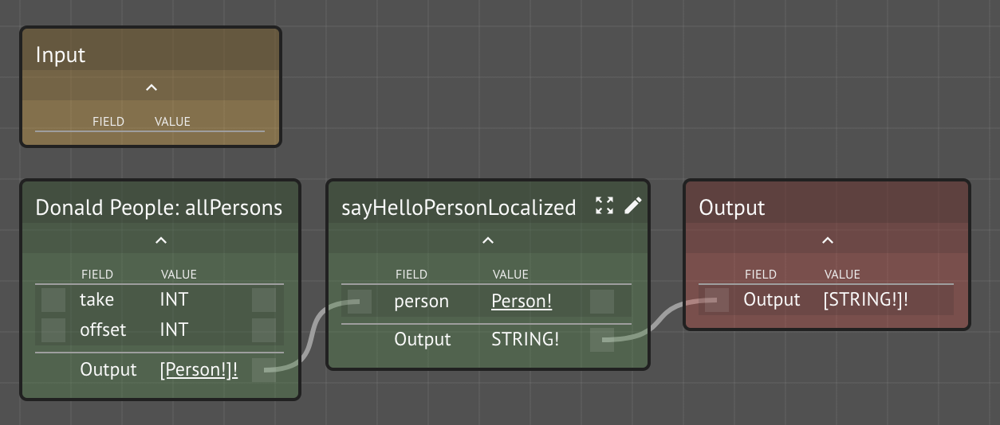
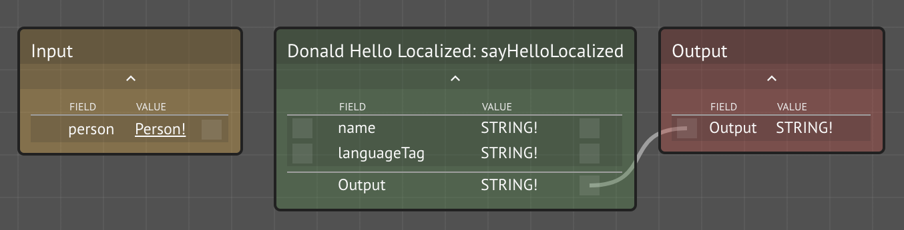
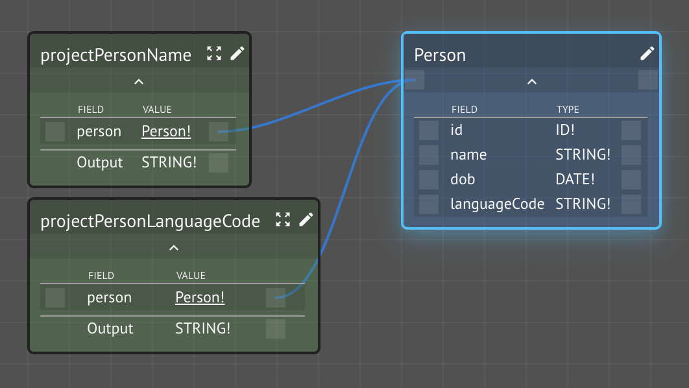
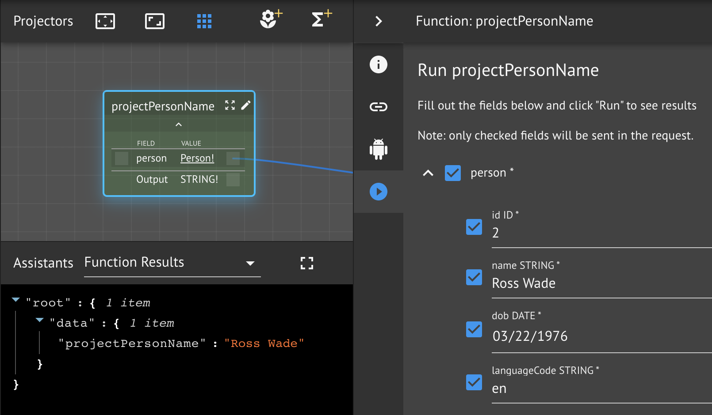
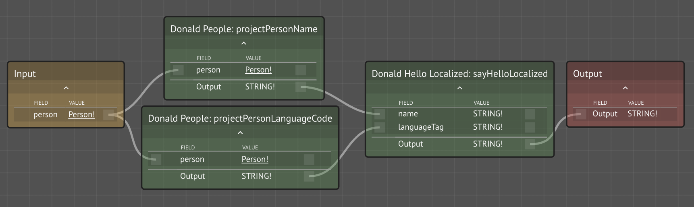
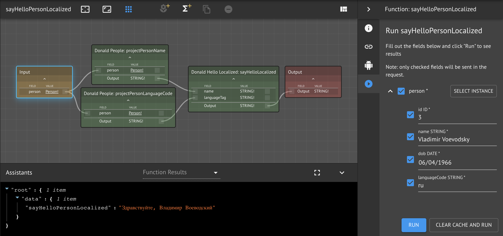
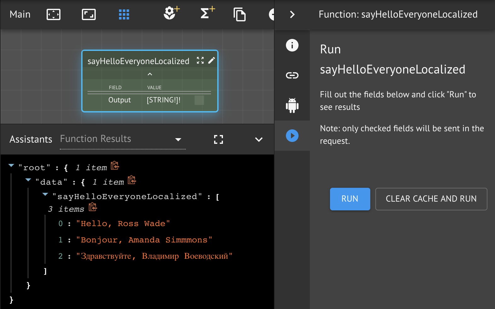

# Localized Greetings

In this lesson, we will create a function graph that iterates over a collection of people and generates greetings in their preferred language.

### Prerequisites

* Your previous workspaces service
  * `<your name>-people`
  * `<your name>-hello-localized`
* **Dependencies**: Lambda Assistant

## Step-by-Step Instructions

**Step 1.** Create a new workspace `<your name> Hello Everyone`with id `<your name>-hello-everyone`

Also, rename the default Knowledge Graph to `Main`.

**Step 2.** Import your previous workspace **services** `<your name>-hello-localized` and `<your name>-people`

**Step 3.** Create a new function `sayHelloEveryoneLocalized`


Note that this function takes no input, yet it produces output, as all functions must. This implies that it is producing a _side-effect_. Will the results be the same each time it is called? What is it internally dependent upon in order to produce its output? **Discuss**.

The CKG runtime will _memoize_ \(cache\) the results of function execution for efficiency. It assume that, unless specifically indicated, that functions are _pure_ \(i.e., don't produce side-effects\) and that it is safe **not** to call them with the same inputs it has been called with previously \(within limits of cache eviction policies\).


Is your function **pure** \(QUERY\) or **impure** \(MUTATION\)?


**Step 4.** Mark your function as a MUTATION

Since our function takes no inputs, it must obtain its data from some source. Our goal is to issue localized greetings to a set of people. We will use the `Person` Kind instances we created earlier using the CRUD boilerplate provided by KindDB. Therefore, we want to _read_ these instances, which we do with another CRUD function, `allPersons`.

And since our function takes no inputs, the results of the first call will be cached by CKG, since it assumes purity by default. This means that any changes to the underlying people instance would not be reflected in subsequent calls to our function. Therefore let's mark the function as a **mutation**, which indicates that it is _impure_ and for CKG to call it and not cache the results.


**Step 5.** Open the `sayHelloEveryoneLocalized` function graph

**Step 6.** Add `allPersons` to the function graph

Recall that one of the CRUD boilerplate functions that KindDB creates for managed Kinds is `allX(offset: Int, take: Int): [X]`. We imported our own People service where we defined the Kind `Person` and added a few instances using `addPerson` CRUD boilerplate. Therefore, we can use its `allPersons` CRUD function here to ask it for `Person` instances.


Don't think in terms of _querying_ _data from databases_

Think in terms of _calling service functions for Kind instances_


Search your workspace inventory for the imported boilerplate `allPersons` and drag it onto the function graph canvas:



**Step 7.** Create a new function `sayHelloPersonLocalized`

We now have a list of people from the boilerplate function. We next need a way to issue our greeting to them.

Let's create a function that can issue a greeting to a single person, first. Once we have that, then we can **apply** **the** **function** to the list of people. This is called **mapping** the list with a function.



**Step 8.** Map the `sayHelloPersonLocalized` over the `Person` list

To apply the function to every element of the list, simply wire it to the _outbound_ list slot and wire the \(single element\) output to a corresponding _inbound_ list slot of a compatible type. For example, the CKG will interpret the following pattern as a map operation \(referred to as _implicit mapping_\):

`[Person] -> func(person: Person): String -> [String]`

This will apply `func` to every person and create a corresponding collection of strings. Note that it is not possible to pass additional arguments to this mapping function. This discussed more in the [Implicit Mapping with Arguments](../../../maana-q-cookbook/design-patterns/implicit-mapping-with-arguments.md) design pattern.


An implicit mapping function can only take a single parameter




**Step 9.** Open the function graph for `sayHelloPersonLocalized`

**Step 10.** Add `sayHelloLocalized` to the function graph

Our goal now is to take a Person Kind and generate a personalized greeting in their preferred language. We have [already created a function](../hello-world/workspaces-are-services.md) that takes a string and language tag and generates and translates a personalized greeting, so let's add that to the function graph.



**Step 11.** Create field projection lambdas

We have a Person that has the fields we need \(name and language\), we simply need to get the values _out_ of the Kind instance. This is called Kind **field projection** and requires custom Lambda functions.

Before we create the functions here, let's think about whether or not they belong here. What service is this? What service does Person live in? Is this something that others might need or use? **Discuss.**

**Step 11a.** Open your `<your name> People` workspace

**Step 11b.** Add the functions `projectPersonName` and `projectPersonLanguageTag`

By convention, projector function names take the form: `"project" + <Kind name> + <Field name>`



**Step 11c.** Add the projector lambda functions

Simply _destructure_ the `person` from the function `input` object and return the respective fields, e.g.:

```javascript
const { person } = input

return person.name
```

Ensure you click **Save**.

**Step 11d.** Test your projectors

Select a `Person` instance and verify the results.



**Step 12.** Wire the projector functions to the function graph

You have updated your People service to expose projector functions for Kind Person. We want to use these functions in the function graph we were working on, `sayHelloPersonLocalized`.

**Step 12a.** Open your `<your name> Hello Everyone` workspace

**Step 12b.** Reload the workspace

In order for the current instance of the UI \(loaded into your browser\) to recognize the change in your dependent service, the workspace needs to be reloaded. The easiest way to accomplish this is to refresh your browser window.

**Step 12c.** Wire the projector functions

After reloading the workspace, the imported projector functions should be available in your inventory. Search for and add them to the function graph.



**Step 13.** Test the `sayHelloPersonLocalized` function

From within the current function graph, select the `Input` node and run the function with a selected `Person` instance.



**Step 14.** Test the `sayHelloEveryoneLocalized` function

With the lower levels completed and tested, we can return to the top-level function we started with.

**Step 14a.** Open the Main \(or default\) Knowledge Graph

**Step 14b.** Run the full function composition



## Conclusion

We covered the following concepts in this lesson:

* Pure and impure functions and how they map to QUERY and MUTATION
* Asking a service for a collection of Kind instances
* Implicit mapping of functions to lists
* Kind field projectors
* Refreshing service definitions between workspaces

