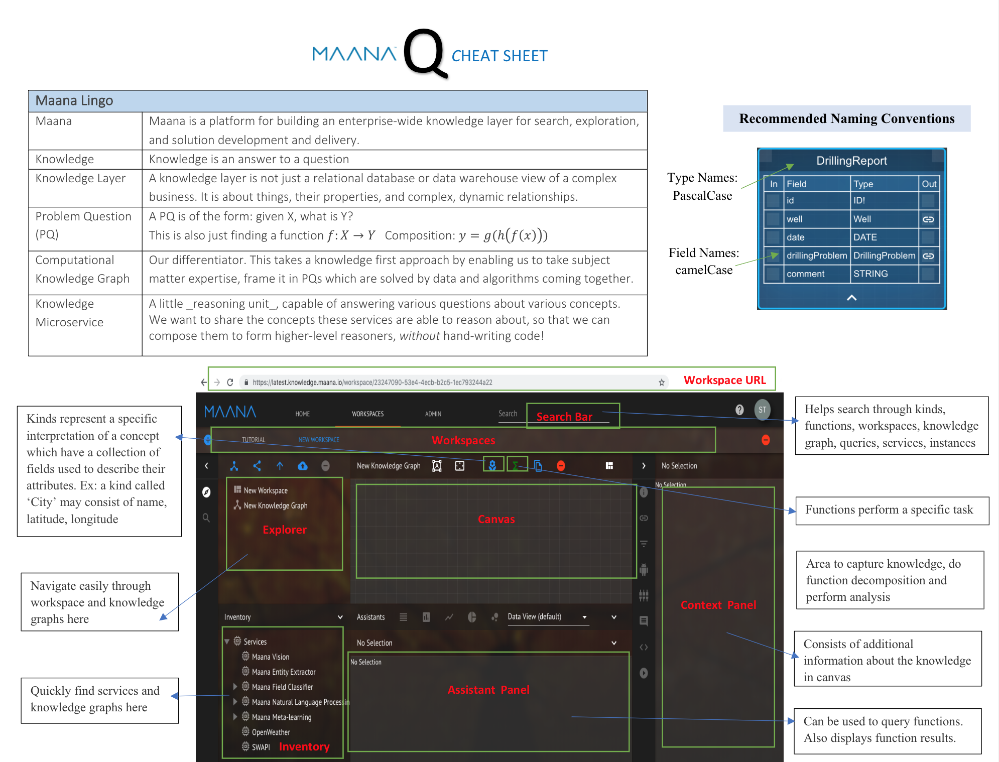

# Pre-Read Material

Before you attend training, please go through this material \(Estimated Time: 2hr\)

### Graph 101

\[Power point pending\]

### Familiarize with Maana terminology

[Maana Cheat Sheet](https://maanainc.app.box.com/file/553860131062)

### Familiarize with Maana UI

\[Videos pending\]

### GraphQL Basics

