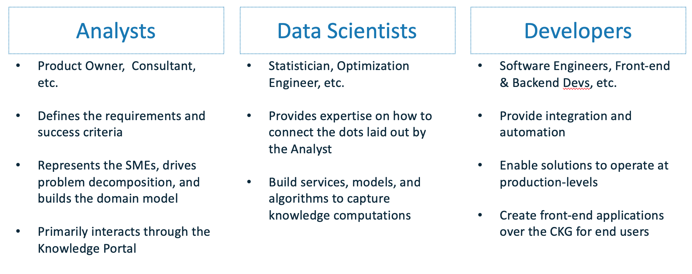

# Maana Target Audience

### Who is Maana's Target Audience?

Maana is a platform meant for companies who are digitally transforming and who are in specifically in search of speed by brining the best that Artificial Intelligence \(AI\) has to offer into one place.  To be clear, by speed we mean the way in which your organization manages processes, and/or how your organization makes decisions and evolves its operating model.

Very few companies today are adept at capturing their ongoing collective learning \(artifacts or solutions built\) and reusing them in subsequent use cases or for other relevant/related efforts. What we have primarily observed across a multitude of organizations and industries is, a collaborative dynamic exists where each contributor's process for encoding knowledge into an artifact or solutions is done within a "black box."  The trouble with this approach, of course, is that downstream contributors cannot possibly keep up with all of the undocumented steps/logic/assumptions taken by their upstream counterparts.  Perhaps you've seen this symptom manifest itself when a Data Scientists didn't know exactly how an algorithm works that they're supposed to be using, or when a Developer wasn't sure how a quote was generated for a build effort estimate.

The Maana Q Platform is meant for an audience who is ready to put these sorts of problems into AI's hands.  It's not meant to replace a human being, or to contribute to expected job losses as a result of automation.  It's meant to automate the time-consuming, and oftentimes mundane, operations of an organization so that the humans in that organization may apply more of their wit and creativity to the act of executing/accomplishing rather than researching/evaluating/planning.

### Who uses the Maana Q Platform?

The Maana platform is used primarily to deliver knowledge solutions/services to end users. Delivering that experience often requires collaboration from multiple Analysts, Data Scientists, and Developers within an organization. The Maana Q Platform is designed to support this sort of collaboration through the Maana Knowledge Portal, which is a shared environment for visual and programmatic development of a solution.

It may come as a surprise to you that Maana is not a platform meant only for Developers. While it's true that having one place to find your organization's re-usable encoded knowledge will enable an easier time for Developers, the Maana Q Platform is designed to make sure that the people who are not interested in coding or haven't coded for a while \(e.g. a subject matter expert, a business analyst, etc.\), have a big part to play in building out the solutions and digitizing the knowledge in their organization.

Here is how we specifically defined the different audiences that the Maana Q Platform is meant to cater to:

If you're someone who most closely identifies as an Analyst in the image above, then you're probably someone who is familiar with things like: 

* Creating charts/tables in Excel.
* Creating instructions for others to follow.
* Building a Tableau or Power BI dashboard.  

If you're capable of doing those things, then you need not worry.  You are technically adept enough to be a user of the Maana Q Platform.

If you're someone who identifies most closely to a Data Scientist or Developer, you may be looking at this image and thinking, "I don't fit cleanly into one audience group or the other, what does that mean?"  Good news! This image is simply meant to articulate the different roles we expect our users could take on during the solution development process, it is by no means meant as a hard boundary or choice that you must make in deciding how you'll act as a user.

